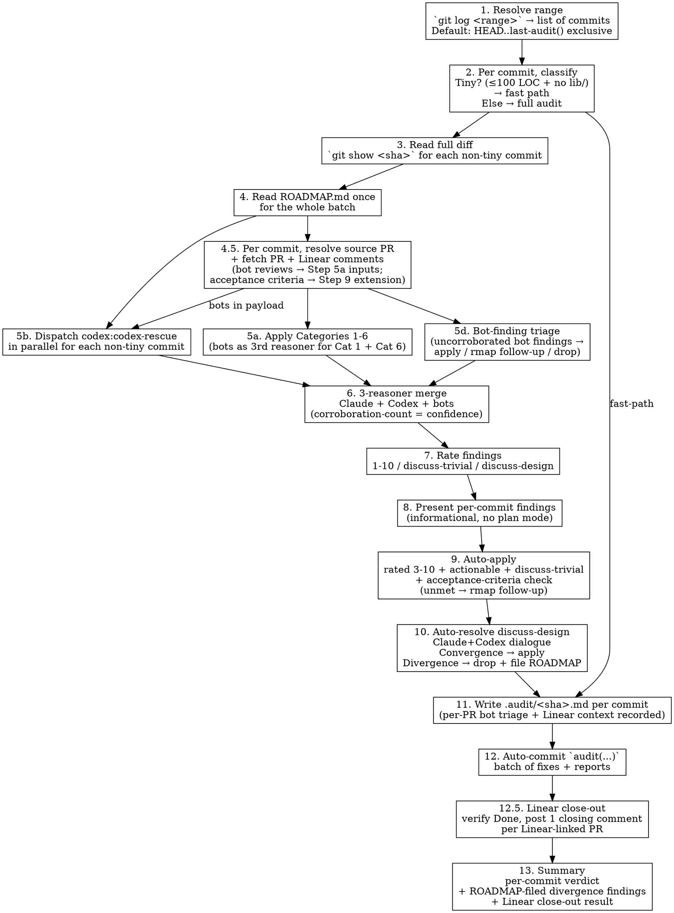

# Audit Review — Post-Commit / Post-Merge Workflow

Walk a commit range. Audit each commit. Auto-apply hygiene fixes. Write a `.audit/<sha>.md` report per commit. Commit the whole batch as one `audit(...)`. **No user gates.** The audit commit is the inspectable artifact — `git revert <audit-sha>` is the user's escape hatch.

## Phase Awareness

**This skill runs in Phase 5 of 5 (terminal)** in the development lifecycle:

`task-driver(1) → worktree(2) → bots(3) → merge(4) → audit-review(5)`

- **Predecessor:** merge (Phase 4) — GH-native `gh pr merge --auto --squash --delete-branch` (set when PR opens; fires on required checks green + no requested-changes + no `[BLOCK-MERGE]` label). Pre-merge phase is zero-Claude.
- **Successor:** (terminal — audit commit lands on default branch)
- **Linear status on entry:** any (typically already `Done` because the deferred audit runs after merge has flipped status); this skill performs the close-out (Step 12.5) when it didn't fire automatically.
- **Linear status on exit:** `Done` confirmed; one closing comment per Linear-linked PR in the batch.

| Layer | Skill | Input | Trigger | Human gates |
|---|---|---|---|---|
| Pre-commit (Phase 2 sub-phase) | `code-review` | `git diff --staged` | Implementer about to commit | One: exit-plan-to-apply |
| Pre-merge (Phase 4) | none — GH-native | `gh pr merge --auto` set at PR open | Required checks green + no requested-changes + no `[BLOCK-MERGE]` | Zero (manual hold via `[BLOCK-MERGE]` label) |
| Post-merge (Phase 5, this skill) | **`audit-review`** | `git log <range>` + each commit's PR + Linear context | Deferred — `staged-review` SessionStart hook surfaces unaudited tails (≥3 commits past last `audit(...)` ancestor); user invokes `/staged-review:audit-status` or `Skill(audit-review) <range>` | **Zero** |

`audit-review` shares Categories 1-6 and the Codex dispatch payload with `code-review`. The differences are:

| Aspect | `code-review` | `audit-review` |
|---|---|---|
| Input | `git diff --staged` | `git show <sha>` per commit in range |
| Plan mode | Yes — exit-to-approve before fixes apply | **No** — auto-apply directly. Audit commit is the artifact |
| `discuss-design` resolution | Claude+Codex dialogue, escalate to user on divergence | Claude+Codex dialogue, **drop + file as ROADMAP candidate** on divergence (no user escalation) |
| Codex second-opinion | Mandatory (single-judge failure mode) | Mandatory (same reasoning) |
| Final action | Edits stay unstaged for committer | Auto-commit one `audit(...)` covering the batch |

## Scope

WHAT THIS SKILL DOES:
  - Walk a commit range (default: HEAD back to the last `audit(...)` commit)
  - Per commit, **resolve source PR** (squashed `(#NNN)` in subject OR `gh search prs --merge-commit <sha>`) and fetch PR + Linear comments (Step 4.5)
  - Per commit, apply the 5 review categories + Category 6 (doc gaps), **with bot review comments (CodeRabbit / Copilot / Codex GH bot) treated as third-reasoner inputs to Cat 1 + Cat 6**
  - Dispatch `codex:codex-rescue` in parallel for second-opinion findings
  - **3-reasoner merge** (Claude + Codex + bots) with corroboration-count = confidence; ≥2-reasoner agreement auto-applies, single-bot bugs file as rmap follow-ups (Step 5d)
  - Auto-apply rated 3-10 + actionable + `discuss-trivial` findings
  - **Cross-reference Linear acceptance criteria** for each PR; unmet criteria file as rmap follow-ups (Step 9 extension)
  - Auto-resolve `discuss-design` via Claude+Codex dialogue: convergence applies, divergence drops the finding from auto-apply and files it as a ROADMAP candidate
  - Write `.audit/<short-sha>-<slug>.md` per audited commit
  - Auto-commit one `audit(...)` covering the batch
  - **Linear close-out** at batch tail (Step 12.5): verify Done state for each Linear-linked PR, post ONE closing comment per issue
  - Tiny-commit fast path (≤100 LOC + no `lib/`): 3-line audit, no PR resolve, no Codex dispatch

WHAT THIS SKILL DOES NOT DO:
  - Review staged or in-flight code (use `code-review`)
  - **Pre-merge review** — pre-merge phase is GH-native auto-merge only (`gh pr merge --auto`); audit-review runs post-merge exclusively. Manual hold via `[BLOCK-MERGE]` label on the PR
  - Ask the user for per-finding approval (the audit commit IS the approval surface — revert to disagree)
  - Escalate `discuss-design` divergence to the user mid-run (drop + file as ROADMAP follow-up, surface in summary)
  - Push the audit commit (the user pushes when ready, same as any other commit)
  - Push back to the cloud agent (no live channel post-merge; correctness gaps file as rmap follow-ups for the next iteration)

**The audit commit is the inspectable artifact.** Every fix, every doc edit, every `.audit/` report lands in one commit. `git show <audit-sha>` shows exactly what the audit changed. `git revert <audit-sha>` undoes the whole batch in one step. This is the load-bearing reason there's no plan-mode gate — the user audits *after* the fact, with full diff + report context, instead of reviewing edit-by-edit before they apply.

## Workflow



### Step 1: Resolve the Commit Range

Resolve which commits to audit. Three input shapes:

```bash
# No argument — walk back from HEAD until the last audit() commit (exclusive)
LAST_AUDIT=$(git log --grep '^audit(' -1 --format=%H 2>/dev/null)
if [ -z "$LAST_AUDIT" ]; then
  # No prior audit commit — bound the range to a sane default (last 20 commits)
  RANGE="HEAD~20..HEAD"
else
  RANGE="${LAST_AUDIT}..HEAD"
fi

# Single SHA argument
RANGE="${SHA}^..${SHA}"

# Range argument (passed verbatim)
RANGE="${ARG}"
```

Then list commits oldest-first (so the audit narrative reads chronologically):

```bash
git log "$RANGE" --reverse --format='%H %s'
```

If the range resolves to zero commits, print `Nothing to audit (range empty).` and stop. If the range resolves to >50 commits, surface the count and confirm with the user before proceeding — that's a deeper backfill than typical and worth a brief sanity check; this is the **only** confirmation gate in the workflow, and it exists because audit-corpus quality drops when batched too wide.

**Skip already-audited commits.** Before walking the list, drop any commit SHA whose short SHA appears in an existing `.audit/<short-sha>-*.md` file. Re-auditing wastes Codex dispatch and pollutes the audit corpus. If the user wants a re-audit, they remove the old `.audit/` entry first.

### Step 2: Classify Each Commit (Tiny vs Full)

For each commit in the range, classify:

```bash
# Total LOC (additions + deletions)
LOC=$(git show --stat --format='' "$SHA" | tail -1 | grep -oE '[0-9]+ insertion|[0-9]+ deletion' | grep -oE '[0-9]+' | paste -sd+ | bc)

# Production-code paths touched (default: lib/ for Elixir; configurable per-repo)
PROD_FILES=$(git show --name-only --format='' "$SHA" | grep -cE '^(lib|src)/')
```

**Tiny-commit fast path** — when **both** hold (`LOC < 100` AND `PROD_FILES == 0`):

- Skip Steps 3-10 for this commit.
- Write `.audit/<short-sha>-<slug>.md` with `verdict: clean — fast-path` and the file list.
- No Codex dispatch.
- The commit still contributes to the batched `audit(...)` commit (Step 12), but with no fixes.

**Override:** the user can force full audit on a tiny commit via `/staged-review:audit-review --full HEAD~1..HEAD` (treat the `--full` flag as a directive to skip the fast-path classification). Default is fast-path; full is opt-in.

**Why `lib/`:** changes to docs, configs, tests, READMEs don't ship code to runtime. The 5+1 categories deliver value on production-code paths (control flow, abstractions, TODO discipline, doc drift). Skipping audit on non-production paths = skipping an audit that wouldn't have found anything.

### Step 3: Read the Full Diff (Non-Tiny Commits)

```bash
git show "$SHA"
```

Capture once per commit and reuse across Steps 5a, 5b, 6. No re-fetching.

If the diff is large enough that re-reading it would burn context (rough rule: > 1000 lines per commit), delegate the survey to an Explore subagent — same shape as `code-review` Step 3a. Pass the diff and the 6 categories; get back a compact findings report. Keep judgment and synthesis in the main session.

### Step 4: Read ROADMAP.md Once for the Batch

Read `ROADMAP.md` (or the project's equivalent task doc) **once at the start of the batch**, not per commit. The audit needs:

- Which task numbers exist (so `TODO(Task N)` markers in the diff can be cross-referenced)
- Which tasks are still ⬜ (so a commit that completes one and doesn't flip ROADMAP becomes a Category 6 finding)

If the project has no ROADMAP.md (per `linear-queue.md` § "ROADMAP-Fallback Flow"), proceed without it — Category 6 still catches CHANGELOG / CLAUDE.md / README drift; only the ROADMAP-status-flip findings are absent.

### Step 4.5: Resolve Source PR + Fetch PR + Linear Comments (Per Non-Tiny Commit)

For each non-tiny commit in the range, resolve its source PR and pull bot + Linear context. Bot review comments (CodeRabbit / Copilot / Codex GH bot) become third-reasoner inputs to Step 5a (Cat 1 + Cat 6). Linear acceptance criteria drive Step 9's extension.

**Resolve the PR number:**

```bash
# 1) Squashed-merge convention: "(#NNN)" in commit subject
PR_NUM=$(git log -1 --format=%s "$SHA" | grep -oE '\(#[0-9]+\)' | tr -d '(#)')

# 2) Fallback: ask GitHub which PR this merge SHA closed
[ -z "$PR_NUM" ] && PR_NUM=$(gh search prs --merge-commit "$SHA" --json number --jq '.[0].number // empty')

# 3) Direct push to default branch (no PR) — file a Cat 6 finding (priority 4):
#    "direct-push, no PR review trail" — skip the rest of Step 4.5 for this commit
```

**When a PR is found, fetch PR + Linear surfaces in one batch:**

```bash
OWNER_REPO=$(gh repo view --json nameWithOwner --jq .nameWithOwner)

# GitHub PR — title, body, reviews (Copilot/CodeRabbit summary + state), labels, top-level comments
gh pr view "$PR_NUM" --json title,body,headRefName,reviews,comments,labels,statusCheckRollup

# Line-level review comments (inline bot + human comments on diff lines)
gh api "repos/${OWNER_REPO}/pulls/${PR_NUM}/comments"

# Linear issue link, if PR body or branch name contains an identifier (e.g., MW-247)
ISSUE_ID=$(gh pr view "$PR_NUM" --json body,headRefName \
  --jq '.body + " " + .headRefName' | grep -oE '[A-Z]+-[0-9]+' | head -1)

if [ -n "$ISSUE_ID" ] && have_linear_mcp; then
  # Linear issue body has acceptance criteria; comments have user clarifications / scope amendments
  mcp__linear-server__get_issue with id="$ISSUE_ID"
  mcp__linear-server__list_comments with issueId="$ISSUE_ID"
fi
```

**Cache per PR.** If the batch has multiple commits per PR (rebase-merge), one fetch per PR number. Squash-merge is one commit ↔ one PR — no caching needed.

**Per-commit context object** (carry into Steps 5a, 5d, 9, 12.5):

```
{
  pr_num:                 int | null,
  pr_title:               string,
  pr_body:                string,
  pr_labels:              [string],
  bot_reviews:            [{author, state, body}],          # PR-level
  bot_inline_comments:    [{author, path, line, body}],     # line-level
  linear_issue_id:        string | null,
  linear_state:           string | null,
  linear_acceptance:      [string] | null,                  # parsed from issue body
  linear_comments:        [{author, body}] | null,
}
```

**Bot identification.** Treat as bot any author matching `coderabbit`, `copilot`, `codex`, `github-actions[bot]`, `<botname>[bot]`. Human reviewers' comments feed Step 5a like any other reviewer note — but their findings are NOT subject to Step 5d's bot triage (humans aren't reasoners in the corroboration count).

**No-PR commits.** Direct pushes to the default branch (no PR), or commits the search can't resolve, get a Cat 6 finding `priority: 4` in `.audit/<sha>.md`: "direct-push commit; no PR review trail recorded — consider PR workflow per worktree-workflow.md".

### Step 5a: Apply Review Categories (Claude)

For each non-tiny commit, walk the 5+1 categories from `code-review` Step 3a. Identical surface. Reproduced here in compressed form; the canonical text lives in `staged-review:code-review` SKILL.md and should be consulted whenever a category's edge case is unclear.

**Category 1 — Bugs & Logic Errors.** Null/nil paths, type confusion, silent failures, unreachable code, concurrency bugs, untested error paths added in the diff. **Confidence filter:** only report if you can name the specific input that triggers the bug.

**Category 2 — Missing Extractions.** Code extractions (functions doing 2+ unrelated things; deeply nested logic; repeated inline logic; long parameter lists) AND data extractions (hardcoded values; magic strings/numbers; inline JSON/map structures).

**Category 3 — Missing TODO Markers.** Temporary code without `TODO:` prefix. Phrases like "for now", "currently", "temporarily", "in production this should". Cross-reference ROADMAP.md tasks for `TODO(Task N): ...` references.

**Category 4 — Abstraction Opportunities.** 3+ similar patterns with stable shape across well-separated contexts. Premature abstraction is worse than duplication; flag only when the pattern is clear.

**Category 5 — Actionable TODOs.** TODOs in the committed diff that are resolvable RIGHT NOW (the function boundary is obvious; the context is clear; the referenced task is complete in this commit).

**Category 6 — Documentation Gaps.** Same surface as `code-review` Step 3a Category 6:
- ROADMAP status flip (commit completes a tracked task but ROADMAP still shows ⬜)
- CHANGELOG entry missing under `## [Unreleased]` for a meaningful change
- CLAUDE.md drift (commit changes repo structure, conventions, hooks)
- README.md drift (user-facing surface invalidated)
- In-code `@doc`/`@spec` enumeration drift (docstring lists 3 errors, function returns 4)
- Public function added without docstring or spec when neighbors have them
- Existing docstring example invalidated by the diff

**Rating defaults** for Category 6 mirror `code-review`'s defaults exactly:
- Missing CHANGELOG entry for a feature/fix → **5-7**
- ROADMAP status flip when task is clearly complete → **6-8**
- CLAUDE.md drift on a load-bearing claim → **7-9**
- `@doc` doesn't enumerate all error atoms → **3-5**
- Public function added with no docstring → **4-6**
- `@spec` missing on public function in a project that uses specs elsewhere → **4-6**
- Cosmetic doc nit → **1-2** (skip unless trivial)

**Don't invent activity.** If the commit doesn't clearly complete a tracked task, don't flip ROADMAP. If you can't summarize the commit in one CHANGELOG line without speculation, mark `discuss` instead of fabricating.

**Bot review comments as Cat 1 / Cat 6 inputs.** From Step 4.5, the per-commit context has `bot_reviews[]` and `bot_inline_comments[]`. Treat each as a candidate finding:

- **Line-level bot comment on a code-path file:** candidate Cat 1 (bug / logic) or Cat 2 (extraction) depending on body text.
- **Line-level bot comment on a doc file or `@doc`/`@spec`:** candidate Cat 6 (doc gap).
- **PR-level bot review summary:** scan for itemized findings; each maps to a category by content.

**Cite-and-skip dedupe** (same shape as `code-review` Step 5 cite-and-skip): when Claude's own audit and a bot agree on a finding, surface ONE row with attribution `also flagged by <bot>`. Don't double-count. When Claude disagrees with a bot, mark `discuss-trivial` and record both positions in `.audit/<sha>.md`. Bot findings without Claude OR Codex corroboration drop through to **Step 5d** for triage (don't auto-apply, don't drop silently).

**Forbidden:** silently dropping a bot-flagged bug because Claude's confidence filter didn't trigger on the same input. The whole reason bots are reasoners here is that they catch what Claude's confidence filter under-flags. If a bot flagged it as a bug and Claude can't reproduce, Step 5d files it as an rmap follow-up — never drop.

### Step 5b: Dispatch Codex Second-Opinion (Required, Parallel with 5a)

Dispatch `codex:codex-rescue` **in parallel** with Step 5a for each non-tiny commit. Same rationale as `code-review` Step 3b: Claude (self-review) under-flags due to the confidence filter; Codex over-flags due to training-bias confidence on niche specs. Both calibrations need the other reviewer's pass to land at the right finding density.

**The dispatch prompt MUST include the project's tool inventory** — see "Dispatch Payload" below.

**Dispatch model: deliberate `--background` + poll via direct Bash.** Codex investigations on non-trivial diffs regularly take 5–30+ minutes. Observed pattern (see `.audit/80cb242-task-76-parsetrade.md` "Codex review hang"): codex does evidence-grade investigation in ~5 min, then the reasoning step can stall 30+ min before emitting findings. The Bash tool's 10-minute hard cap means foreground dispatch will be killed mid-investigation — silently losing exactly the bug-catching Codex is dispatched for. Background dispatch uses the codex plugin's persistent broker (`scripts/app-server-broker.mjs` spawns a detached codex app-server per repo; jobs persist across Claude turns AND sessions in `$CLAUDE_PLUGIN_DATA/state/<repo-slug>-*/jobs/`) and lets the audit-agent poll deliberately.

**Pin background on both layers:**

1. **Agent tool** — invoke `codex:codex-rescue` with `run_in_background: false` so the audit-agent receives the rescue agent's stdout in this tool round (the stdout contains the jobId; backgrounding the *Agent call* loses it).
2. **Rescue agent's forwarding** — include `--background` explicitly in the dispatch prompt so the rescue agent forwards `codex-companion task --background …`. The rescue agent's stdout will be: `<title> started in the background as <jobId>. Check /codex:status <jobId> for progress.` Parse the jobId from that line.

**Poll for completion via direct Bash, not via rescue or slash command.** The rescue agent is locked to `task` only (no status/result/cancel — by design, per evaluator separation). `/codex:status` and `/codex:result` have `disable-model-invocation: true` — Claude can't call them. Invoke codex-companion directly:

```bash
COMPANION="$HOME/.claude/plugins/marketplaces/openai-codex/plugins/codex/scripts/codex-companion.mjs"
node "$COMPANION" status --wait --timeout-ms 600000 --json <jobId>   # blocks up to 10 min
```

If the returned JSON has `job.status == "completed"`, fetch findings:
```bash
node "$COMPANION" result <jobId>
```

If `waitTimedOut: true`, re-poll up to 2 more times (30 min total per commit) before declaring the job stalled. Concurrent batched dispatch: kick off all rescue Agent calls in one tool round, then issue all status polls in one Bash round — both fan out in parallel.

**Why background over foreground here:** the user's stance — "Codex is able to find bugs that Opus 4.7 did not see" — makes dropping the second-opinion an unacceptable degradation. Forced foreground hits the Bash 10-min cap on long codex investigations and silently degrades to single-reviewer. Background + explicit polling preserves the dual-reviewer guarantee at the cost of wall-time/possibly-multi-session orchestration. That trade is correct.

**Failure modes:**
- **Codex unreachable** (binary missing, broker dead, dispatch errors) → continue with single-reviewer pass for that commit. Mark closing summary `Codex unreachable — single-reviewer pass`.
- **Codex returns garbage / refuses** → same as unreachable; don't fall back to "trust Codex" — single-reviewer the commit and surface the failure.
- **Codex job stalled** (3+ polls timed out, ~30 min wall-time, job still `running`) → write `.audit/_in_progress_<range>.md` checkpoint with the pending jobIds + Claude's findings captured so far + harness state, then STOP the audit. Do NOT silently degrade to single-reviewer. Multi-session resume per Step 5c is the correct path — losing a Codex finding on a long-running job is not an acceptable trade.

### Step 5c: Resuming from `_in_progress_<range>.md` Checkpoint

If `.audit/_in_progress_*.md` exists at audit start, the previous session stalled on background Codex jobs. Resume:

1. Read the checkpoint — note jobIds, commit range, Claude findings already captured.
2. For each pending jobId, quick-check status (no `--wait`): `node "$COMPANION" status --json <jobId>`.
3. If `status: "completed"` → fetch via `node "$COMPANION" result <jobId>`, merge into Step 6 for that commit.
4. If still `running` → one round of `node "$COMPANION" status --wait --timeout-ms 600000 <jobId>`.
5. If still running after this round → re-write the checkpoint with updated state and stop again. Codex genuinely hung; the user may need to `/codex:cancel <jobId>` and rerun, or wait.
6. After all jobIds resolve → continue Steps 6-13 normally. **Delete `.audit/_in_progress_<range>.md` as part of the final commit** (along with the per-commit `.audit/<sha>.md` reports).

#### Dispatch Payload (What to Send Codex on Every Dispatch)

Identical structure to `code-review`'s "Dispatch Payload" (search `staged-review:code-review` SKILL.md for that section). Four required sections in order:

1. **Task** — "Audit commit `<SHA>` against Categories 1-6 from `staged-review:audit-review` SKILL.md. Same surface as `code-review` Step 3a. Return a per-finding table with file:line, category, priority (1-10) or `discuss`, and a one-line description."
2. **Context** — embed the full `git show <sha>` output, the relevant ROADMAP.md excerpt for the current phase / task, and the commit's parent SHA so Codex can `git diff <parent> <sha>` if needed.
3. **Project tool inventory** — the project's MCP servers (e.g., `mcp__tidewave__project_eval`), mix tasks (`mix test.json --quiet --failed`, `mix dialyzer.json --quiet --filter-type no_return`, `mix credo --strict --format json`), hex-docs URLs for any packages referenced in the diff (`https://hexdocs.pm/<pkg>/llms.txt`), and other project scripts visible in `mix.exs` aliases.
4. **Verification instruction** — explicit: "Before asserting any claim about the codebase, verify it with one of the tools above. Training-data recall is insufficient. If a tool isn't available, say so; don't guess."

This is load-bearing. Without the inventory, Codex's over-flagging surge dominates and the audit corpus fills with noise.

### Step 5d: Bot-Finding Triage (Uncorroborated Bot Findings Only)

After Steps 5a + 5b complete, partition `bot_reviews[]` + `bot_inline_comments[]` from Step 4.5 into:

- **Corroborated** — at least one of {Claude (Step 5a), Codex (Step 5b)} raised the same finding. Already handled by Step 6's merge — collapse with `also flagged by <bot>` attribution.
- **Uncorroborated** — only the bot raised it. Apply the triage table below.

| Bot finding shape | Corroboration | Action |
|---|---|---|
| Bug / correctness flagged by **≥2 bots** | bot+bot | **Auto-apply** (rated 7; high-confidence corroboration is structurally identical to Claude+Codex agreement) |
| Bug / correctness flagged by **1 bot**, Claude+Codex agree it's real on verification | post-dispatch | **Auto-apply** (rate by severity per Step 7 scale) |
| Bug / correctness flagged by **1 bot**, Claude+Codex disagree | single | **File as rmap follow-up** — could be false positive; next iteration cycle picks up. NEVER drop silently |
| Hygiene / doc gap flagged by **any bot** | any | **Auto-apply** (rated 3-5; low risk, mechanical fix) |
| Cosmetic / nit flagged by **1 bot** (style, wording, formatting) | single | **Drop** with one-line rationale in `.audit/<sha>.md` |
| Bot finding on a file outside the commit diff | n/a | **Drop** — not this audit's scope |

**Corroboration count = confidence.** Two bots agreeing is the same shape as Claude+Codex agreement; the merge pipeline (Step 6) treats them uniformly. The two principles:

1. **Bugs are never silently dropped.** Single-bot bug → rmap follow-up. Always.
2. **Cosmetic single-bot findings drop.** Bots over-flag nits; auto-applying every bot suggestion bloats the audit commit.

**rmap follow-up filing.** When this step files a follow-up:

```
rmap new --from-stdin <<TOML
[[task]]
phase = <project's audit_followups phase or current phase>
bundle = <audit_followups bundle>
status = "pending"
title = "Audit-surfaced: <bot finding title>"
scores = { d = ?, b = ?, u = ? }   # leave for user's next prioritization pass
body = """
<bot name> flagged in PR #<N>: <verbatim quote of bot comment>.
Claude+Codex did not corroborate; filed as rmap follow-up pending verification.
Filed by audit-review against commit <short-sha> on <YYYY-MM-DD>; see .audit/<short-sha>-<slug>.md.
"""
TOML
```

The follow-up filing happens inside the same audit commit (Step 12) — `roadmap/tasks.toml`, `ROADMAP.md`, `roadmap/data.json` all land together. Same shape as `discuss-design` divergence filing.

### Step 6: Merge Claude + Codex Findings (Now 3-Reasoner)

Per commit, combine findings from **three reasoners** — Claude (5a), Codex (5b), and bots (Step 4.5 + 5d). The reasoners are treated uniformly in the merge: corroboration count = confidence.

**Merge rules:**

| Source mix | Action |
|---|---|
| Corroborated by **≥2 reasoners** (any two of Claude / Codex / ≥1 bot) | Collapse to one row. Highest confidence. Pick the most specific description. Tag attribution: `also flagged by <other reasoners>` |
| **Claude-only** | Keep with Claude's rating |
| **Codex-only** | Tag `(codex)`. Default priority to `discuss` until verified against actual code (open file, confirm claimed symbol/invariant exists). Per `critical-rules.md`: Codex frequently cites nonexistent functions / wrong imports — treat as suggestions, never facts |
| **Single-bot bug, no Claude/Codex agreement** | Routed through Step 5d triage — file as rmap follow-up (don't auto-apply, don't drop) |
| **Single-bot hygiene** | Routed through Step 5d triage — auto-apply (low risk) |
| **Single-bot cosmetic** | Routed through Step 5d triage — drop with one-line rationale |
| **Bot + Claude/Codex agreement** | Treated as corroborated (≥2 reasoners); collapse |

**Why bots count as reasoners.** CodeRabbit, Copilot, and Codex's GH bot run on every PR for free and produce high-signal Cat 1 + Cat 6 findings (cartouche audit observation: the 3-bot ensemble caught every substantive code-correctness defect Tier-2 review independently caught at critical tier). Treating them as reasoners — instead of a separate triage pass — keeps the merge logic uniform and lets corroboration-count drive auto-apply confidence.

**Codex-only override on bot agreement.** If a bot agrees with a Codex-only finding (and Claude didn't raise it), promote from `(codex) discuss` to **corroborated** — the bot agreement is independent verification.

### Step 7: Rate Each Finding

Rating scale identical to `code-review` Step 5:

| Priority | Band | Default action |
|---|---|---|
| 9-10 | critical | Auto-apply |
| 7-8 | high | Auto-apply |
| 5-6 | medium | Auto-apply |
| 3-4 | low | Auto-apply |
| 1-2 | cosmetic | List only; skip unless trivial |
| — | `discuss-trivial` | **Auto-apply** (cognitively reversible — single coherent change, no new public surface, auditable in one read) |
| — | `discuss-design` | Step 10 Claude+Codex dialogue. **Convergence applies; divergence drops + files as ROADMAP candidate.** No user escalation |

**The `discuss` split is the same as in `code-review`** — the gate is *ripple*, not line count. A 5-line `@spec` tightening that breaks N callers is `discuss-design`; a 40-line clean extraction inside one module is `discuss-trivial`. Re-read `code-review` Step 5 if classification is unclear.

### Step 8: Present Per-Commit Findings (Informational)

For each audited commit, output a single findings table — no plan mode, no preamble. Audit-review is post-commit; the commit already shipped. The table is a report of what the audit will fix (priority 3-10 + actionable + `discuss-trivial`) and what's headed to dialogue (`discuss-design`).

```
## Commit abc1234: <subject>

| # | Pri | Category | File:Line | Description | Resolution |
|---|-----|----------|-----------|-------------|------------|
| 1 | 9   | bug      | lib/api.ex:42 | nil crash on missing key | Apply: pattern match + error |
| 2 | 7   | doc-gap  | CHANGELOG.md  | Missing [Unreleased] entry | Apply: add entry |
| 3 | —   | discuss-trivial | lib/foo.ex:90 | @doc enumerates 3, fn returns 4 | Apply, alt noted |
| 4 | —   | discuss-design  | lib/cache.ex  | TTL of 60s — N callers affected | Step 10 dialogue |
```

Keep description cells ≤10 words so the table renders.

For batched ranges, also emit a roll-up index at the top:

```
## Audit batch: 4 commits in HEAD~4..HEAD

| Commit  | LOC | Path  | Verdict (this run) |
|---------|-----|-------|--------------------|
| abc1234 | 12  | tiny  | clean — fast-path  |
| def5678 | 145 | full  | 2 fixes pending    |
| 9abc123 | 67  | full  | 1 discuss-design   |
| 7def890 | 23  | tiny  | clean — fast-path  |
```

### Step 9: Auto-Apply Rated Fixes

Apply every priority 3-10 finding, every actionable TODO, and every `discuss-trivial` finding using `Edit` / `MultiEdit`. **No exit-plan-mode prompt.** No per-finding approval. The audit commit (Step 12) is the user's review surface.

Applies in this order, deterministic across runs:
1. Bugs (priority 7-10)
2. Doc gaps (CHANGELOG, ROADMAP, CLAUDE.md, README, in-code `@doc`/`@spec`)
3. Extractions and refactors
4. TODO marker additions
5. Cosmetic (only if priority ≥ 3)

Skip priority 1-2 cosmetic findings unless the fix is a single-line trivial edit (typo in a doc string, wrong word in an error message). Cosmetic noise dilutes the audit corpus.

ROADMAP status flips go through `rmap status <id> done` (rmap re-renders `ROADMAP.md` + `roadmap/data.json`) — never a hand-edit to `ROADMAP.md`. Delegation markers (`cx` / `csr`) live on the `[[task]]` entry in `roadmap/tasks.toml` and persist across the status change automatically; the rendered `[CX]` / `[CSR]` notation is preserved by construction. See `rmap.md`.

**Acceptance-criteria cross-reference** (per commit with a Linear-linked PR from Step 4.5). For each criterion in `linear_acceptance[]`:

| Result | Action |
|---|---|
| ✅ Met by the merged code | Record in `.audit/<sha>.md` (Findings table — category `acceptance`, no fix needed) |
| ❌ Not met (verifiable gap) | **File as rmap follow-up** — task title `Audit-surfaced: PR #<N> — unmet criterion <N>`, body quotes the criterion verbatim + the gap + filed-by line. No auto-fix attempt — the next iteration cycle picks it up |
| ❓ Ambiguous criterion (wording unclear or scope drift) | Record in `.audit/<sha>.md` only. No rmap task — avoid speculation |

**rmap filing shape** (same envelope as Step 5d's filings):

```
rmap new --from-stdin <<TOML
[[task]]
phase = <project's audit_followups phase>
bundle = <audit_followups bundle>
status = "pending"
title = "Audit-surfaced: PR #<N> — unmet criterion <short summary>"
scores = { d = ?, b = ?, u = ? }   # leave for user
body = """
PR #<N> (<title>) merged with this acceptance criterion unmet:

> <verbatim criterion>

Gap: <one sentence on what's missing or wrong>.

Filed by audit-review against commit <short-sha> on <YYYY-MM-DD>; see .audit/<short-sha>-<slug>.md.
"""
TOML
```

Skip the entire acceptance-criteria check for commits without `linear_issue_id` (no Linear link) or without parseable `linear_acceptance[]` (issue body had no criteria section).

### Step 10: Auto-Resolve `discuss-design` via Claude+Codex Dialogue

If no `discuss-design` rows exist in this batch, skip this step.

Otherwise, for each `discuss-design` finding:

1. **Claude position.** Write a short paragraph: proposed resolution + reasoning, factoring in the roadmap (already read in Step 4), codebase conventions, and the specific trade-off. Keep it ~3 sentences.

2. **Codex position.** Dispatch `codex:codex-rescue` with the four-section payload (Task = "resolve this `discuss-design` finding"; Context = the finding + Claude's position + ROADMAP excerpts; Tool inventory = same as Step 5b; Verification instruction = "verify before asserting"). Ask for an independent resolution and reasoning. **Same dispatch model as Step 5b: `run_in_background: false` on the Agent call + `--background` in the dispatch prompt, then poll `codex-companion status --wait --timeout-ms 600000 <jobId>` via direct Bash and fetch `result <jobId>` when complete.** A dialogue dispatch should not be foregrounded — it hits the Bash 10-min cap on the same reasoning-step hang as the per-commit second opinion. If the dialogue job stalls 30+ min, append the jobId to the checkpoint and stop; resume per Step 5c. Do NOT treat a stalled dialogue as "Codex unreachable" and drop the finding to ROADMAP — that loses Codex's resolution to a timing artifact.

3. **Compare and decide:**
   - **Convergence** — same resolution, or resolutions that differ only in minor wording → **apply the fix.** Record both reasoners' justifications in `.audit/<sha>.md`.
   - **Divergence** — different resolutions → **drop the finding from auto-apply.** File it as a ROADMAP candidate row (low priority; user reviews on the next roadmap pass) with both positions captured in the row's description and in `.audit/<sha>.md`. **No user escalation mid-run.** The summary (Step 13) lists divergence-dropped findings so the user knows what landed in ROADMAP.

**Why divergence drops instead of escalating** (the autonomy-first lens, per project memory `feedback_autonomy_first.md`):

- Convergent findings already represent the consensus path — applying them is safe.
- Divergent findings are genuine design judgment calls. Bouncing every divergence to the user mid-run defeats the autonomous workflow's point and trains the user to interrupt for low-information decisions.
- The user can review divergence-dropped findings asynchronously when they next read ROADMAP.md — same cognitive surface as any other prioritization pass.

**If Codex is unreachable for a `discuss-design` finding,** fall back to single-reviewer: drop the finding from auto-apply and file it as a ROADMAP candidate with Claude's position and an explicit "Codex unreachable — single-reviewer pass" note. Don't apply unilaterally just because Codex didn't respond.

### Step 11: Write `.audit/<sha>.md` Per Commit

For each audited commit (including fast-path commits), write `.audit/<short-sha>-<slug>.md` at the repo root. The filename uses the commit's short SHA (first 7 chars) and a kebab-cased prefix of the commit subject, capped at 30 chars after the SHA segment.

```bash
SHORT_SHA=$(git rev-parse --short=7 "$SHA")
SLUG=$(git log -1 --format=%s "$SHA" | tr '[:upper:]' '[:lower:]' | sed -E 's/[^a-z0-9]+/-/g; s/^-+|-+$//g' | cut -c1-30)
mkdir -p .audit
FILE=".audit/${SHORT_SHA}-${SLUG}.md"
```

Schema (use this verbatim):

```markdown
---
sha: <full-sha>
short_sha: <short-sha>
audited_at: <YYYY-MM-DD>
auditor_model: claude-opus-4-7
verdict: clean | findings-applied | discuss-required
codex_status: dual-reviewer | unreachable
audited_by: audit-review v1
---

# Audit: <commit subject line>

**Original commit:** <short-sha> — `<subject>`
**Author:** <name>
**Files touched:** <N>
**LOC:** ±<M>

## Findings

| # | Pri | Category | File:Line | Description | Resolution |
|---|-----|----------|-----------|-------------|------------|
| 1 | 7   | doc-gap  | CHANGELOG.md  | No [Unreleased] entry | applied |
| 2 | —   | discuss-trivial | lib/foo.ex:42 | @doc enumerates 3, returns 4 | applied; alt noted |
| 3 | —   | discuss-design  | lib/cache.ex  | TTL of 60s — N callers affected | dropped + filed ROADMAP |

## Auto-applied fixes

- CHANGELOG.md: added entry under [Unreleased] for parser fix
- lib/foo.ex:42: extended `@doc` to enumerate `:not_found` error

## Discuss-tier resolutions

- (none) | (dialogue-resolved: <one-paragraph convergent reasoning>) | (dropped + ROADMAP-filed: <one-paragraph both-positions summary>)

## Codex second-opinion

Status: dual-reviewer | unreachable
Corroborated findings: 1, 2
Codex-only findings (verified): —
Codex-only findings (discarded as over-flag): 1
```

For fast-path commits, the file is a 3-line stub:

```markdown
---
sha: <full-sha>
short_sha: <short-sha>
audited_at: <YYYY-MM-DD>
auditor_model: claude-opus-4-7
verdict: clean — fast-path
codex_status: not-dispatched
audited_by: audit-review v1
---

# Audit: <commit subject line>

**Reason for fast-path:** ≤100 LOC, no production-code paths touched.
**Files touched:** README.md, CHANGELOG.md
```

### Step 12: Auto-Commit `audit(...)`

Stage every auto-applied fix file + every `.audit/<sha>.md` file from this batch in one commit:

```bash
git add .audit/
git add <every other file the audit touched>  # tracked explicitly, never `git add -A`
```

Commit message shape:

**Single-commit batch** (one commit audited):
- Clean fast-path: `audit(abc1234): clean — fast-path`
- Findings applied: `audit(abc1234): 3 fixes — dual-reviewer pass`
- Discuss-design divergence dropped: `audit(abc1234): 2 fixes, 1 dropped to ROADMAP — dual-reviewer pass`

**Multi-commit batch** (range with multiple non-tiny commits):
```
audit(abc1234...def5678): 4 commits, 6 fixes applied — dual-reviewer pass

Reports:
- .audit/abc1234-add-foo.md
- .audit/def5678-fix-bar.md
- .audit/9abc123-update-spec.md
- .audit/7def890-readme-tweak.md (fast-path)

Auto-applied:
- CHANGELOG.md: 2 missing [Unreleased] entries
- ROADMAP.md: Task 7, 9 → ✅
- lib/parser.ex:88: missing TODO(Task 12) marker

Dropped to ROADMAP (discuss-design divergence):
- lib/cache.ex TTL — see ROADMAP follow-up entry
```

**Commit, don't push.** The skill never `git push`es. The user pushes when ready, same as any other commit. This keeps the audit commit subject to the same `critical-rules.md` § GIT COMMIT / PUSH scoping — auto-allowed inside a tracked worktree, ask first elsewhere — without the skill having to know which scope it's in.

**Don't skip git hooks (`--no-verify`).** If the project has a pre-commit hook that flags something in the staged audit files, fix the underlying issue and recommit (a NEW commit, not `--amend`). Per `critical-rules.md` § "🚨 FIX HOOK-FLAGGED ISSUES ON FILES YOU TOUCH".

### Step 12.5: Linear Close-Out (Batch Tail)

After the `audit(...)` commit lands, post one closing comment per Linear-linked PR in the batch. Skip this step entirely when **either** holds:

- No Linear MCP available (gh-only mode — same detection as Step 4.5)
- No PRs in the batch had a resolved `linear_issue_id`

**Collect unique Linear issue IDs** from Step 4.5's per-commit contexts. For each:

```
mcp__linear-server__get_issue with id=$ISSUE_ID
```

Branch on current state:

| `linear_state` | Action |
|---|---|
| `Done` | Skip transition; post closing comment |
| `In Review` | Transition to `Done` via `save_issue` (look up Done state-id once via `list_issue_statuses` filtered by team); then post closing comment |
| `In Progress` | Transition to `Done`; post closing comment with a note `(state was In Progress — cloud-agent auto-transition didn't fire; transitioned by audit-review)` |
| Anything else | Don't transition; post comment as-is and surface in Step 13 summary |

**Closing comment shape** (one comment per Linear issue, regardless of how many commits in the batch touched it):

```
Audit complete — PR #<N> merged.

audit(<short-sha>) landed; reports: .audit/<short-sha>-<slug>.md.
Acceptance criteria: <N>/<M> met. <if gaps:> Filed as rmap follow-ups: <list of new task IDs>.
Bot findings triaged: <K> auto-applied, <J> filed as rmap follow-ups, <I> dropped.

This issue is now Done.
```

**Auto-post per `delegation-rules.md` § "POST LINEAR / PR COMMENTS WITHOUT ASKING".** Surface in one short line ("Posting close-out to MW-247"), then `mcp__linear-server__save_comment` immediately. Don't gate on user approval.

**If `save_comment` fails** (Linear API hiccup, missing permissions), surface the failure in Step 13's summary with the issue ID + the comment body so the user can post manually. Don't retry indefinitely.

### Step 13: Summarize

After the audit commit, output a summary block. Honest verdict per commit, no embellishment:

```
## Audit summary: HEAD~4..HEAD (4 commits)

| Commit  | Verdict | Codex |
|---------|---------|-------|
| abc1234 | clean — fast-path | n/a |
| def5678 | 3 fixes applied | dual-reviewer |
| 9abc123 | 1 fix applied, 1 discuss-design dropped to ROADMAP | dual-reviewer |
| 7def890 | clean — fast-path | n/a |

**Audit commit:** <audit-sha-here>
**ROADMAP follow-ups filed:** 1 row (cache TTL — see ROADMAP entry under "Audit-surfaced follow-ups")
**Reports:** .audit/abc1234-add-foo.md, .audit/def5678-fix-bar.md, .audit/9abc123-update-spec.md, .audit/7def890-readme-tweak.md
```

Closing line — pick one:
- `dual-reviewer pass` (every non-tiny commit got a Codex pass)
- `Codex unreachable — single-reviewer pass for N of M commits` (some commits only got Claude)
- `Codex unreachable — single-reviewer pass` (none got Codex)

Don't silently drop the Codex outcome — mark it.

## rmap Task Filing

When `discuss-design` divergence drops a finding, file it as an `rmap` task inside the audit commit (so it lands with the rest of the audit batch). Use `rmap new --from-stdin` with a `[[task]]` block — see `task-writing.md` for the schema:

- `title`: `Audit-surfaced: <one-line title>`
- `body`: both positions in 2-3 sentences — Claude's resolution, Codex's resolution, the trade-off — plus `Filed by audit-review on <YYYY-MM-DD> against commit <short-sha>; see .audit/<short-sha>-<slug>.md for full context.`
- `status = "pending"`; leave scoring for the user's next prioritization pass — the audit can't speculate on user-side cost/value.

`rmap new` re-renders `ROADMAP.md` + `roadmap/data.json`; stage all three (`roadmap/tasks.toml`, `ROADMAP.md`, `roadmap/data.json`) into the audit commit alongside the `.audit/` reports.

**Don't open new `rmap` tasks for findings the audit auto-applied.** Filing should only happen on `discuss-design` divergence — the case where neither reasoner won and the decision genuinely belongs to the user. Auto-applied findings are already represented in the audit commit and `.audit/<sha>.md`.

For projects still on a hand-edited `ROADMAP.md` (pre-rmap migration), fall back to appending a row under a `## Audit-Surfaced Follow-Ups` section.

## Tiny-Commit Fast Path

Triggered when **both** hold:
- LOC < 100 (additions + deletions)
- 0 files under `lib/` (or `src/`, language equivalent — configurable per-repo via `.audit-review.toml` `production_paths` if present)

Effect:
- Skip Steps 5-10 for that commit.
- Write a 3-line `.audit/<sha>.md` stub (per Step 11).
- No Codex dispatch.
- The commit still rolls into the batched `audit(...)` — fast-path commits don't get their own audit commit when other commits in the range need fixes.

Reasoning: typo fixes, formatting, doc-only commits don't earn a Codex dispatch (which costs more than the diff). Skipping the dispatch on these saves token budget for commits that actually warrant deep audit.

## Triggers (Deferred Invocation)

The skill runs deferred — it is NOT chained synchronously off any merge or PR-create. Two invocation paths, both user-driven:

1. **SessionStart hook surfaces the tail.** The `staged-review` plugin's SessionStart hook (`check-unaudited-commits.sh`, ≥3 unaudited threshold) emits `additionalContext` recommending `/staged-review:audit-status` (read-only snapshot) or `Skill(audit-review) <range>` (batched audit). User reads the prompt, invokes one.

2. **Manual** (`/audit-review`): user runs the slash command for catch-up audits, batch passes after a backfill, compliance asks, or the `agent-pr-review.md` § "Bundled Code-Revisions in Bookkeeping Commit" variant (one case where the audit fires on a specific merge SHA in the same session). Default range is HEAD..last-audit (exclusive); user can pass any commit or range.

**The skill itself doesn't care which path triggered it** — it always operates on a commit range. The audit commit lands on the default branch (per `critical-rules.md` § GIT COMMIT / PUSH exception for `^audit\(` commits).

## Common Mistakes

| Mistake | Fix |
|---------|-----|
| Re-auditing commits already covered by an existing `.audit/<sha>.md` | Step 1 skips them. Wastes Codex dispatch and pollutes the corpus |
| Entering plan mode before applying fixes | Audit-review is post-commit — there's no implementer to gate. The audit commit IS the inspectable artifact. Auto-apply directly |
| Escalating `discuss-design` divergence to the user mid-run | Divergence drops the finding and files it as a ROADMAP candidate. User reviews async. Mid-run escalation defeats the autonomous workflow |
| Auto-applying every Codex-only finding without verification | Codex over-flags. Codex-only items default to `discuss` until verified against the actual code. Same calibration rule as `code-review` Step 4 |
| Dispatching Codex without the project tool inventory | Every dispatch sends MCP servers + mix tasks + hex-docs URLs + verify-before-asserting instruction. Without it, Codex reasons from training alone and over-flags |
| Skipping Codex dispatch on tiny-fast-path commits "to save tokens" | Tiny-path commits already skip Codex by design (LOC + scope criteria). Don't extend the skip to non-tiny commits |
| Running `git push` after the audit commit | Skill never pushes. User pushes when ready. Same posture as `code-review` Step 8 (reviewer leaves edits unstaged for the committer) |
| Bypassing pre-commit hooks with `--no-verify` | Per `critical-rules.md` § "🚨 FIX HOOK-FLAGGED ISSUES ON FILES YOU TOUCH". Fix the issue, recommit (NEW commit, not `--amend`) |
| Filing auto-applied findings as `rmap` tasks | Only `discuss-design` divergences become `rmap` tasks (`rmap new --from-stdin`). Auto-applied findings already live in the audit commit + `.audit/<sha>.md` |
| Using `git add -A` to stage audit files | Always stage explicitly: `git add .audit/` + named touched files |
| Inventing `.audit/` entries when the commit doesn't actually need them | Every commit in the range gets a `.audit/<sha>.md` (full or fast-path stub). Don't skip "boring" commits to keep the corpus clean — completeness is the corpus's value |
| Forgetting the closing line on Codex unreachability | Always close with `dual-reviewer pass` or `Codex unreachable — single-reviewer pass [for N of M commits]`. Silent dropping looks like success |
| Confirming the user before applying findings | The only confirmation gate in this skill is range-too-wide (>50 commits). Per-finding gates contradict the autonomy-first lens — the audit commit is the surface |
| Treating a single-bot finding as auto-apply candidate | Apply Step 5d triage. Auto-apply requires ≥2-reasoner corroboration (bot+bot, or bot+Claude, or bot+Codex). Single-bot bug → rmap follow-up. Single-bot cosmetic → drop |
| Silently dropping a bot-flagged bug when Claude's confidence filter didn't trigger | Bugs are never silently dropped. Step 5d routes uncorroborated bot bugs to rmap follow-up. Drop is only for cosmetic single-bot findings |
| Skipping Linear close-out (Step 12.5) when PRs in batch had Linear issues | Step 12.5 is mandatory whenever Step 4.5 resolved ≥1 `linear_issue_id`. Skip only when no Linear MCP OR no Linear-linked PR in batch |
| Re-fetching PR comments per commit when batch has multiple commits per PR | Step 4.5 caches by PR number. Rebase-merge can produce multiple commits per PR; squash-merge is 1:1 (no caching needed for squash) |
| Re-litigating bot findings in Step 5a output | Cite-and-skip dedupe: when Claude agrees with a bot, surface ONE row with `also flagged by <bot>` attribution. Don't double-count |
| Filing an rmap follow-up for an unmet acceptance criterion AND auto-applying a partial fix in the same audit | Acceptance-criteria gaps are NEVER auto-fixed in audit-review (avoids speculation on user intent). File the follow-up; let the next iteration cycle pick it up |
| Pre-merge invocation of audit-review | Audit-review is post-merge only. Pre-merge phase is GH-native `gh pr merge --auto` + `[BLOCK-MERGE]` label for manual hold. See `plugins/staged-review/templates/auto-merge.md` |

## Cross-References

Closely related includes and skills:

- `staged-review:code-review` — pre-commit local-work counterpart. Source of truth for Categories 1-6 prose, Codex dispatch payload, rating scale. Audit-review reuses these by reference; consult `code-review` SKILL.md when an edge case is unclear
- `plugins/staged-review/templates/auto-merge.md` — GH-native pre-merge replacement (`gh pr merge --auto --squash --delete-branch` + `[BLOCK-MERGE]` label). Pre-merge phase carries zero Claude tokens; this skill absorbs the post-merge work (bot triage, Linear close-out, acceptance-criteria check)
- `~/.claude/includes/critical-rules.md` § GIT COMMIT / PUSH / PR-CREATE — `audit(...)` commits are auto-allowed inside tracked worktrees AND on `main` (post-merge audit lands on `main` by design, scoped to commits matching `^audit\(`)
- `~/.claude/includes/critical-rules.md` § "🚨 FIX HOOK-FLAGGED ISSUES ON FILES YOU TOUCH" — pre-commit hook flags during the audit commit get fixed in a new commit, not bypassed
- `~/.claude/includes/worktree-workflow.md` § "After PR Merge — `audit-review` Is Deferred" — the deferred trigger model
- `~/.claude/includes/delegation-rules.md` § "DON'T AUTO-MERGE PRS" — auto-merge tail ends at branch cleanup; audit runs deferred
- `plugins/staged-review/scripts/check-unaudited-commits.sh` — SessionStart hook that surfaces the unaudited tail (≥3 threshold)
- `~/.claude/includes/task-prioritization.md` § "Ceremony Floor" — applied implicitly via the rating scale and the discuss-design dialogue. Bug findings always surface; small cosmetic findings auto-apply or skip; `rmap` task filing is reserved for cross-session coordination cost (which is exactly what discuss-design divergence represents)
- `~/.claude/includes/rmap.md` — the roadmap substrate; status flips go through `rmap status` and divergence-dropped findings are filed via `rmap new --from-stdin` (both re-render `ROADMAP.md`, never hand-edited)
- `feedback_autonomy_first.md` (memory) — the design lens: workflows default to less human-in-the-loop. This skill is the post-commit / post-merge half of the three-tier autonomous review architecture
