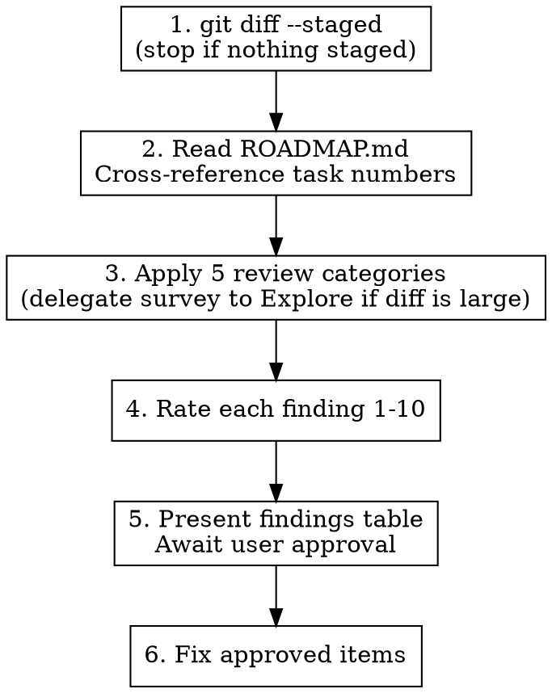

# Code Review — Staged Files Workflow

Read the staged diff. Find real problems. Present them in a table. Fix what the user approves.

## Scope

WHAT THIS SKILL DOES:
  - Review `git diff --staged` for bugs, extractions, TODOs, abstractions
  - Cross-reference ROADMAP.md for tracked task numbers
  - Rate each finding 1-10 priority
  - Present findings as a table
  - Fix items the user approves

WHAT THIS SKILL DOES NOT DO:
  - Comprehensive language-specific checklist (use `/elixir-code-review` or similar)
  - Review unstaged or committed code (scope is staged files only)
  - Update ROADMAP.md / CHANGELOG.md / CLAUDE.md — that's the committer's job (or `task-driver`'s). Reviewers surface doc gaps as findings; they don't write the doc edits.
  - Style/formatting checks (use linters)

**Why review-only on docs:** if the reviewer silently rewrites CHANGELOG during review, the committer's mental model diverges from the diff they'll actually push. Reviewers report; committers decide.

## Workflow



**No plan mode.** A code review is a report, not a design proposal — the findings table IS the artifact the user approves against. Plan mode would force a ceremony around a table you're going to read in two seconds. If any *individual* fix is large enough to need its own design, enter plan mode scoped to that one fix before applying it; don't blanket the whole review.

### Step 1: Read Staged Changes

```bash
git diff --staged
```

If nothing is staged, tell the user and stop. Do NOT silently review unstaged changes — the scope of the review is the commit the user is *about* to make.

### Step 2: Read ROADMAP.md

Read `ROADMAP.md` (or the project's equivalent task doc) before reviewing. You need to know:

- Which task numbers exist (so you can reference them in `TODO(Task N)` markers)
- Whether the staged diff appears to complete a tracked task (flag as a finding if it does but ROADMAP still shows ⬜ — don't flip the status yourself)

### Step 3: Apply Review Categories

Review all staged changes against the 5 categories below. Language shows up in *examples*, not in workflow — the categories themselves are language-agnostic.

**Delegate the diff survey to an Explore subagent** when the staged set touches ~20+ files, or when a finding would need cross-file tracing (e.g., "is this helper called anywhere else?", "does any other module inline the same constant?"). Push the raw Grep/Glob work to Explore; keep judgment and synthesis in the main session. Explore returns a compact report — file:line pairs and brief findings — instead of pouring hundreds of raw matches into main context. For small diffs (a handful of files, no cross-file questions), review inline.

#### Category 1: Bugs & Logic Errors

Code that will fail at runtime or produce incorrect results:

- **Null/nil paths**: What happens when this value is nil/None/null?
- **Type confusion**: String vs atom keys, float equality, cross-type comparison
- **Silent failures**: Discarded return values, catch-all error handlers, `with` without `else`
- **Unreachable code**: Dead branches, impossible conditions
- **Concurrency bugs**: Race conditions, deadlocks, unhandled messages

**Confidence filter**: only report if you can name the specific input that triggers the bug. "Looks suspicious" is not a finding — it's noise that trains the user to ignore you. If you think something is off but can't demonstrate the trigger, mark it *discuss* (see rating scale below) rather than *bug*.

#### Category 2: Missing Extractions

Two kinds to look for:

**Code extractions** — code that should be in separate functions/modules:
- Function doing 2+ unrelated things → split
- Deeply nested logic → extract inner block
- Repeated inline logic (even 2x) → extract to named function
- Long parameter lists → extract to struct/config

**Data extractions** — data that should be extracted from its container:
- Hardcoded values in function bodies → module attributes/constants
- Inline JSON/map structures → named constants or config
- Magic strings/numbers → named references
- Response data accessed deep in call chains → extract at boundary, pass structured

#### Category 3: Missing TODO Markers

Temporary code must have `TODO:` markers so static analysis (Credo, clippy, golangci-lint with custom linters) can track it:

- "For now, we use..." → needs `TODO:`
- "Currently..." / "Temporarily..." → needs `TODO:`
- "In production, this should..." → needs `TODO:`
- Hardcoded values that should be configurable → needs `TODO:`
- Workarounds and quick fixes → needs `TODO:`

**Cross-reference ROADMAP.md**: if the TODO relates to a tracked task, reference it: `TODO(Task 42): ...`. If the work is real but not yet in the roadmap, flag it as a finding — the committer (or `task-driver` later) adds the entry.

#### Category 4: Abstraction Opportunities

3+ similar patterns that could be unified:

- **Elixir**: Macro DSL, `@before_compile` accumulation, protocol implementation
- **Rust**: Generic function, trait + impl, procedural macro
- **Go**: Interface + implementations, code generation, generic function
- **Any language**: Shared function, configuration-driven dispatch, template

Flag only when the pattern is stable and well-understood — three examples of similar shape across well-separated contexts. Premature abstraction is worse than duplication: the wrong abstraction forces every future change to pay the "reshape the abstraction" tax.

#### Category 5: Actionable TODOs

TODOs in the staged diff that are resolvable RIGHT NOW:

- TODO says "add error handling" and context is clear → add it
- TODO says "extract to function" and the function boundary is obvious → do it
- TODO references a task that's being completed in this diff → resolve it

**Flag them as findings with priority, don't silently fix them.** The user's approval in Step 5 is what turns a finding into an edit. Don't defer what's already implementable — *and* don't skip the approval step.

### Step 4: Rate Each Finding

Use this scale. It collapses cleanly onto the priority bands the user actually cares about:

| Priority | Band | Meaning | Default action if approved |
|----------|------|---------|---------------------------|
| 9-10 | critical | Bug that will crash or corrupt data | Fix before commit |
| 7-8 | high | Logic error, security issue, or clear extraction win | Fix before commit |
| 5-6 | medium | Missing extraction, worth-doing abstraction | Fix if quick, else flag as `TODO(Task N)` |
| 3-4 | low | Missing TODO marker, minor cleanup | Add marker |
| 1-2 | cosmetic | Style, naming nits | Skip unless trivial |
| — | discuss | Judgment call, not a clear finding | Ask the user |

**"Discuss" is not a cop-out** — it's the honest category for "I'd lean this way, but it's a real design choice." Premature abstractions, architectural-flavor decisions, and subjective readability calls belong here, not in the 5-6 band.

### Step 5: Present Findings Table

Output a single table. No plan mode, no preamble — just the findings:

```
| # | Pri | Category    | File:Line           | Description                          | Proposed action |
|---|-----|-------------|---------------------|--------------------------------------|-----------------|
| 1 | 9   | bug         | lib/api.ex:42       | nil crash on missing response key    | Add pattern match + error tuple |
| 2 | 7   | extraction  | lib/parser.ex:15-30 | Inline JSON parsing → extract fn     | Extract parse_response/1 |
| 3 | 5   | abstraction | lib/handlers/*.ex   | 4 similar handle_event clauses       | Flag as TODO(Task N) |
| 4 | 4   | todo-marker | lib/config.ex:8     | Hardcoded timeout needs TODO(Task 7) | Add marker |
| 5 | 3   | actionable  | lib/auth.ex:22      | TODO: add rate limiting              | Resolve inline |
| 6 | —   | discuss     | lib/cache.ex:5      | TTL of 60s — aggressive? confirm     | Ask user |
```

After the table, end with: "Which of these should I apply? (all / 1,3,5 / none)". **Wait for the user's reply** — do not apply fixes unprompted.

### Step 6: Fix Approved Items

For each approved finding, apply the fix directly. Use `Edit`/`MultiEdit`. After all fixes, re-run `git diff` (the reviewer's edits are unstaged — see below) and summarize: "X fixes applied across Y files. The remaining findings (flagged as TODOs / marked discuss) are: …"

Do not run `git add` for the reviewer's own edits unless the user explicitly asks — let them stage the review changes themselves so the distinction between "author's work" and "reviewer's work" stays inspectable.

## Boundary Rule: Report Upstream Issues, Don't Patch Over Them

If during review you discover issues originating from **external dependencies** — malformed output from a generator, wrong data shapes from an extractor, broken schemas from a build tool, unexpected API response formats — **STOP, mark it, and report to the user** rather than compensating in the reviewed code.

**Mark with a FIXME comment** so Credo (or the language's equivalent linter) flags it as a warning:

```elixir
# FIXME(upstream): Generator output missing `exchange_id` field — fix in Go extractor, not here
```

- Use `FIXME` (not `TODO`) — Credo treats FIXME as higher priority than TODO
- Include `(upstream)` tag to distinguish from regular code issues
- Describe the source: which tool, which field, what's wrong

You fix the code under review. The user fixes the upstream source. Then you continue.

**After marking**, write a prompt for a fresh Claude Code session in the upstream codebase. Don't diagnose the root cause — describe the symptom and let the upstream expert do the analysis:

```
## Bug: [short description]

**Symptom:** [what you observed in the downstream code]
**Where observed:** [file:line in the code under review]
**Expected:** [what the output should look like]
**Actual:** [what you got instead]

Investigate and fix. The downstream code at [file:line] depends on this.
```

**Examples:**
- Generated code has wrong field names → `FIXME(upstream)`, don't rename downstream
- Extractor output is missing data or malformed JSON → `FIXME(upstream)`, don't add nil guards
- Build tool produces incorrect artifacts → `FIXME(upstream)`, don't compensate in application code
- API response shape changed → `FIXME(upstream)`, don't silently adapt the parser

**Why:** compensating for upstream issues masks real bugs. The compensation ships, the root cause persists, and future code inherits the same problem. A FIXME keeps it visible until the source is fixed.

## Common Mistakes

| Mistake | Fix |
|---------|-----|
| Reviewing all files, not just staged | Always start with `git diff --staged` |
| Skipping ROADMAP.md read | Read it BEFORE reviewing — task numbers matter |
| Flagging without priority | Every finding gets a 1-10 rating (or "discuss") |
| Fixing approved items before the user approves | Step 5 is the approval gate; Step 6 is where edits happen |
| Silently updating CHANGELOG/ROADMAP | Reviewer surfaces doc gaps; committer writes the entries |
| Reporting "looks suspicious" | Name the triggering input or mark it "discuss" |
| Running `grep`/`glob` all over a 40-file diff | Delegate the survey to an Explore subagent (Step 3) |
| Entering plan mode for the review itself | Plan mode is for an individual large fix, not the review report |
