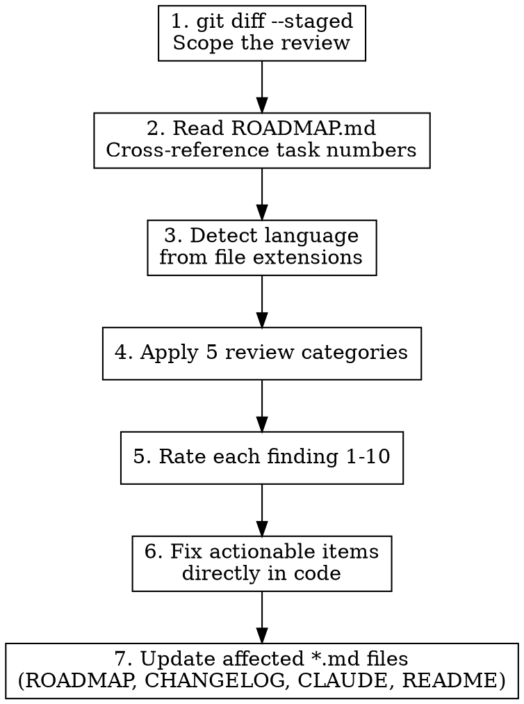

# Code Review — Staged Files Workflow

Review staged files for actionable findings. Fix what you can, flag what you can't.

## Scope

WHAT THIS SKILL DOES:
  - Review `git diff --staged` for bugs, extractions, TODOs, abstractions
  - Cross-reference ROADMAP.md for tracked task numbers
  - Rate each finding 1-10 priority
  - Fix resolvable issues directly
  - Update affected *.md files

WHAT THIS SKILL DOES NOT DO:
  - Comprehensive language-specific checklist (use /elixir-code-review or /rust-code-review)
  - Review unstaged or committed code (scope is staged files only)
  - Style/formatting checks (use linters)

## Workflow



### Step 1: Read Staged Changes

```bash
git diff --staged
```

If nothing is staged, tell the user and stop. Do NOT review unstaged changes.

### Step 2: Read ROADMAP.md

Read `ROADMAP.md` (or equivalent task tracking doc) to:
- Know which task numbers exist
- Cross-reference TODO markers against tracked tasks
- Identify if staged changes complete a tracked task

### Step 3: Detect Language

From file extensions in the diff. Apply language-appropriate patterns:
- `.ex`, `.exs` → Elixir (macros, pipe chains, pattern matching)
- `.rs` → Rust (ownership, lifetimes, trait bounds)
- `.go` → Go (error handling, goroutine safety, interface satisfaction)
- Mixed → apply each language's patterns to its files

### Step 4: Apply Review Categories

Review ALL staged changes against these 5 categories:

#### Category 1: Bugs & Logic Errors

Look for code that will fail at runtime or produce incorrect results:

- **Null/nil paths**: What happens when this value is nil/None/null?
- **Type confusion**: String vs atom keys, float equality, cross-type comparison
- **Silent failures**: Discarded return values, catch-all error handlers, `with` without `else`
- **Unreachable code**: Dead branches, impossible conditions
- **Concurrency bugs**: Race conditions, deadlocks, unhandled messages

**Confidence filter**: Only report if you can name the specific input that triggers the bug. "Looks suspicious" is not a finding.

#### Category 2: Missing Extractions

Two kinds of extraction to look for:

**Code extractions** — code that should be in separate functions/modules:
- Function doing 2+ unrelated things → split
- Deeply nested logic → extract inner block
- Repeated inline logic (even 2x) → extract to named function
- Long parameter lists → extract to struct/config

**Data extractions** — data that should be extracted from its container:
- Hardcoded values in function bodies → module attributes/constants
- Inline JSON/map structures → named constants or config
- Magic strings/numbers → named references
- Response data accessed deep in call chains → extract at boundary, pass structured

#### Category 3: Missing TODO Markers

Temporary code MUST have `TODO:` markers for static analysis detection:

- "For now, we use..." → needs `TODO:`
- "Currently..." / "Temporarily..." → needs `TODO:`
- "In production, this should..." → needs `TODO:`
- Hardcoded values that should be configurable → needs `TODO:`
- Workarounds and quick fixes → needs `TODO:`

**Cross-reference ROADMAP.md**: If the TODO relates to a tracked task, reference it: `TODO(Task 42): ...`

#### Category 4: Abstraction Opportunities

3+ similar patterns that could be unified:

- **Elixir**: Macro DSL, `@before_compile` accumulation, protocol implementation
- **Rust**: Generic function, trait + impl, procedural macro
- **Go**: Interface + implementations, code generation, generic function
- **Any language**: Shared function, configuration-driven dispatch, template

Flag only when the pattern is stable and well-understood. Premature abstraction is worse than duplication.

#### Category 5: Actionable TODOs

TODOs in the staged diff that are resolvable RIGHT NOW:

- TODO says "add error handling" and context is clear → add it
- TODO says "extract to function" and the function boundary is obvious → do it
- TODO references a task that's being completed in this diff → resolve it

**Fix these directly.** Don't flag them — resolve them. The whole point is: don't defer what's already implementable.

### Step 5: Rate Each Finding

Priority 1-10:

| Priority | Meaning | Action |
|----------|---------|--------|
| 9-10 | Bug that will crash or corrupt data | Fix immediately |
| 7-8 | Logic error or security issue | Fix before commit |
| 5-6 | Missing extraction or abstraction opportunity | Fix if quick, flag otherwise |
| 3-4 | Missing TODO marker, style issue | Add marker, note for later |
| 1-2 | Minor improvement, cosmetic | Skip unless trivial to fix |

### Step 6: Fix Actionable Items

For findings rated 5+, fix directly if possible. For findings rated 3-4, add TODO markers. For 1-2, mention but don't fix.

### Step 7: Update Documentation

Check and update whichever of these are affected:
- **ROADMAP.md** — Mark task status if a tracked task was completed (no counts/stats)
- **CHANGELOG.md** — Add entry under Unreleased
- **CLAUDE.md** — Update if repo structure, architecture, or conventions changed
- **README.md** — Update if user-facing features or setup changed

## Output Format

Present findings as a table:

```
| # | Pri | Category    | File:Line           | Description                          | Action      |
|---|-----|-------------|---------------------|--------------------------------------|-------------|
| 1 | 9   | bug         | lib/api.ex:42       | nil crash on missing response key    | Fixed       |
| 2 | 7   | extraction  | lib/parser.ex:15-30 | Inline JSON parsing → extract fn     | Fixed       |
| 3 | 5   | abstraction | lib/handlers/*.ex   | 4 similar handle_event clauses       | Flagged     |
| 4 | 4   | todo-marker | lib/config.ex:8     | Hardcoded timeout needs TODO(Task 7) | Added TODO  |
| 5 | 3   | actionable  | lib/auth.ex:22      | TODO: add rate limiting — done       | Resolved    |
```

After the table, summarize: X findings, Y fixed, Z flagged.

## Boundary Rule: Report Upstream Issues, Don't Patch Over Them

If during review you discover issues originating from **external dependencies** — malformed output from a generator, wrong data shapes from an extractor, broken schemas from a build tool, unexpected API response formats — **STOP, mark it, and report to the user** rather than compensating in the reviewed code.

**Mark with a FIXME comment** so Credo flags it as a warning:

```elixir
# FIXME(upstream): Generator output missing `exchange_id` field — fix in Go extractor, not here
```

- Use `FIXME` (not `TODO`) — Credo treats FIXME as higher priority than TODO
- Include `(upstream)` tag to distinguish from regular code issues
- Describe the source: which tool, which field, what's wrong

You fix the code under review. The user fixes the upstream source. Then you continue.

**Examples:**
- Generated code has wrong field names → `FIXME(upstream)`, don't rename downstream
- Extractor output is missing data or malformed JSON → `FIXME(upstream)`, don't add nil guards
- Build tool produces incorrect artifacts → `FIXME(upstream)`, don't compensate in application code
- API response shape changed → `FIXME(upstream)`, don't silently adapt the parser

**Why:** Compensating for upstream issues masks real bugs. The compensation ships, the root cause persists, and future code inherits the same problem. A FIXME ensures Credo keeps it visible until the source is fixed.

## Common Mistakes

| Mistake | Fix |
|---------|-----|
| Reviewing all files, not just staged | Always start with `git diff --staged` |
| Skipping ROADMAP.md read | Read it BEFORE reviewing — task numbers matter |
| Flagging without priority | Every finding gets a 1-10 rating |
| Flagging actionable TODOs instead of fixing them | If it's implementable now, implement it |
| Not updating docs | Check ROADMAP, CHANGELOG, CLAUDE.md, README after fixes |
| Reporting "looks suspicious" | Name the triggering input or don't report it |
