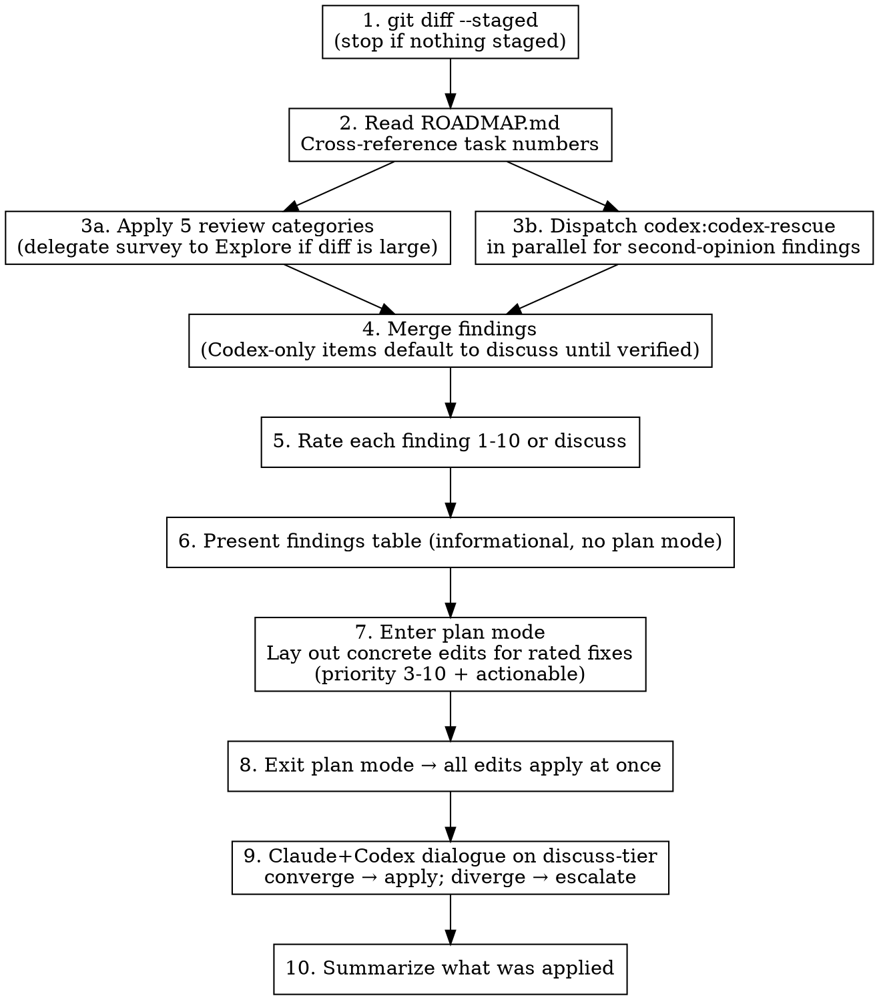

# Code Review — Staged Files Workflow

Read the staged diff. Find real problems. Present them in a table. Auto-apply rated fixes. Ask only about judgment calls.

## Scope

WHAT THIS SKILL DOES:
  - Review `git diff --staged` for bugs, extractions, TODOs, abstractions
  - Cross-reference ROADMAP.md for tracked task numbers
  - Rate each finding 1-10 priority (or `discuss`)
  - Present findings as a table (informational)
  - Auto-apply fixes for anything rated 3-10 and actionable TODOs
  - Ask the user only about `discuss`-tier findings

WHAT THIS SKILL DOES NOT DO:
  - Comprehensive language-specific checklist (use `/elixir-code-review` or similar)
  - Review unstaged or committed code (scope is staged files only)
  - Update ROADMAP.md / CHANGELOG.md / CLAUDE.md — that's the committer's job (or `task-driver`'s). Reviewers surface doc gaps as findings; they don't write the doc edits.
  - Style/formatting checks (use linters)

**Why review-only on docs:** if the reviewer silently rewrites CHANGELOG during review, the committer's mental model diverges from the diff they'll actually push. Reviewers report; committers decide.

## Workflow



**Plan mode is for the fix step, not the review step.** Presenting findings is a report — a plain table, no plan mode. But *applying* the fixes is the real design moment, and it deserves plan mode: concrete edits visible before anything is written, single exit-to-proceed approval for the whole batch, no cherry-picking ceremony. The user's approval is Claude Code's built-in "exit plan mode" UX — one click, all rated fixes applied. Discuss-tier items (Step 9) are handled separately via a Claude+Codex dialogue with ROADMAP.md in scope; the user is escalated to only on divergence.

### Step 1: Read Staged Changes

```bash
git diff --staged
```

If nothing is staged, tell the user and stop. Do NOT silently review unstaged changes — the scope of the review is the commit the user is *about* to make.

### Step 2: Read ROADMAP.md

Read `ROADMAP.md` (or the project's equivalent task doc) before reviewing. You need to know:

- Which task numbers exist (so you can reference them in `TODO(Task N)` markers)
- Whether the staged diff appears to complete a tracked task (flag as a finding if it does but ROADMAP still shows ⬜ — don't flip the status yourself)

### Step 3a: Apply Review Categories (Claude)

Review all staged changes against the 5 categories below. Language shows up in *examples*, not in workflow — the categories themselves are language-agnostic.

**Delegate the diff survey to an Explore subagent** when the staged set touches ~20+ files, or when a finding would need cross-file tracing (e.g., "is this helper called anywhere else?", "does any other module inline the same constant?"). Push the raw Grep/Glob work to Explore; keep judgment and synthesis in the main session. Explore returns a compact report — file:line pairs and brief findings — instead of pouring hundreds of raw matches into main context. For small diffs (a handful of files, no cross-file questions), review inline.

### Step 3b: Dispatch Codex Second-Opinion (Required, Parallel with 3a)

Dispatch the `codex:codex-rescue` agent **in parallel** with your own Category 1-5 pass. Give it the same staged diff and the same five categories. This step is not optional — see the "Second-Opinion Review (Required)" section below for the rationale.

Parallel dispatch matters: don't feed Codex your own findings first. Independent eyes catch what the other's confidence filter suppresses.

If Codex is unreachable or the agent errors out, continue with a single-reviewer pass and mark the closing summary "Codex unreachable — single-reviewer pass." Don't silently drop it.

#### Category 1: Bugs & Logic Errors

Code that will fail at runtime or produce incorrect results:

- **Null/nil paths**: What happens when this value is nil/None/null?
- **Type confusion**: String vs atom keys, float equality, cross-type comparison
- **Silent failures**: Discarded return values, catch-all error handlers, `with` without `else`
- **Unreachable code**: Dead branches, impossible conditions
- **Concurrency bugs**: Race conditions, deadlocks, unhandled messages

**Confidence filter**: only report if you can name the specific input that triggers the bug. "Looks suspicious" is not a finding — it's noise that trains the user to ignore you. If you think something is off but can't demonstrate the trigger, mark it *discuss* (see rating scale below) rather than *bug*.

#### Category 2: Missing Extractions

Two kinds to look for:

**Code extractions** — code that should be in separate functions/modules:
- Function doing 2+ unrelated things → split
- Deeply nested logic → extract inner block
- Repeated inline logic (even 2x) → extract to named function
- Long parameter lists → extract to struct/config

**Data extractions** — data that should be extracted from its container:
- Hardcoded values in function bodies → module attributes/constants
- Inline JSON/map structures → named constants or config
- Magic strings/numbers → named references
- Response data accessed deep in call chains → extract at boundary, pass structured

#### Category 3: Missing TODO Markers

Temporary code must have `TODO:` markers so static analysis (Credo, clippy, golangci-lint with custom linters) can track it:

- "For now, we use..." → needs `TODO:`
- "Currently..." / "Temporarily..." → needs `TODO:`
- "In production, this should..." → needs `TODO:`
- Hardcoded values that should be configurable → needs `TODO:`
- Workarounds and quick fixes → needs `TODO:`

**Cross-reference ROADMAP.md**: if the TODO relates to a tracked task, reference it: `TODO(Task 42): ...`. If the work is real but not yet in the roadmap, flag it as a finding — the committer (or `task-driver` later) adds the entry.

#### Category 4: Abstraction Opportunities

3+ similar patterns that could be unified:

- **Elixir**: Macro DSL, `@before_compile` accumulation, protocol implementation
- **Rust**: Generic function, trait + impl, procedural macro
- **Go**: Interface + implementations, code generation, generic function
- **Any language**: Shared function, configuration-driven dispatch, template

Flag only when the pattern is stable and well-understood — three examples of similar shape across well-separated contexts. Premature abstraction is worse than duplication: the wrong abstraction forces every future change to pay the "reshape the abstraction" tax.

#### Category 5: Actionable TODOs

TODOs in the staged diff that are resolvable RIGHT NOW:

- TODO says "add error handling" and context is clear → add it
- TODO says "extract to function" and the function boundary is obvious → do it
- TODO references a task that's being completed in this diff → resolve it

**List them in the findings table, then fix them in Step 7 (plan mode) with the rest of the rated findings.** Don't defer what's already implementable.

### Step 4: Merge Claude + Codex Findings

Wait for Codex to return, then merge both sets into a single findings list:

- **Corroborated** (both raised it) — collapse to one row. These are the highest-confidence findings.
- **Claude-only** — keep as-is. Apply your normal rating.
- **Codex-only** — tag the Description cell with `(codex)`. Default the priority to `discuss` until you independently verify it against the actual code. Verification means: open the file, confirm the claimed symbol / invariant / behavior exists and matches Codex's description. Only after verification can you assign a numeric priority. Per `critical-rules.md`: Codex findings look authoritative but frequently cite nonexistent functions, wrong imports, or mis-stated invariants — treat them as suggestions to investigate, never facts to accept.

### Step 5: Rate Each Finding

Use this scale. It collapses cleanly onto the priority bands the user actually cares about:

| Priority | Band | Meaning | Default action |
|----------|------|---------|----------------|
| 9-10 | critical | Bug that will crash or corrupt data | **Auto-apply** |
| 7-8 | high | Logic error, security issue, or clear extraction win | **Auto-apply** |
| 5-6 | medium | Missing extraction, worth-doing abstraction | **Auto-apply** (or add `TODO(Task N)` if the fix needs scoping beyond this commit) |
| 3-4 | low | Missing TODO marker, minor cleanup | **Auto-apply** |
| 1-2 | cosmetic | Style, naming nits | List only; skip unless trivial |
| — | discuss | Judgment call, not a clear finding | **Ask the user** |

**"Discuss" means "two reasoners should think about this together"** — it's the honest category for "I'd lean this way, but it's a real trade-off." Premature abstractions, architectural-flavor decisions, and subjective readability calls belong here, not in the 5-6 band. If you rated it numerically, you're committing to the fix; use `discuss` only when you genuinely can't. Step 9 runs these through a Claude+Codex dialogue — the user is escalated to only on divergence.

### Step 6: Present Findings Table (Informational, No Plan Mode)

Output a single table. No plan mode at this step — it's a report, not a design proposal. No preamble, no "Insight" blocks, no "Not flagged (verified clean)" appendix. Just the findings.

```
| # | Pri | Category    | File:Line           | Description                          | Proposed action |
|---|-----|-------------|---------------------|--------------------------------------|-----------------|
| 1 | 9   | bug         | lib/api.ex:42       | nil crash on missing response key    | Add pattern match + error tuple |
| 2 | 7   | extraction  | lib/parser.ex:15-30 | Inline JSON parsing → extract fn     | Extract parse_response/1 |
| 3 | 5   | abstraction | lib/handlers/*.ex   | 4 similar handle_event clauses       | Flag as TODO(Task N) |
| 4 | 4   | todo-marker | lib/config.ex:8     | Hardcoded timeout needs TODO(Task 7) | Add marker |
| 5 | 3   | actionable  | lib/auth.ex:22      | TODO: add rate limiting              | Resolve inline |
| 6 | —   | discuss     | lib/cache.ex:5      | TTL of 60s — aggressive? confirm     | Ask user |
```

**Keep descriptions terse** — 10 words max per cell, so the table renders. Long reasoning goes in a follow-up note if needed, not in the table.

### Step 7: Enter Plan Mode with Concrete Edits

After the findings table, **enter plan mode** (`ExitPlanMode` is what you'll call once the plan is written). Inside the plan, lay out every rated fix (priority 3-10 and every `actionable` entry) as a concrete edit — not prose descriptions, actual file:line + before/after snippets or specific `Edit` operations.

Skip priority 1-2 unless the fix is a single-line trivial edit.

Do NOT include `discuss`-tier findings in the plan — those go to Step 9. Plan mode is for decided fixes only.

The user's **single exit-to-proceed** approves the whole batch. No cherry-picking. If they want to drop individual items, they can say so before exiting plan mode and you revise the plan; the default is "all of it."

### Step 8: Apply the Plan

Once the user exits plan mode, apply every edit in the plan using `Edit`/`MultiEdit`. No further prompts.

Do not run `git add` for the reviewer's own edits unless the user explicitly asks — let them stage the review changes themselves so the distinction between "author's work" and "reviewer's work" stays inspectable.

### Step 9: Claude+Codex Dialogue on `discuss`-Tier

If no `discuss` rows exist, skip this step.

Otherwise, resolve each `discuss` finding via a **Claude+Codex dialogue** with ROADMAP.md in scope (already read in Step 2). For each item:

1. You (Claude) write a short position: proposed resolution + reasoning, factoring in roadmap direction, codebase conventions, and the specific trade-off at hand. Keep it to ~3 sentences.
2. Dispatch `codex:codex-rescue` with the finding, your position, and ROADMAP.md excerpts. Ask for its independent resolution and reasoning.
3. Compare:
   - **Convergence** (same resolution, or resolutions that differ only in minor wording) → apply the fix directly. Record both reasoners' short justification in the Step 10 summary so the user can audit.
   - **Divergence** (different resolutions, or one says "apply X" and the other says "don't do this") → escalate to the user with both positions laid out side by side. Wait for their decision. Apply what they choose.

**Do not default to "ask the user"** — the dialogue is the default path. The user is the escalation target, not the first responder. This protects the user's attention for genuine design disagreements and uses the two-model pass for everything else.

After dialogue-resolved fixes are applied (or user-resolved ones, on divergence), move to the summary.

### Step 10: Summarize

After all auto-fixes and any dialogue-resolved or user-resolved discuss-tier fixes are applied, summarize:
- "N fixes auto-applied across M files"
- List of files touched (so the user can `git diff` them)
- Any priority 1-2 items that were skipped
- Each discuss-tier item and how it was resolved: `dialogue-resolved` (with the convergent reasoning in ~1 sentence), `user-resolved` (with the user's decision), or `declined`/`deferred`
- Closing line: either `dual-reviewer pass` or `Codex unreachable — single-reviewer pass` (honest either way)

## Boundary Rule: Report Upstream Issues, Don't Patch Over Them

If during review you discover issues originating from **external dependencies** — malformed output from a generator, wrong data shapes from an extractor, broken schemas from a build tool, unexpected API response formats — **STOP, mark it, and report to the user** rather than compensating in the reviewed code.

**Mark with a FIXME comment** so Credo (or the language's equivalent linter) flags it as a warning:

```elixir
# FIXME(upstream): Generator output missing `exchange_id` field — fix in Go extractor, not here
```

- Use `FIXME` (not `TODO`) — Credo treats FIXME as higher priority than TODO
- Include `(upstream)` tag to distinguish from regular code issues
- Describe the source: which tool, which field, what's wrong

You fix the code under review. The user fixes the upstream source. Then you continue.

**After marking**, write a prompt for a fresh Claude Code session in the upstream codebase. Don't diagnose the root cause — describe the symptom and let the upstream expert do the analysis:

```
## Bug: [short description]

**Symptom:** [what you observed in the downstream code]
**Where observed:** [file:line in the code under review]
**Expected:** [what the output should look like]
**Actual:** [what you got instead]

Investigate and fix. The downstream code at [file:line] depends on this.
```

**Examples:**
- Generated code has wrong field names → `FIXME(upstream)`, don't rename downstream
- Extractor output is missing data or malformed JSON → `FIXME(upstream)`, don't add nil guards
- Build tool produces incorrect artifacts → `FIXME(upstream)`, don't compensate in application code
- API response shape changed → `FIXME(upstream)`, don't silently adapt the parser

**Why:** compensating for upstream issues masks real bugs. The compensation ships, the root cause persists, and future code inherits the same problem. A FIXME keeps it visible until the source is fixed.

## Second-Opinion Review (Required)

Every staged review runs a Codex second-opinion pass. This is not optional, not opt-in, not "for high-stakes diffs." Every review.

**Why mandatory.** Left optional, it never gets invoked — neither the user nor Claude thinks to ask. The opt-in framing looks reasonable but produces a single-reviewer pass in practice, every time.

**The calibration both reviewers need to respect:**

- **Claude (self-review) under-flags.** The confidence filter in Category 1 ("only report if you can name the specific input that triggers the bug") suppresses real issues alongside noise. Codex's independent pass catches what the filter hides.
- **Codex over-flags.** Codex frequently asserts things that look wrong in isolation but are correct in context (wrong imports, nonexistent functions, mis-stated invariants). Its reviews read authoritative but contain errors. Per `critical-rules.md`, treat Codex findings as *suggestions to investigate*, never facts to accept.

**How it plugs into the flow:**

- **Step 3b** — dispatch `codex:codex-rescue` in parallel with Claude's own review pass. Same diff, same five categories, no priming with Claude's findings.
- **Step 4** — merge the two result sets. Corroborated findings are the highest-confidence. Codex-only findings default to `discuss` until you verify them against the actual code.
- **Step 9** — resolve `discuss`-tier via Claude+Codex dialogue with ROADMAP.md in scope. Convergence applies the fix; divergence escalates to the user.

**Failure mode.** If Codex is unreachable or errors out, continue single-reviewer and close with `Codex unreachable — single-reviewer pass` in the summary. Don't silently drop the second pass — mark it.

**Discipline note.** The mandatory-second-opinion rule does the same work that TDD's "no code without a failing test first" rule does: it removes a decision point where the motivated agent (you) can rationalize its way out of the discipline. Opt-in disciplines don't stick.

## Common Mistakes

| Mistake | Fix |
|---------|-----|
| Reviewing all files, not just staged | Always start with `git diff --staged` |
| Skipping ROADMAP.md read | Read it BEFORE reviewing — task numbers matter, and Step 9's dialogue depends on it |
| Skipping the Codex second-opinion pass | Step 3b is required. If Codex is unreachable, mark the summary `Codex unreachable — single-reviewer pass`; don't drop silently |
| Priming Codex with Claude's findings | Dispatch Codex in parallel with 3a, not after. Independent eyes catch what the other's filter suppresses |
| Accepting Codex-only findings at face value | Default them to `discuss` until verified against the actual code (Codex over-flags) |
| Defaulting `discuss`-tier to "ask the user" | Step 9 is a Claude+Codex dialogue; user is the escalation target on divergence, not the first responder |
| Flagging without priority | Every finding gets a 1-10 rating (or "discuss") |
| Asking the user to hand-pick "1, 2, 3" from the table | Rated findings auto-apply via plan mode; discuss-tier routes through Step 9 dialogue |
| Entering plan mode to present the findings table | Step 6 is a report, not a plan — no plan mode there. Plan mode is Step 7 (concrete edits) |
| Silently updating CHANGELOG/ROADMAP | Reviewer surfaces doc gaps; committer writes the entries |
| Reporting "looks suspicious" | Name the triggering input or mark it "discuss" |
| Running `grep`/`glob` all over a 40-file diff | Delegate the survey to an Explore subagent (Step 3a) |
| Emitting `★ Insight` blocks or "Not flagged (verified clean)" appendices | The findings table is the entire deliverable — no headers, no afterword |
| Using vertical `#: 1 / Pri: 4 / …` field lists instead of the table | Output MUST be a markdown table. Keep description cells ≤10 words so it renders |
