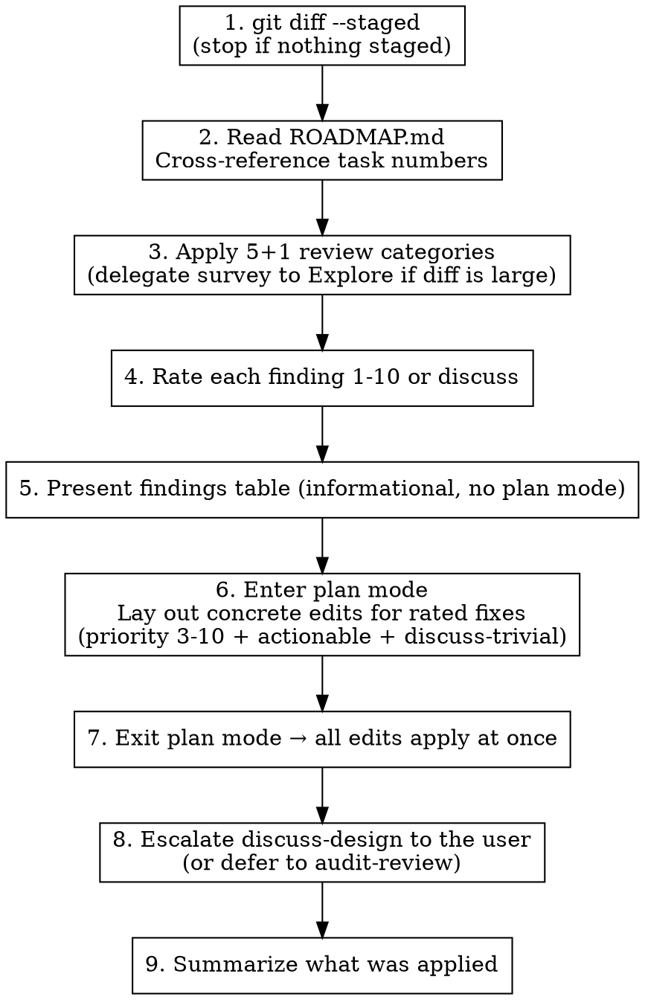

# Code Review — Staged Files Workflow

Read the staged diff. Find real problems. Present them in a table. Auto-apply rated fixes. Escalate design questions to the user.

## Position in the Three-Tier Review Chain

`code-review` is the **pre-commit triage** layer — single-reviewer pass with auto-apply. The dual-reviewer pass (mandatory Codex + Claude+Codex dialogue) runs in `audit-review` post-PR-create / post-merge.

| Skill | When | Reviewer | Auto-mode? |
|---|---|---|---|
| `code-review` (this skill) | Pre-commit — `git diff --staged` | Single (Claude) | Plan-mode-with-auto-apply (one user gate: exit-plan-to-apply) |
| `commit-review` | Pre-merge cloud-agent PR — narrowed correctness gate | Single (Claude) | Auto-merge on ✅ + green CI + cloud-agent branch (zero gates for the cloud-agent path) |
| `audit-review` | Post-commit / post-merge — committed code | Dual (Claude + mandatory Codex), with dialogue | Fully autonomous (zero gates) |

Same 5+1 categories across all three layers. `commit-review` runs only Cat 1 (Bugs) + a thin slice of Cat 6 (`@doc`/`@spec` correctness drift) — hygiene categories deferred to audit-review post-merge. `audit-review` skips plan-mode (the `audit(...)` commit IS the inspectable artifact).

**Why no Codex at this layer?** `audit-review` auto-fires after `gh pr create` (per `worktree-workflow`) and after every cloud-agent merge — every commit reaches the dual-reviewer pass either way. Running Codex pre-commit AND post-PR-create is redundant work on the same code; the post-PR-create pass has the committed view, ROADMAP scope, and all hygiene categories, so it's the better place to spend the dual-reviewer cost. Pre-commit stays fast.

**When NOT to use `code-review`:** if the code is already committed (use `audit-review`), or if reviewing a cloud-agent PR pre-merge (use `commit-review`).

## Scope

WHAT THIS SKILL DOES:
  - Review `git diff --staged` for bugs, extractions, TODOs, abstractions, doc gaps
  - Cross-reference ROADMAP.md for tracked task numbers
  - Rate each finding 1-10 priority (or `discuss`)
  - Present findings as a table (informational)
  - Auto-apply fixes for anything rated 3-10 and actionable TODOs — **including doc updates** (ROADMAP.md, CHANGELOG.md, CLAUDE.md, README.md)
  - Escalate `discuss-design` to the user (no Codex dialogue at this layer — `audit-review` runs it post-PR-create / post-merge)

WHAT THIS SKILL DOES NOT DO:
  - Dispatch Codex (deferred to `audit-review` for the full dual-reviewer + dialogue pass)
  - Run Claude+Codex dialogue on `discuss-design` items (deferred to `audit-review`)
  - Comprehensive language-specific checklist (use `/elixir-code-review` or similar)
  - Review unstaged or committed code (scope is staged files only)
  - Style/formatting checks (use linters)
  - Stage the reviewer's own doc edits (Step 7 — leaves them unstaged so the committer inspects before `git add`)

**Doc updates are findings, not silent edits.** When the staged diff completes a tracked task, omits a CHANGELOG entry, or invalidates a CLAUDE.md claim, the gap appears as a Category 6 row in the findings table, gets rated, and flows through plan mode (Step 6) like every other fix. The user sees the proposed `ROADMAP.md` / `CHANGELOG.md` / `CLAUDE.md` / `README.md` edits **before** approving the plan — nothing happens silently. After plan mode exits, the edits apply but stay unstaged (Step 7), so the committer can `git diff` and decide what to add to the commit.

## Workflow



**Plan mode is for the fix step, not the review step.** Presenting findings is a report — a plain table, no plan mode. But *applying* the fixes is the real design moment, and it deserves plan mode: concrete edits visible before anything is written, single exit-to-proceed approval for the whole batch, no cherry-picking ceremony. The user's approval is Claude Code's built-in "exit plan mode" UX — one click, all rated fixes applied. `discuss-design` items (Step 8) are surfaced separately for user decision; the user can also defer them to `audit-review`'s dialogue pass.

### Step 1: Read Staged Changes

```bash
git diff --staged
```

If nothing is staged, tell the user and stop. Do NOT silently review unstaged changes — the scope of the review is the commit the user is *about* to make.

### Step 2: Read ROADMAP.md

Read `ROADMAP.md` (or the project's equivalent task doc) before reviewing. You need to know:

- Which task numbers exist (so you can reference them in `TODO(Task N)` markers)
- Whether the staged diff appears to complete a tracked task (flag as a finding if it does but ROADMAP still shows ⬜ — don't flip the status yourself)

### Step 3: Apply Review Categories

Review all staged changes against the 5+1 categories below. Language shows up in *examples*, not in workflow — the categories themselves are language-agnostic.

**Delegate the diff survey to an Explore subagent** when the staged set touches ~20+ files, or when a finding would need cross-file tracing (e.g., "is this helper called anywhere else?", "does any other module inline the same constant?"). Push the raw Grep/Glob work to Explore; keep judgment and synthesis in the main session. Explore returns a compact report — file:line pairs and brief findings — instead of pouring hundreds of raw matches into main context. For small diffs (a handful of files, no cross-file questions), review inline.

#### Category 1: Bugs & Logic Errors

Code that will fail at runtime or produce incorrect results:

- **Null/nil paths**: What happens when this value is nil/None/null?
- **Type confusion**: String vs atom keys, float equality, cross-type comparison
- **Silent failures**: Discarded return values, catch-all error handlers, `with` without `else`
- **Unreachable code**: Dead branches, impossible conditions
- **Concurrency bugs**: Race conditions, deadlocks, unhandled messages
- **Untested error paths added in this diff**: an error tuple, `raise` site, or new `else`/catch branch added in the staged code that no staged test exercises. The trigger is concrete (the input that produces the error), so this clears the confidence filter. Scope is **the diff itself** — not "module coverage is below X%" (which rots every commit). Pattern: scan the diff for new `{:error, _}` / `raise` / new branches, then confirm a staged test names each one. If not, the branch ships unverified — frequently with a wrong tuple shape, wrong atom, or wrong message.

**Confidence filter**: only report if you can name the specific input that triggers the bug. "Looks suspicious" is not a finding — it's noise that trains the user to ignore you. If you think something is off but can't demonstrate the trigger, mark it *discuss-design* (see rating scale below) rather than *bug*.

#### Category 2: Missing Extractions

Two kinds to look for:

**Code extractions** — code that should be in separate functions/modules:
- Function doing 2+ unrelated things → split
- Deeply nested logic → extract inner block
- Repeated inline logic (even 2x) → extract to named function
- Long parameter lists → extract to struct/config

**Data extractions** — data that should be extracted from its container:
- Hardcoded values in function bodies → module attributes/constants
- Inline JSON/map structures → named constants or config
- Magic strings/numbers → named references
- Response data accessed deep in call chains → extract at boundary, pass structured

#### Category 3: Missing TODO Markers

Temporary code must have `TODO:` markers so static analysis (Credo, clippy, golangci-lint with custom linters) can track it:

- "For now, we use..." → needs `TODO:`
- "Currently..." / "Temporarily..." → needs `TODO:`
- "In production, this should..." → needs `TODO:`
- Hardcoded values that should be configurable → needs `TODO:`
- Workarounds and quick fixes → needs `TODO:`

**Cross-reference ROADMAP.md**: if the TODO relates to a tracked task, reference it: `TODO(Task 42): ...`. If the work is real but not yet in the roadmap, flag it as a finding — the committer (or `task-driver` later) adds the entry.

#### Category 4: Abstraction Opportunities

3+ similar patterns that could be unified:

- **Elixir**: Macro DSL, `@before_compile` accumulation, protocol implementation
- **Rust**: Generic function, trait + impl, procedural macro
- **Go**: Interface + implementations, code generation, generic function
- **Any language**: Shared function, configuration-driven dispatch, template

Flag only when the pattern is stable and well-understood — three examples of similar shape across well-separated contexts. Premature abstraction is worse than duplication: the wrong abstraction forces every future change to pay the "reshape the abstraction" tax.

#### Category 5: Actionable TODOs

TODOs in the staged diff that are resolvable RIGHT NOW:

- TODO says "add error handling" and context is clear → add it
- TODO says "extract to function" and the function boundary is obvious → do it
- TODO references a task that's being completed in this diff → resolve it

**List them in the findings table, then fix them in Step 6 (plan mode) with the rest of the rated findings.** Don't defer what's already implementable.

#### Category 6: Documentation Gaps

Doc edits the staged diff implies but doesn't make. The reviewer **writes** these (via plan mode), not just flags them. Two scopes — both diff-structural, neither relies on counts that age:

**External docs** (markdown files at repo root):
- **ROADMAP.md** — staged diff completes a tracked task but ROADMAP still shows ⬜ → flip to ✅ and update the phase summary / Current Focus
- **CHANGELOG.md** — meaningful change (feature, fix, behavior change, new dep, schema change) with no entry under `## [Unreleased]` → add one
- **CLAUDE.md** — staged diff changes repo structure, conventions, hook behavior, command surface, or anything CLAUDE.md asserts → update the affected section
- **README.md** — user-facing feature, install step, or example invalidated by the diff → update
- **Project-specific tracking docs** — touched-file is referenced in another doc that now disagrees with reality → update

**In-code docs** (docstrings, type signatures on staged functions):
- **`@doc` enumerates a subset of returns/raises** — docstring lists 3 error tuples but the function returns 4 (or vice versa). Trigger is concrete: name the missing/spurious atom. Same shape for `raise`-able exceptions, return shapes, and option keys.
- **Public function added with no docstring** — Elixir `@doc`, Rust `///`, Go doc-comment, Python docstring. Skip private helpers; flag exported surface only.
- **`@spec` / type signature missing on public function added in the diff** — Elixir `@spec`, TypeScript signature, Python type hints if the project uses them. Project convention rules: if neighbors have specs, the new function needs one too.
- **Existing docstring example invalidated by the diff** — function renamed, return shape changed, parameter added/removed, but the `## Examples` block still shows the old shape. The example will mislead the next reader.

**Rating defaults:**

External:
- Missing CHANGELOG entry for a feature/fix → **5-7** (medium-high; expected hygiene)
- ROADMAP status flip when task is clearly complete → **6-8** (committer relies on this for next session)
- CLAUDE.md drift on a load-bearing claim (architecture, hook list, conventions) → **7-9** (other sessions read this)
- README drift on user-facing surface → **6-8**
- Cosmetic doc nit (typo, wording) → **1-2** (skip unless trivial)

In-code:
- `@doc` doesn't enumerate all error atoms / return shapes a function emits → **3-5** (medium; agents and Dialyzer-equivalents lean on this)
- Public function added with no docstring → **4-6** (higher when it's an exported API surface; lower for internal-but-public helpers)
- `@spec` missing on public function in a project that uses specs elsewhere → **4-6**
- Docstring example invalidated by the diff (will mislead readers) → **5-7**

**When in doubt, mark `discuss-design`** — e.g., "is this change worth a CHANGELOG entry, or is it noise?" The user decides at Step 8 (or defers to `audit-review`'s dialogue pass).

**Don't invent activity.** If the diff doesn't actually complete the task, don't flip ROADMAP. If you can't summarize the change in one CHANGELOG line without speculation, the entry isn't yours to write — flag as `discuss-design`. Same rule for in-code docs: if you don't know which error atoms the function actually returns, don't fabricate the enumeration — read the code or mark `discuss-design`.

### Step 4: Rate Each Finding

Use this scale. It collapses cleanly onto the priority bands the user actually cares about:

| Priority | Band | Meaning | Default action |
|----------|------|---------|----------------|
| 9-10 | critical | Bug that will crash or corrupt data | **Auto-apply** |
| 7-8 | high | Logic error, security issue, or clear extraction win | **Auto-apply** |
| 5-6 | medium | Missing extraction, worth-doing abstraction | **Auto-apply** (or add `TODO(Task N)` if the fix needs scoping beyond this commit) |
| 3-4 | low | Missing TODO marker, minor cleanup | **Auto-apply** |
| 1-2 | cosmetic | Style, naming nits | List only; skip unless trivial |
| — | discuss-trivial | Lean apply; cognitively reversible (single coherent change, no new public surface, auditable in one read) | **Apply now**, note the alternative + reasoning in the Step 9 summary |
| — | discuss-design | Genuine trade-off — structural, multi-file ripple, hard-to-revert, or roadmap-shaping | **Step 8 user escalation** (or deferred to `audit-review`'s dialogue pass) |

**The `discuss` split exists because escalation cost is roughly fixed but fix cost varies wildly.** For a 2-line `@doc` extension or a rename, surfacing the trade-off to the user costs more attention than the diff itself contains. The triage question: *would the user-attention cost exceed the fix-and-revert cost?*

- **`discuss-trivial`** — yes, escalation would dominate. The change is **cognitively reversible**: single coherent diff (revert it as a unit, not piecewise), no new public API surface that callers will start depending on, no structural cascade, and the user can audit it in one read. Examples: extending a `@doc` to enumerate a missing error atom, a single-file rename, a localized extraction with no callsite churn. Apply, note the alternative in the summary; the user reads the diff and reverts in one line if they disagree. The user's attention is the audit, not the up-front decision.
- **`discuss-design`** — no, the decision actually shapes the codebase. User decision (or audit-review's dual-reviewer dialogue) earns its keep here: premature abstractions, architectural-flavor decisions, multi-file structural changes, new public API surface, anything tied to roadmap direction. Line count isn't the gate — *ripple* is. A 5-line `@spec` tightening that breaks N callers is `discuss-design`; a 40-line clean extraction inside one module is `discuss-trivial`.

If you rated it numerically (1-10), you're committing to the fix without escalation. Use `discuss-trivial` when you'd lean apply but want the alternative on the record. Use `discuss-design` when you genuinely can't decide alone and the cost of being wrong is high.

### Step 5: Present Findings Table (Informational, No Plan Mode)

Output a single table. No plan mode at this step — it's a report, not a design proposal. No preamble, no "Insight" blocks, no "Not flagged (verified clean)" appendix. Just the findings.

```
| # | Pri | Category    | File:Line           | Description                          | Proposed action |
|---|-----|-------------|---------------------|--------------------------------------|-----------------|
| 1 | 9   | bug         | lib/api.ex:42       | nil crash on missing response key    | Add pattern match + error tuple |
| 2 | 7   | extraction  | lib/parser.ex:15-30 | Inline JSON parsing → extract fn     | Extract parse_response/1 |
| 3 | 5   | abstraction | lib/handlers/*.ex   | 4 similar handle_event clauses       | Flag as TODO(Task N) |
| 4 | 4   | todo-marker | lib/config.ex:8     | Hardcoded timeout needs TODO(Task 7) | Add marker |
| 5 | 3   | actionable  | lib/auth.ex:22      | TODO: add rate limiting              | Resolve inline |
| 6 | 7   | doc-gap     | CHANGELOG.md        | No [Unreleased] entry for parser fix | Add entry |
| 7 | 6   | doc-gap     | ROADMAP.md          | Task 7 done in diff but still ⬜      | Flip to ✅, update phase summary |
| 8 | —   | discuss-trivial | lib/parser.ex:90    | @doc lists 3 errors, fn returns 4   | Apply, note alt in summary |
| 9 | —   | discuss-design  | lib/cache.ex:5      | TTL of 60s — aggressive? Affects N callers | Step 8 user decision (or defer to audit) |
```

**Keep descriptions terse** — 10 words max per cell, so the table renders. Long reasoning goes in a follow-up note if needed, not in the table.

### Step 6: Enter Plan Mode with Concrete Edits

After the findings table, **enter plan mode** (`ExitPlanMode` is what you'll call once the plan is written). Inside the plan, lay out every rated fix (priority 3-10 and every `actionable` entry) as a concrete edit — not prose descriptions, actual file:line + before/after snippets or specific `Edit` operations.

Skip priority 1-2 unless the fix is a single-line trivial edit.

Include `discuss-trivial` findings in the plan — they auto-apply with the rest, and the alternative + reasoning gets recorded in the Step 9 summary so the user can revert in one line if they disagree. Do NOT include `discuss-design` findings — those go to Step 8. Plan mode is for decided fixes only.

The user's **single exit-to-proceed** approves the whole batch. No cherry-picking. If they want to drop individual items, they can say so before exiting plan mode and you revise the plan; the default is "all of it."

### Step 7: Apply the Plan

Once the user exits plan mode, apply every edit in the plan using `Edit`/`MultiEdit`. No further prompts.

Do not run `git add` for the reviewer's own edits unless the user explicitly asks — let them stage the review changes themselves so the distinction between "author's work" and "reviewer's work" stays inspectable.

### Step 8: Escalate `discuss-design` to the User

If no `discuss-design` rows exist, skip this step. (`discuss-trivial` items already applied via plan mode in Step 7 — their alternatives go in the Step 9 summary, not this escalation.)

Otherwise, surface each `discuss-design` finding to the user in a brief paragraph:

1. The trade-off (structural cost, ripple, what changes downstream)
2. Your leaning, with one-sentence reasoning
3. The alternative — what happens if we don't apply

Wait for their decision. Apply what they choose.

**Defer-to-audit option.** The user can also say "let audit handle it" — the `discuss-design` item drops to the `audit-review` queue, which runs a Claude+Codex dialogue post-PR-create / post-merge (per `worktree-workflow.md`). That's the lower-friction path when the user doesn't want to context-switch into the design question right now. Note the deferral in the Step 9 summary so the user knows the dual-reviewer pass will revisit it.

After user-resolved or deferred items are handled, move to the summary.

### Step 9: Summarize

After all auto-fixes and any user-resolved discuss-design fixes are applied, summarize:
- "N fixes auto-applied across M files"
- List of files touched (so the user can `git diff` them)
- Any priority 1-2 items that were skipped
- Each `discuss`-tier item and how it was resolved: `applied-as-trivial` (with the alternative + reasoning in ~1 sentence so the user can decide whether to revert), `user-resolved` (with the user's decision), `deferred-to-audit` (audit-review will run the Claude+Codex dialogue), or `declined`/`deferred`

## Boundary Rule: Report Upstream Issues, Don't Patch Over Them

If during review you discover issues originating from **external dependencies** — malformed output from a generator, wrong data shapes from an extractor, broken schemas from a build tool, unexpected API response formats — **STOP, mark it, and report to the user** rather than compensating in the reviewed code.

**Mark with a FIXME comment** so Credo (or the language's equivalent linter) flags it as a warning:

```elixir
# FIXME(upstream): Generator output missing `exchange_id` field — fix in Go extractor, not here
```

- Use `FIXME` (not `TODO`) — Credo treats FIXME as higher priority than TODO
- Include `(upstream)` tag to distinguish from regular code issues
- Describe the source: which tool, which field, what's wrong

You fix the code under review. The user fixes the upstream source. Then you continue.

**After marking**, write a prompt for a fresh Claude Code session in the upstream codebase. Don't diagnose the root cause — describe the symptom and let the upstream expert do the analysis:

```
## Bug: [short description]

**Symptom:** [what you observed in the downstream code]
**Where observed:** [file:line in the code under review]
**Expected:** [what the output should look like]
**Actual:** [what you got instead]

Investigate and fix. The downstream code at [file:line] depends on this.
```

**Examples:**
- Generated code has wrong field names → `FIXME(upstream)`, don't rename downstream
- Extractor output is missing data or malformed JSON → `FIXME(upstream)`, don't add nil guards
- Build tool produces incorrect artifacts → `FIXME(upstream)`, don't compensate in application code
- API response shape changed → `FIXME(upstream)`, don't silently adapt the parser

**Why:** compensating for upstream issues masks real bugs. The compensation ships, the root cause persists, and future code inherits the same problem. A FIXME keeps it visible until the source is fixed.

## Why Single-Reviewer at This Layer

The dual-reviewer pass (mandatory parallel Codex + Claude+Codex dialogue on `discuss-design` items) lives in `audit-review`, which auto-fires after `gh pr create` (per `worktree-workflow`) and after every cloud-agent merge. Every commit reaches the dual-reviewer pass either way — running it pre-commit AND post-PR-create is redundant work on the same code.

**The calibration to keep in mind:**

- **Single-reviewer pre-commit under-flags.** The confidence filter in Category 1 ("only report if you can name the specific input that triggers the bug") suppresses real issues alongside noise. That's intentional here — the pre-commit pass is meant to be fast triage, not exhaustive audit.
- **`audit-review` catches what pre-commit misses.** Codex's independent pass + the Claude+Codex dialogue on `discuss-design` items + the full 5+1 categories on committed code provides the deeper second pass. By design, that's the layer that earns the dual-reviewer cost.
- **Pre-commit is for the fast wins.** Auto-apply rated 3-10 + actionable + `discuss-trivial`, escalate `discuss-design` only when the user wants pre-commit closure on the design question. Most of the time, defer-to-audit is the right call.

**Failure mode to avoid.** Don't try to recreate the dual-reviewer pass here — no parallel Codex dispatch, no dialogue, no "let me check this with another agent" digression. If a finding genuinely needs a second opinion, mark it `discuss-design` and let the user defer to audit-review. Pre-commit stays fast.

## Common Mistakes

| Mistake | Fix |
|---------|-----|
| Reviewing all files, not just staged | Always start with `git diff --staged` |
| Skipping ROADMAP.md read | Read it BEFORE reviewing — task numbers matter, and `discuss-design` reasoning depends on it |
| Dispatching Codex pre-commit "just to be safe" | The dual-reviewer pass lives in `audit-review` (auto-fires after `gh pr create` / post-merge). Pre-commit is single-reviewer by design — don't recreate the audit-review work here |
| Trying to run a Claude+Codex dialogue on `discuss-design` here | Step 8 is user escalation (or defer-to-audit). The dialogue is in `audit-review` |
| Defaulting `discuss-design` to "ask the user" without offering defer-to-audit | Always offer the defer-to-audit option in Step 8 — it's usually the lower-friction path |
| `discuss-trivial` not auto-applying | Apply it with the rest in Step 7. Note the alternative + reasoning in the Step 9 summary so the user can revert in one line if they disagree |
| Misclassifying a rippling change as `discuss-trivial` | Ripple is the gate, not line count. A 5-line `@spec` tightening that breaks N callers is `discuss-design`. A 40-line clean extraction inside one module with no callsite churn is `discuss-trivial`. If you'd need to chase callers to verify the fix, it's not trivial |
| Flagging without priority | Every finding gets a 1-10 rating (or `discuss-trivial`/`discuss-design`) |
| Asking the user to hand-pick "1, 2, 3" from the table | Rated findings + `discuss-trivial` auto-apply via plan mode; `discuss-design` routes through Step 8 |
| Entering plan mode to present the findings table | Step 5 is a report, not a plan — no plan mode there. Plan mode is Step 6 (concrete edits) |
| Silently updating CHANGELOG/ROADMAP without showing the user first | Doc edits are Category 6 findings — they go in the table, then plan mode (Step 6), then apply on exit. Never edit docs before the findings table is presented |
| Inventing CHANGELOG entries or flipping ROADMAP status when the diff doesn't actually complete the task | Don't fabricate doc activity. If you can't summarize the change in one line without speculation, mark `discuss-design` instead of writing |
| Staging the reviewer's doc edits with `git add` | Step 7 — leave reviewer edits unstaged so the committer can `git diff` and decide |
| Reporting "looks suspicious" | Name the triggering input or mark it `discuss-design` |
| Running `grep`/`glob` all over a 40-file diff | Delegate the survey to an Explore subagent (Step 3) |
| Emitting `★ Insight` blocks or "Not flagged (verified clean)" appendices | The findings table is the entire deliverable — no headers, no afterword |
| Using vertical `#: 1 / Pri: 4 / …` field lists instead of the table | Output MUST be a markdown table. Keep description cells ≤10 words so it renders |
