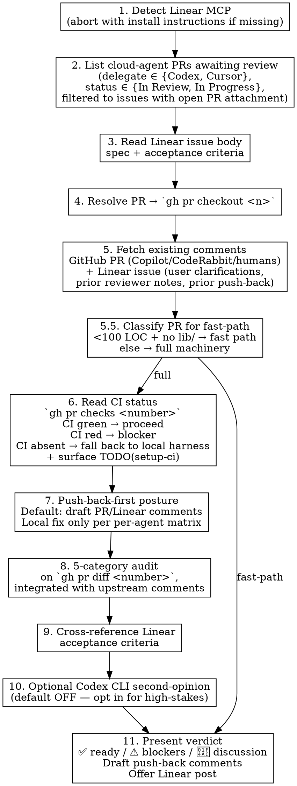

# Commit Review — Cloud-Agent PR Workflow (Tier 2, CI-as-Gate)

Read the PR diff. Read upstream reviewer comments (PR + Linear). Read CI status. Audit against acceptance criteria. **Default to push-back over local fix.** Surface a verdict with explicit push-back-vs-fix-locally guidance. **Don't merge** — the user merges (per `critical-rules.md` § "DON'T AUTO-MERGE PRS").

## Scope

WHAT THIS SKILL DOES:
  - **Tier 2 framing** — reserved for PRs that warrant deep audit (critical-tier code paths, CodeRabbit-flagged ambiguity, or explicit user invocation). Routine PRs defer to CodeRabbit + CI
  - Poll Linear for cloud-agent-delegated issues (Codex / Cursor) with an open PR attachment (status ∈ {In Review, In Progress} — agent transitions are unreliable, so the PR attachment is the authoritative signal)
  - `gh pr checkout` the linked PR branch locally
  - **Fetch existing comments from both the GitHub PR and the Linear issue** before auditing — so the audit doesn't duplicate Copilot/CodeRabbit/human findings and inherits Linear-side context (user clarifications, scope amendments, prior push-back rounds)
  - **Classify tiny PRs onto the fast path** (Step 5.5) — <100 LOC + no `lib/` changes → 3-line verdict, no full audit
  - **Read CI status** as the harness gate (`gh pr checks <number>`) — CI green → proceed; CI red → blocker; CI absent → fall back to running the local harness inline and surface a `TODO(setup-ci)` finding pointing at the `elixir-ci-harness` skill
  - Apply `code-review`'s 5-category audit against `gh pr diff <number>`, integrated with upstream reviewer findings
  - Cross-reference findings against the Linear issue's acceptance criteria
  - **Default to push-back over local fix** — local fix is the exception, governed by the per-agent push-back-vs-fix-locally matrix (Step 7)
  - **Draft asymmetric push-back comments** — PR review = line-level code feedback; Linear comment = ONE paragraph on scope/intent match. Never duplicate content across surfaces
  - **Optional Codex CLI second-opinion** (default off) — opt in for high-stakes PRs (auth, money, migrations, anything tagged 95% critical tier)
  - Surface a verdict (✅ ready / ⚠️ blockers / 💬 discussion items) and offer to post to Linear (user decides)

WHAT THIS SKILL DOES NOT DO:
  - Merge the PR (user merges — see `critical-rules.md` § "DON'T AUTO-MERGE PRS")
  - Auto-post draft comments to PR or Linear (drafts only; user posts)
  - Commit any local fix edits (stage only; user decides whether to push as a follow-up commit on the PR branch)
  - Review local staged work (use `staged-review:code-review` for that)
  - Replace the cloud agent's dispatch — the agent is the implementer here, not the reviewer

**Distinction from `code-review`:**

| Aspect | `code-review` | `commit-review` (this skill) |
|---|---|---|
| Input | `git diff --staged` | `gh pr diff <number>` after `gh pr checkout`, plus upstream PR + Linear comments |
| Trigger | Local pre-commit | Cloud-agent (Codex/Cursor) PR awaiting Tier 2 review |
| Harness gate | Local hooks ran inline | CI checks (`gh pr checks`) — falls back to local harness if absent |
| Codex CLI second-opinion | **Mandatory** (single-judge failure mode is the reason `code-review` exists) | **Optional, default off** (evaluator separation already comes from cloud-agent + CI + Claude) |
| Default action on blocker | Auto-fix when mechanical, surface for user otherwise | **Push back via PR/Linear comment** — local fix is the exception per per-agent matrix |
| Output | Findings + auto-applied edits + final commit-by-user | Verdict + draft push-back comments + optional Linear post + merge-by-user |

Both skills share the 5-category audit. The differences are **input source**, **harness mechanism (CI vs local)**, **second-opinion posture (optional vs mandatory)**, and **default action posture (push-back vs fix)**.

## When to Invoke vs Defer to CodeRabbit

`commit-review` is **Tier 2** review. CodeRabbit / Copilot / equivalent automated PR reviewers are **Tier 1**. Use this skill only when:

1. **PR touches critical-tier code paths** — signing, crypto, money handling, wire-format encoders/decoders (RLP, ABI, SSZ, BLS), JSON-RPC method handlers, schema migrations, authentication, authorization. Repos can configure their own match list; default Elixir match: `lib/.*signature|crypto|wire|abi|rpc|migration|auth`
2. **CodeRabbit (Tier 1) flagged ambiguity** — its review surfaced something it couldn't classify confidently, or it disagrees with another bot, or a human reviewer escalated for a deeper read
3. **User explicitly invoked** — override

Otherwise: skip. Let CodeRabbit + CI handle routine PRs. Reasoning: CodeRabbit costs cents per PR; this skill costs ~15m of Codex CLI tokens (when second-opinion is opted in) plus session attention. Reserving Tier 2 for PRs that warrant deep audit stops paying CLI tokens for "everything looks fine" reviews.

**Out of scope here:** CodeRabbit setup / `.coderabbit.yaml` configuration. The skill assumes CodeRabbit may or may not be present in the target repo; when absent, falls back to the user's explicit invocation as the sole trigger for Tier 2 review.

## Workflow



### Step 1: Detect Linear MCP Availability

Verify the Linear MCP is installed and reachable. The skill needs `mcp__linear-server__list_issues`, `mcp__linear-server__get_issue`, `mcp__linear-server__list_comments`, and (optionally for the comment-post step) `mcp__linear-server__save_comment`.

If the Linear MCP isn't available:

```
Linear MCP not detected. This skill needs the Linear MCP to find PRs awaiting review.

Install:
  https://linear.app/changelog/2025-05-01-mcp

After install, restart Claude Code so the MCP tools register, then re-invoke this skill.
```

Then **abort**. Don't try to find PRs through `gh` alone — the Linear → PR linkage is what makes the workflow tractable.

### Step 2: List Cloud-Agent PRs Awaiting Review

**The PR-attachment link in Linear is the authoritative "ready for review" signal.** Linear status is just a cached version of that, and cloud-agent transition behavior has been unreliable across observed round-trips:

- Sometimes the agent stays at `Backlog` (no auto-transition, no PR auto-open)
- Sometimes the agent auto-opens the PR but stays at `In Progress` (no transition to `In Review`)
- Sometimes the canonical `In Progress` → `In Review` transition fires correctly

So polling **only** `status = In Review` misses real PRs awaiting review. Broaden the filter:

Call `mcp__linear-server__list_issues` filtered for:
- `delegate` ∈ { Codex's user id (verified: `cbb4823b-2de9-493b-8238-9697da57a07b`), Cursor's Background Agent id (verified: `b8668f6b-992f-4152-9e59-13b6fe1f599b`) — look up by email/name if ids are stale }
- `status` ∈ { `In Review`, `In Progress` }

Then for each candidate, fetch attachments via `mcp__linear-server__get_issue` (or check the issue body if the integration writes PR links inline) and **filter to issues with at least one open GitHub PR attachment**. The PR-link check is the load-bearing one — it filters out `In Progress` issues the agent is still working on.

Group the results into two lists when presenting:

- **`In Review` (canonical):** issues whose status flipped correctly
- **`In Progress` with open PR (non-canonical):** issues where the agent auto-opened a PR but didn't flip status. Surface these explicitly so the user knows the issue is on a non-canonical status — they may want to manually flip it after the review, or you can include the status flip in the post-review Linear comment

If there's exactly one candidate across both groups, default to it (user can override). Zero candidates → "no cloud-agent PRs awaiting review" and stop. Multiple → list with title + identifier + status + delegate (Codex/Cursor) and ask which one.

### Step 3: Read the Linear Issue Body

Call `mcp__linear-server__get_issue`. The issue body **is** the spec — full prompt, acceptance criteria, file paths the agent was given. Pull out:

- The acceptance criteria (often at the bottom under "Success criteria" or "Acceptance criteria")
- Any explicit out-of-scope items
- File paths the agent was told to touch (so you know where to look in the diff)

You'll cross-reference this in Step 9.

### Step 4: Resolve PR and Check It Out

Find the PR linked to the Linear issue. Linear surfaces linked PRs in the issue's `attachments` or in the body. If unsure, search:

```bash
gh pr list --search "in:title <issue-identifier>" --state open
gh pr list --search "<issue-identifier>" --state open
```

Then check it out locally — this creates a local branch tracking the remote PR branch, so you can run mix tasks against it if Step 6 falls back to the local harness:

```bash
gh pr checkout <number>
```

Confirm you're on the PR branch:

```bash
git branch --show-current
git log -1 --oneline
```

### Step 5: Fetch Existing Comments — GitHub PR AND Linear Issue

**Before auditing, read both comment streams.** Auditing without reading them duplicates work and misses context that's already documented (intent, prior discussion, won't-fix decisions, scope amendments, prior push-back rounds). This is the same shape covered in `~/.claude/includes/linear-workflow.md` § "Fetch Existing Comments Before Auditing" — apply both sub-blocks.

**GitHub PR comments** — Copilot, CodeRabbit, and human reviewers may have left comments on the PR; both PR-level reviews and line-level review comments matter:

```bash
# PR-level review summaries + issue-style PR comments
gh pr view <number> --json reviews,comments

# Line-level review comments (Copilot/CodeRabbit/humans inline on specific diff lines)
gh api repos/OWNER/REPO/pulls/<number>/comments

# Quick scan of comment bodies for triage
gh pr view <number> --json reviews --jq '.reviews[] | {author: .author.login, state, body}'
gh api repos/OWNER/REPO/pulls/<number>/comments --jq '.[] | {author: .user.login, path, line, body: .body[0:200]}'
```

The repo's `OWNER/REPO` is whatever `gh repo view --json nameWithOwner --jq .nameWithOwner` returns.

**Linear issue comments** — fetch the comment thread on the source Linear issue identified in Step 2/3:

```
mcp__linear-server__list_comments  (filter by issueId)
mcp__linear-server__get_issue      (returns the comment thread inline)
```

Triage the Linear thread for:

- **Scope amendments** — user clarifications added after the issue was created. If they conflict with the issue body, the comment usually wins (the user added context the agent missed)
- **Prior reviewer notes** — if this is a revision round (PR has prior commits + a push-back comment), read what the prior reviewer flagged so you don't re-flag the same issues
- **Agent self-summary** — Codex/Cursor sometimes post a summary on PR open. Useful for understanding what the agent thinks it did vs what the diff actually shows
- **Prior `@codex` / `@cursor` mentions** — tell you whether this is a fresh review or a revision after push-back. If a prior reviewer pushed something back and the agent amended, your audit should focus on the amend, not re-litigate the original

**Then classify every comment from both streams** for use in Step 8:

- **Already flagged** — the audit's own categories will mention this; surface it in the table with attribution (e.g., `(also flagged by Copilot)` or `(also flagged in Linear comment by user)`) rather than as a fresh finding. Don't re-litigate
- **Confirmed-by-upstream** — upstream reviewer agreed the diff is correct or marked something as "intentional / won't fix" — incorporate as context; don't re-flag
- **Disputed** — your audit disagrees with an existing comment. Surface explicitly in Step 11 (verdict) so the user sees the disagreement and decides
- **Scope-shifting** — a Linear comment re-scopes what the PR should do. Treat the comment's scope as authoritative for Step 9's acceptance-criteria cross-reference

If there are no existing comments on either stream (fresh PR, fresh Linear issue), proceed normally.

### Step 5.5: Classify PR for Fast-Path Routing

Before running full machinery, classify by size and scope:

```bash
gh pr diff <number> --stat
```

Two signals decide fast-path vs full machinery:

- **Size:** total LOC < 100 (additions + deletions across all files)
- **Scope:** no files under `lib/` (Elixir production-code path; configurable per-repo via a `production_paths` setting in target repo's `.commit-review.toml` if present — default to `lib/` for Elixir)

If **both** conditions hold → **fast path:**
- Run Step 6 (CI status check) only — skip Steps 7 (push-back-vs-fix posture), 8 (5-category audit), 9 (acceptance criteria), 10 (Codex second-opinion)
- Emit a 3-line verdict (see Step 11 fast-path block)
- Reasoning surfaced explicitly so the user knows *why* the audit was skipped — not buried

If **either** condition fails → full machinery (proceed to Step 6 + 7 + 8 + 9 [+ 10 if opted in] + 11 full verdict).

**Override:** the user can force full machinery on a tiny PR ("review this fully even though it's small") — fast-path is a default, not a constraint.

**Why `lib/` matters:** changes to docs, configs, tests, READMEs don't ship code to production. CI gates already cover format/credo/test correctness on those. The 5-category audit's value is for production-code paths (control flow, abstractions, TODO discipline, missing extractions). Skipping audit on non-production paths = skipping an audit that wouldn't have found anything.

### Step 6: Read CI Status (Harness Gate)

CI is the canonical harness gate when present. Replace the old "run full local harness" step with `gh pr checks` against the PR head:

```bash
gh pr checks <number> --json name,state,bucket
```

Three branches:

1. **All checks `success`** (or required checks `success` with optional ones pending) — CI is the harness gate. Capture the check names + states for the verdict block. Proceed to Step 7.
2. **One or more checks `failure`** — surface as harness blocker. **Don't fix locally by default.** Push back to the agent with the specific check name + failing job log link:
   ```bash
   gh run view <run-id> --log-failed | head -100
   ```
   The push-back-vs-fix-locally matrix in Step 7 governs whether to override the default and fix locally.
3. **No checks configured** (empty result, or only Claude/Copilot bots present without a real harness check) — fall back to running the local harness inline:
   ```bash
   mix format --check-formatted
   mix compile --warnings-as-errors
   mix credo --strict --format json
   mix dialyzer.json --quiet
   mix test.json --quiet --cover
   mix doctor --raise   # if available
   mix sobelow          # if available
   ```
   Then surface a finding in the verdict:
   > **`TODO(setup-ci)`** — this repo has no `harness.yml`. Adopt the `elixir-ci-harness` skill: copy `templates/harness.yml` to `.github/workflows/`, customize 4 inputs (branch, MIX_ENV, threshold, integration tag), commit. Next PR push gets the harness check; this skill stops needing to run mix locally.

If checks are still `pending` / `in_progress` (PR was just pushed), poll briefly:

```bash
gh pr checks <number> --watch --interval 30 --fail-fast
```

…for up to ~5 minutes, then either proceed if green or surface the timeout as a separate blocker class. If the harness check regularly takes longer than 5m on this repo, the user can extend the timeout per-repo — flag the gap rather than silently waiting indefinitely.

**Coverage gate** (per `critical-rules.md` § "RAISE COVERAGE BEFORE MUTATING"): if the PR mutates a module whose `mix test.json --cover` percentage is below tier (≥80% standard, ≥95% critical), CI's `--cover-threshold` will fail the check. Treat the failure the same way as any CI red — push back unless it's pre-existing coverage debt the PR uncovered (then local-fix per the matrix).

### Step 7: Push-Back-First Posture

**Default action on a blocker is push-back, not local fix.** This is a substantial reframe from prior versions of this skill: previously Step 7 staged harness fixes locally; now the default flow is to draft a push-back comment for the user, and local fix is reserved for items in the per-agent matrix below.

When CI is red (Step 6) or audit findings (Step 8) surface blockers, generate **draft** push-back comments per the asymmetric-channels rule below — don't auto-post, don't auto-fix.

#### Asymmetric Push-Back Channels

Two surfaces with **distinct purposes** — never duplicate content across them:

**GitHub PR review (LINE-LEVEL CODE FEEDBACK):**

```bash
gh pr review <number> --comment --body "$(cat <<'EOF'
@codex / @cursor — issues to address (CI failed: <check-name>):
- file.ex:42 — [specific code finding with reasoning]
- file.ex:87 — [specific code finding with reasoning]
EOF
)"
```

Scope: line-level findings, code-specific reasoning, cite `file:line`. This is where the cloud-agent's GitHub bot picks up the mention and iterates. Prefix with `@codex` / `@cursor` per `~/.claude/includes/linear-workflow.md` § "Push-Back vs Fix Locally Matrix" so the agent receives the mention.

**Linear issue comment (ONE PARAGRAPH ON SCOPE / INTENT MATCH):**

```
mcp__linear-server__save_comment with issueId + body
```

Scope: a single paragraph answering *"did this PR match the spec / scope intent?"* — not line-level code feedback. Examples:

- "Acceptance criterion 3 (about edge case X) wasn't addressed; the rest are met."
- "PR delivers what the issue asked but the issue scope drifted in comments — closing this PR and re-scoping to <new issue>."
- "Matches spec, but discovery during implementation surfaced <topic> — adding to ROADMAP as Task N follow-up."

**The asymmetry is enforced.** Don't echo line-level findings to Linear; don't echo intent prose to PR. Two surfaces, two purposes. This keeps each channel scannable for its audience: PR for the implementing agent (line-level iteration), Linear for the dispatching user (scope/intent verification).

**Drafts only — user posts.** This skill never auto-posts the draft to PR or Linear. Same shape as `critical-rules.md` § "DON'T AUTO-MERGE PRS" — automation drafts; human commits.

#### Push-Back-vs-Fix-Locally Matrix (per agent)

For each blocker, classify by whether **the implementing agent can realistically fix it given its environment constraints** (per `~/.claude/includes/cloud-agent-environments.md`). Per-agent reachability differs:

- **Codex Cloud** — no hex.pm, no Tidewave, no internet. Hex-API correctness, live-data diagnosis, and external-spec lookups all fail under push-back.
- **Cursor Cloud** — has hex.pm, can run mix tasks, has internet. The Codex-class hex-API push-back limitations don't apply. Tidewave is still unavailable.

| Blocker class | Codex PR default | Cursor PR default | Why |
|---|---|---|---|
| User-code logic (control flow, off-by-one, wrong case branch, missing nil-guard on user data) | **Push back** | **Push back** | Agent can fix from diff + training. Preserves implementer/reviewer separation; preserves delegation token economics |
| Project-internal API misuse (calling wrong helper, ignoring an existing module) | **Push back** — point to the right helper | **Push back** — point to the right helper | Both agents have the local repo; can find it once told |
| Hex-package API correctness (ExUnit assertion macros, Phoenix/Ecto signatures, version-pinned third-party APIs) | **Fix locally** — local has hex_docs MCP, can verify in seconds | **Push back** — Cursor has hex.pm | Codex Cloud has no hex.pm. Cursor does. Observed (INE-6 on Codex): `assert_received/2` shipped with timeout int as 2nd arg; should have been `assert_receive/3`. Codex couldn't have known; Cursor would have |
| Anything needing Tidewave / live runtime state to diagnose | **Fix locally** | **Fix locally** | Neither agent reaches Tidewave |
| External spec / RFC / EIP correctness (wire-format byte order, gas costs, JSON-RPC error codes) | **Fix locally** — use WebFetch on the spec | **Push back** — Cursor has internet | Codex can't fetch external URLs; Cursor can |
| Acceptance criteria genuinely not met (the diff didn't do the thing) | **Push back** — Linear comment, quote the missing criterion | **Push back** — Linear comment, quote the missing criterion | Spec gap; agent needs to know what's missing. **Linear channel** for this — it's a scope/intent issue, not line-level |
| Coverage below tier on a touched module | New code → **push back**. Pre-existing debt the PR uncovered → **fix locally** | New code → **push back**. Pre-existing debt the PR uncovered → **fix locally** | New-code coverage is the agent's responsibility; legacy gap surfacing now → local fix per `critical-rules.md` § "RAISE COVERAGE BEFORE MUTATING" |
| CI format / credo / dialyzer / doctor drift | **Push back** — quote the failing check + log link | **Push back** — quote the failing check + log link | Both agents can re-run the checks against CI signal. Cursor especially (mix tasks runnable). Local fix-up was the old default; the harness-via-CI shift makes push-back viable |

**When fixing locally:**
- Stage only — don't commit (per `critical-rules.md` § "NEVER COMMIT WITHOUT EXPLICIT REQUEST")
- The user decides whether to push as a follow-up commit on the PR branch, ask the agent to amend, or merge as-is and clean up in a follow-up PR

**Hybrid is fine:** a single PR may have both push-back and fix-locally blockers. Surface them in two groups; the user can decide whether to push fixes locally and amend the PR branch, push back to the agent with the logic bugs and only fix the hex-API ones locally, or any other split.

### Step 8: Apply the 5-Category Audit (Integrated with Upstream Comments)

Run `code-review`'s Step 3a categories against `gh pr diff <number>` (not against `git diff --staged` — the input is the PR's full diff vs. its base):

```bash
gh pr diff <number>
```

Categories (full text in `staged-review:code-review` SKILL.md):

1. **Bugs & Logic Errors** — null paths, type confusion, silent failures, untested error paths added in this diff
2. **Missing Extractions** — code AND data extractions
3. **Missing TODO Markers** — temporary code without `TODO:` prefix; cross-reference ROADMAP.md
4. **Abstraction Opportunities** — 3+ similar patterns; flag only when stable
5. **Actionable TODOs** — TODOs in the PR diff resolvable right now
6. **Documentation Gaps** — ROADMAP.md, CHANGELOG.md, CLAUDE.md, README.md, in-code `@doc`/`@spec` drift

Same confidence filter as `code-review`: only report bugs you can name the triggering input for. Same rating scale (1–10 or `discuss-trivial`/`discuss-design`).

**Integrate upstream comments from Step 5:** when a finding overlaps with an existing reviewer's comment, attribute it (`also flagged by <reviewer>`) instead of presenting it as a fresh discovery. When you disagree with an upstream comment, mark it `disputed` and include both positions in Step 11. When upstream has marked something "won't fix" or "intentional," don't re-raise unless you have new evidence.

**Delegate the survey to Explore** if the PR touches ~20+ files or needs cross-file tracing — same pattern as `code-review` Step 3a.

### Step 9: Cross-Reference Linear Acceptance Criteria

Walk the acceptance criteria from Step 3 (and any scope amendments from Step 5's Linear comments — those override the original body). For each one:

- ✅ Met — diff clearly satisfies it (cite file:line)
- ⚠️ Partially met — some-but-not-all of the criterion (cite what's missing)
- ❌ Not met — diff doesn't address it (this is a blocker finding)
- ❓ Ambiguous — criterion is vague enough that it's hard to tell (mark `discuss`)

Acceptance criteria not met are **always blockers** — and per the matrix they get **Linear-channel push-back** (one paragraph on what's missing), not PR-channel line-level feedback. The PR shouldn't merge until the spec is satisfied or the user decides to descope.

### Step 10: Optional Codex CLI Second-Opinion (Default OFF)

Unlike `code-review` (where Codex CLI second-opinion is **mandatory** because the only reviewer is Claude itself), this skill defaults to **off**. Evaluator separation already comes from three parties:

1. The cloud agent (Codex / Cursor) wrote the code
2. CI (deterministic harness) gates the mechanical concerns
3. Claude (this session) audits diff + cross-references acceptance criteria

Adding Codex CLI as a fourth reviewer is diminishing returns at the observed cost (~15m per PR, frequently exceeding the implementation savings the delegation produced).

**When to opt in (offer in the verdict, not auto-dispatch):**

- High-stakes PRs — auth, crypto, money handling, schema migrations, anything tagged 95% critical tier
- Codex-implemented PRs that touch hex-package API surface (extra eyes since Codex Cloud couldn't verify signatures)
- PRs where CI was absent or fell back to local harness (less deterministic upstream signal)

Surface as a one-line offer in the verdict block:

> *"Stakes look critical (auth/money/migration touched). Want me to dispatch Codex CLI second-opinion? (~15m, parallel to your other work) — yes / no"*

If the user opts in, dispatch `codex:codex-rescue` with the `code-review` Step 3b payload spec (Task / Context / Project tool inventory / Verification instruction), the PR diff, the Linear issue body, upstream reviewer comments from Step 5, and ROADMAP.md excerpts for the current phase. Merge the result sets per `code-review` Step 4 (corroborated > Claude-only > Codex-only-default-to-discuss-until-verified).

If Codex is dispatched and unreachable, surface that in the verdict closing line as `Codex second-opinion dispatched but unreachable — single-reviewer pass`. Don't silently drop it.

**`code-review` (pre-commit, local work) keeps Codex CLI mandatory.** That skill reviews code Claude itself just wrote — single-judge failure mode is the whole reason it exists. Don't change that behavior; this opt-in scope is `commit-review` only.

### Step 11: Present Verdict — Don't Merge

Output a single verdict block. **Fast-path** and **full** shapes differ.

#### Fast-path (Step 5.5 routed here)

```
## Verdict: ✅ Fast-path approved (<N> LOC, no lib/ changes)

**Harness:** CI green (Harness check passed in Xm) — link
User: when ready, run `gh pr merge <number>`.
```

That's it. Three lines. No 5-category audit, no acceptance-criteria walkthrough, no Codex offer. The user knows *why* the audit was skipped (the LOC + scope reasoning is in the verdict line).

If CI is absent on a fast-path PR, append:

> `TODO(setup-ci)` — adopt the `elixir-ci-harness` skill so the next iteration of this PR has CI.

#### Full machinery — three top-level shapes

**✅ Ready to merge:**

```
## Verdict: ✅ Ready to merge

**Acceptance criteria:** all met (cite each, including any scope amendments from Linear comments)
**Upstream comments (Step 5):** N integrated, 0 disputed
**Harness:** CI green (Harness check passed in Xm) — link to checks page
**5-category audit:** N findings, all priority ≤ 4 / discuss-trivial
**Coverage:** N% on touched modules (≥ tier)
**Codex second-opinion:** not run (default off — high stakes? offer below)

User: when ready, run `gh pr merge <number>` (rebase / squash / merge per repo policy).
```

**⚠️ Blockers:**

```
## Verdict: ⚠️ Blockers — do not merge yet

**Blockers:**
- [list — acceptance criteria not met, CI failures, priority 7+ findings]

**Recommended action per blocker:** see push-back-vs-fix matrix in Step 7
- Push-back blockers: [list, channel = PR (line-level) or Linear (scope/intent)]
- Local-fix blockers: [list, with reason from matrix]

**Draft push-back comments:**
[PR review draft — line-level findings only, prefix with @codex / @cursor]
[Linear issue comment draft — ONE paragraph on scope/intent if applicable]

**Non-blocking findings table:** [the findings table per code-review Step 6 format, with upstream attribution where applicable]

**Codex second-opinion:** not run (default off — high stakes? want me to dispatch? ~15m)
```

**💬 Discussion items:**

```
## Verdict: 💬 Discussion items — your call

[Cases where CI passes and acceptance criteria are met but a `discuss-design` finding wants user input.
Lay out both reasoners' positions side by side per code-review Step 9.
Surface any `disputed` upstream comments here too.]
```

**Then offer the Linear comment (full machinery only):**

> "Want me to post the Linear-channel one-paragraph scope/intent summary as a Linear comment via `mcp__linear-server__save_comment`? (yes / no / edit first)"

Default is **don't post** — wait for explicit user confirmation. The verdict in this session's chat is the deliverable; the Linear comment is optional persistence.

**Do NOT run `gh pr merge`.** Per `critical-rules.md` § "DON'T AUTO-MERGE PRS", merge is the user's call. The skill's job ends at the verdict.

## Common Mistakes

| Mistake | Fix |
|---------|-----|
| Running `gh pr merge` after a ✅ verdict | Skill ends at the verdict. Per `critical-rules.md` § "DON'T AUTO-MERGE PRS", the user merges — never the agent |
| Running this skill on every cloud-agent PR | Tier 2 framing — reserve for PRs that touch critical-tier code paths OR where CodeRabbit (Tier 1) flagged ambiguity OR explicit user invocation. Routine PRs defer to CodeRabbit + CI |
| Running the full machinery on a tiny PR (<100 LOC, no `lib/`) | Step 5.5 routes to fast path. 3-line verdict, no audit, no Codex offer. Override with explicit user request only |
| Running the local harness when CI exists | Step 6 reads `gh pr checks` — CI is the harness gate. Local harness is the fallback when CI is absent (then surface `TODO(setup-ci)` finding) |
| Local-fixing CI red as the default | Default is **push back** to the agent with the failing check name + log link. Local fix is the exception per the per-agent matrix in Step 7 |
| **Echoing line-level findings into the Linear comment** | **PR review = line-level code feedback (cite file:line). Linear comment = ONE paragraph on scope/intent match. Never duplicate. Asymmetric channels exist because each surface has a different audience: PR for the agent (iteration), Linear for the user (scope verification)** |
| **Auto-posting draft push-back comments to PR or Linear** | **Drafts only — user posts. Same shape as the don't-auto-merge rule. Surface the draft text in the verdict; user decides whether to post, edit, or discard** |
| **Pushing hex-API bugs back to a Codex Cloud PR** | **Codex Cloud has no hex.pm — fix locally per the matrix. Cursor PRs CAN take hex-API push-back (Cursor has hex.pm). Per-agent reachability differs; check the `delegate` field before defaulting** |
| **Pushing live-data / Tidewave bugs back to either agent** | **Neither Codex Cloud nor Cursor reaches Tidewave. Fix locally per the matrix** |
| **Auto-dispatching Codex CLI second-opinion** | **Step 10 is opt-in (default off). Offer in the verdict for high-stakes PRs (auth, money, migrations, 95% critical tier). The mandatory dual-reviewer in `code-review` is untouched — that's a different evaluator-separation problem (local pre-commit work, single judge by default)** |
| Skipping Step 5 (fetching upstream PR comments AND Linear issue comments) | The audit duplicates Copilot/CodeRabbit/human findings and misses Linear-side context (user clarifications, scope amendments, prior push-back rounds). Always fetch `gh pr view --json reviews,comments` AND `gh api .../pulls/<n>/comments` AND `mcp__linear-server__list_comments` (or `get_issue`) before auditing |
| Skipping Linear acceptance-criteria cross-reference | Step 9 is the spec gate. Acceptance criteria not met is always a blocker, and per the matrix, scope/intent push-back goes to **Linear** not PR |
| Treating original Linear issue body as authoritative when comments amended scope | Linear scope-amendment comments override the original body. If the user added context after the issue was created, the comment wins |
| Polling only `status = In Review` | Cloud-agent transitions are unreliable — also poll `In Progress` and filter by open-PR-attachment. Status is a cached version of the PR-link signal; the PR attachment is the authoritative one |
| Treating cloud-agent MCP user lookups as fact | Verify Codex / Cursor user ids by name/email if ids seem stale. Linear can rotate ids on workspace migration |
| Running this skill when Linear MCP isn't installed | Step 1 aborts cleanly with install instructions. Don't fall back to `gh`-only — Linear → PR linkage is the workflow |
| Surfacing CI mechanical drift as "blockers" requiring local fix | CI red on format/credo/dialyzer/doctor is push-back-default per the matrix. Both Codex and Cursor can iterate against the same CI signal once told what failed |
| Inventing Linear acceptance criteria not in the issue body | If the body lacks explicit criteria, mark "criteria implicit" in the verdict and lean on the 5-category audit. Don't fabricate a checklist |
