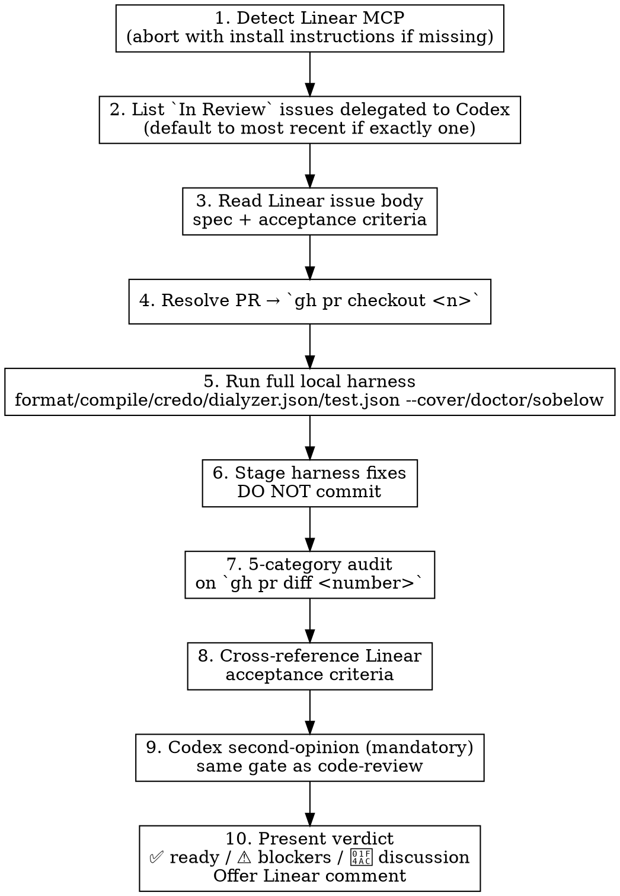

# Commit Review — Cloud-Agent PR Workflow

Read the PR diff. Run the local harness Codex didn't have. Fix harness drift. Review the diff against Linear acceptance criteria. Surface a verdict. **Don't merge** — the user merges (per `critical-rules.md` § "DON'T AUTO-MERGE PRS").

## Scope

WHAT THIS SKILL DOES:
  - Poll Linear for `In Review` issues delegated to Codex
  - `gh pr checkout` the linked PR branch locally
  - Run the full local harness Codex's environment lacks (format/compile/credo/dialyzer.json/test.json --cover/doctor/sobelow)
  - **Fix harness-flagged issues in the PR branch** — Codex doesn't run our hooks, so format/credo/dialyzer/test drift is expected
  - Apply `code-review`'s 5-category audit against `gh pr diff <number>`
  - Cross-reference findings against the Linear issue's acceptance criteria
  - Run mandatory `codex:codex-rescue` second-opinion pass (same gate as `code-review`)
  - Surface a verdict: ✅ ready to merge / ⚠️ blockers / 💬 discussion items
  - Optionally post the review summary as a Linear comment (offer; user decides)

WHAT THIS SKILL DOES NOT DO:
  - Merge the PR (user merges — see `critical-rules.md` § "DON'T AUTO-MERGE PRS")
  - Commit the harness-fix edits (stage only; user decides whether to push as a follow-up commit on the PR branch)
  - Review local staged work (use `staged-review:code-review` for that)
  - Replace the Codex dispatch — Codex is the implementer here, not the reviewer

**Distinction from `code-review`:**

| Aspect | `code-review` | `commit-review` (this skill) |
|---|---|---|
| Input | `git diff --staged` | `gh pr diff <number>` after `gh pr checkout` |
| Trigger | Local pre-commit | Codex (or other cloud-agent) PR awaiting review |
| Output | Findings + auto-applied edits + final commit-by-user | Verdict + optional Linear comment + merge-by-user |
| Harness fixes | Not expected (local hooks ran) | **Expected** (Codex's harness lacked our hooks) |

Both skills share the 5-category audit and the mandatory Codex second-opinion. The difference is **input source** and **output shape**.

## Workflow



### Step 1: Detect Linear MCP Availability

Verify the Linear MCP is installed and reachable. The skill needs `mcp__linear-server__list_issues`, `mcp__linear-server__get_issue`, and (optionally for the comment-post step) `mcp__linear-server__save_comment`.

If the Linear MCP isn't available:

```
Linear MCP not detected. This skill needs the Linear MCP to find PRs awaiting review.

Install:
  https://linear.app/changelog/2025-05-01-mcp

After install, restart Claude Code so the MCP tools register, then re-invoke this skill.
```

Then **abort**. Don't try to find PRs through `gh` alone — the Linear → PR linkage is what makes the workflow tractable.

### Step 2: List `In Review` Issues Delegated to Codex

Call `mcp__linear-server__list_issues` filtered for:
- `status` = `In Review` (workflow status type `started` — this is the cloud-agent → reviewer handoff signal)
- `delegate` = Codex's user id (verified: `cbb4823b-2de9-493b-8238-9697da57a07b`; or look up by email/name if id is stale)

Present results to the user. If there's exactly one, default to it (the user can override). If there are zero, tell the user "no Codex PRs awaiting review" and stop. If there are multiple, list them with title + identifier and ask which one.

### Step 3: Read the Linear Issue Body

Call `mcp__linear-server__get_issue`. The issue body **is** the spec — full prompt, acceptance criteria, file paths Codex was given. Pull out:

- The acceptance criteria (often at the bottom under "Success criteria" or "Acceptance criteria")
- Any explicit out-of-scope items
- File paths Codex was told to touch (so you know where to look in the diff)

You'll cross-reference this in Step 8.

### Step 4: Resolve PR and Check It Out

Find the PR linked to the Linear issue. Linear surfaces linked PRs in the issue's `attachments` or in the body. If unsure, search:

```bash
gh pr list --search "in:title <issue-identifier>" --state open
gh pr list --search "<issue-identifier>" --state open
```

Then check it out locally — this creates a local branch tracking the remote PR branch, so you can run mix tasks against it:

```bash
gh pr checkout <number>
```

Confirm you're on the PR branch:

```bash
git branch --show-current
git log -1 --oneline
```

### Step 5: Run the Full Local Harness

Codex's harness lacks our hooks (no `post-edit-check.sh`, no `pre-commit-unified.sh`, no Styler-in-formatter). Run every gate the local hooks would have run:

```bash
mix format --check-formatted
mix compile --warnings-as-errors
mix credo --strict --format json
mix dialyzer.json --quiet
mix test.json --quiet --cover
mix doctor      # if available
mix sobelow     # if available
```

Capture the output. Test failures and dialyzer warnings are blockers; format/credo drift is fixable.

**Coverage gate** (per `critical-rules.md` § "RAISE COVERAGE BEFORE MUTATING"): if the PR mutates a module whose `mix test.json --cover` percentage is below tier (≥80% standard, ≥95% critical), raising coverage is part of this review. The PR isn't ready to merge until the gate passes.

### Step 6: Stage Harness Fixes — Don't Commit

For format/credo/dialyzer/doctor drift you can fix mechanically:

- `mix format` — re-run, accept output
- Credo nits (alias ordering, unused vars, doc gaps in your touched scope) — fix per `critical-rules.md` § "FIX HOOK-FLAGGED ISSUES ON FILES YOU TOUCH"
- Doctor doc gaps — add missing `@doc` / `@moduledoc` / `@spec` on public functions
- Trivial dialyzer fixes (`@spec` corrections matching actual return shape) — apply

Stage with `git add <paths>` so the diff is visible. **Do not commit.** The user decides whether to:
- push these as a follow-up commit on the PR branch (typical case)
- ask Codex to amend (cleaner for the PR's history but slow)
- merge as-is and clean up in a follow-up PR

For non-mechanical issues (genuine test failures, dialyzer issues that need redesign, missing test coverage on a code path the PR added), surface them as findings in Step 10 — don't try to "fix" by guessing what Codex's intent was.

### Step 7: Apply the 5-Category Audit

Run `code-review`'s Step 3a categories against `gh pr diff <number>` (not against `git diff --staged` — the input is the PR's full diff vs. its base):

```bash
gh pr diff <number>
```

Categories (full text in `staged-review:code-review` SKILL.md):

1. **Bugs & Logic Errors** — null paths, type confusion, silent failures, untested error paths added in this diff
2. **Missing Extractions** — code AND data extractions
3. **Missing TODO Markers** — temporary code without `TODO:` prefix; cross-reference ROADMAP.md
4. **Abstraction Opportunities** — 3+ similar patterns; flag only when stable
5. **Actionable TODOs** — TODOs in the PR diff resolvable right now
6. **Documentation Gaps** — ROADMAP.md, CHANGELOG.md, CLAUDE.md, README.md, in-code `@doc`/`@spec` drift

Same confidence filter as `code-review`: only report bugs you can name the triggering input for. Same rating scale (1-10 or `discuss-trivial`/`discuss-design`).

**Delegate the survey to Explore** if the PR touches ~20+ files or needs cross-file tracing — same pattern as `code-review` Step 3a.

### Step 8: Cross-Reference Linear Acceptance Criteria

Walk the acceptance criteria from Step 3. For each one:

- ✅ Met — diff clearly satisfies it (cite file:line)
- ⚠️ Partially met — some-but-not-all of the criterion (cite what's missing)
- ❌ Not met — diff doesn't address it (this is a blocker finding)
- ❓ Ambiguous — criterion is vague enough that it's hard to tell (mark `discuss`)

Acceptance criteria not met are **always blockers** — the PR shouldn't merge until the spec is satisfied or the user decides to descope.

### Step 9: Mandatory Codex Second-Opinion

Per `critical-rules.md` and `code-review` Step 3b: every PR review runs a Codex second-opinion pass. **This is not optional.**

Dispatch `codex:codex-rescue` with the dispatch payload spec from `code-review` (Task / Context / Project tool inventory / Verification instruction). The payload here is:

- **Task** — review this Codex PR for the 5 categories above; verify acceptance criteria met
- **Context** — the PR diff (`gh pr diff <number>`), the Linear issue body, ROADMAP.md excerpts for the current phase
- **Project tool inventory** — MCP servers in `.mcp.json` (e.g., `mcp__tidewave__project_eval`), mix tasks (`mix test.json`, `mix dialyzer.json`, `mix compile`, `mix credo`), hex-docs `/llms.txt` URLs for packages in the diff
- **Verification instruction** — "Before asserting any claim about the codebase, verify it with one of the tools above. Training-data recall is insufficient. Don't comment on style or formatting — those are linter scope. Do NOT run `gh pr merge`."

Merge the result sets per `code-review` Step 4 (corroborated > Claude-only > Codex-only-default-to-discuss-until-verified).

If Codex is unreachable, continue single-reviewer and mark the verdict closing line `Codex unreachable — single-reviewer pass`. Don't silently drop it.

### Step 10: Present Verdict — Don't Merge

Output a single verdict block. Three top-level shapes:

**✅ Ready to merge:**
```
## Verdict: ✅ Ready to merge

**Acceptance criteria:** all met (cite each)
**Harness:** clean (or: N format/credo nits staged in <files>, push as follow-up before merging)
**5-category audit:** N findings, all priority ≤ 4 / discuss-trivial — addressed in staged fixes
**Coverage:** N% on touched modules (≥ tier)

User: when ready, run `gh pr merge <number>` (rebase / squash / merge per repo policy).

dual-reviewer pass
```

**⚠️ Blockers:**
```
## Verdict: ⚠️ Blockers — do not merge yet

**Blockers:**
- [list — acceptance criteria not met, test failures, dialyzer warnings, priority 7+ findings]

**Recommended action:**
- [comment on the PR / amend via Codex / fix locally and push to PR branch]

**Non-blocking findings table:** [the findings table per code-review Step 6 format]

dual-reviewer pass
```

**💬 Discussion items:**
```
## Verdict: 💬 Discussion items — your call

[Cases where the harness passes and acceptance criteria are met but a `discuss-design` finding wants user input. Lay out both reasoners' positions side by side per code-review Step 9.]

dual-reviewer pass
```

**Then offer the Linear comment.** Construct a summary suitable for the Linear issue's comment thread:

> "Want me to post this verdict as a Linear comment via `mcp__linear-server__save_comment`? (yes / no / edit first)"

Default is **don't post** — wait for explicit user confirmation. The verdict in this session's chat is the deliverable; the Linear comment is optional persistence.

**Do NOT run `gh pr merge`.** Per `critical-rules.md` § "DON'T AUTO-MERGE PRS", merge is the user's call. The skill's job ends at the verdict.

## Common Mistakes

| Mistake | Fix |
|---------|-----|
| Running `gh pr merge` after a ✅ verdict | Skill ends at the verdict. Per `critical-rules.md` § "DON'T AUTO-MERGE PRS", the user merges — never the agent |
| Skipping the local harness ("the PR's CI passed, that's enough") | Codex doesn't run our hooks. Format/credo/dialyzer drift is expected even on green CI. Run the full local harness |
| Committing the harness fixes | Stage only — `git add`. The user decides whether to push as a follow-up commit on the PR branch, ask Codex to amend, or merge as-is |
| Skipping Codex second-opinion | Step 9 is required. Same gate as `code-review` Step 3b |
| Skipping Linear acceptance-criteria cross-reference | Step 8 is the spec gate. Acceptance criteria not met is always a blocker |
| Auto-posting the verdict as a Linear comment without asking | Default is don't post. Offer; wait for explicit confirmation |
| Reviewing staged work with this skill | Use `staged-review:code-review` for local pre-commit. This skill is for cloud-agent PR review |
| Treating Codex MCP user lookups as fact | Verify the Codex user id by name/email if the id seems stale. Linear can rotate user ids on workspace migration |
| Running this skill when Linear MCP isn't installed | Step 1 aborts cleanly with install instructions. Don't fall back to gh-only — Linear → PR linkage is the workflow |
| Surfacing harness fixes as "blockers" when they're mechanical | Mechanical drift (format, alias order, missing `@doc`) is expected and gets staged in Step 6, not blocked. Genuine bugs/test failures/dialyzer issues are blockers |
| Inventing Linear acceptance criteria not in the issue body | If the body lacks explicit criteria, mark "criteria implicit" in the verdict and lean on the 5-category audit. Don't fabricate a checklist |
