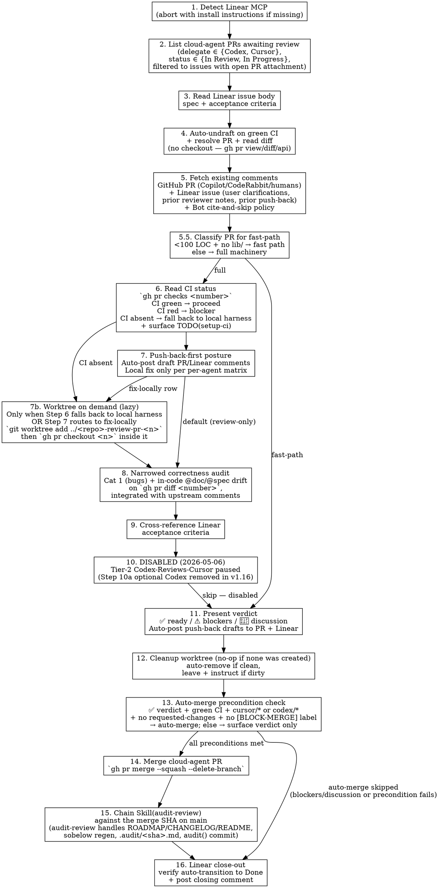

# Commit Review — Cloud-Agent PR Workflow (Tier 2, CI-as-Gate)

Read the PR diff. Read upstream reviewer comments (PR + Linear). Read CI status. Audit against acceptance criteria — **correctness gate only** (Cat 1 bugs + in-code `@doc`/`@spec` drift; hygiene moves to `audit-review` post-merge). **Default to push-back over local fix.** **Auto-post draft push-back comments** to PR + Linear per the asymmetric-channels rule (no "want me to post?" prompt). On ✅ verdict, **auto-merge cloud-agent PRs** that satisfy the preconditions (✅ verdict + green CI + `cursor/*`|`codex/*` branch + no requested-changes review + no `[BLOCK-MERGE]` label), then immediately chain `Skill(audit-review)` against the merge SHA so post-merge hygiene + bookkeeping happen automatically.

The autonomy-first design rests on three layers: pre-merge correctness gate (this skill), post-merge hygiene (audit-review), and CI as the deterministic harness. Together they replace the old single-step user merge gate. See `delegation-rules.md` § "DON'T AUTO-MERGE PRS" for the precondition list and the `[BLOCK-MERGE]` escape hatch the user can label any PR with to manually pause an auto-merge.

**Tier-2 Codex-Reviews-Cursor delegation is currently DISABLED** (2026-05-06; see `linear-workflow.md` § "Codex-Reviews-Cursor Pattern"). This skill is the single review path for cloud-agent PRs in v1. Step 10b retains its body as legacy reference but is gated behind the disabled-callout — do NOT spawn delegation issues.

## Scope

WHAT THIS SKILL DOES:
  - **Tier 2 framing** — reserved for PRs that warrant deep audit (critical-tier code paths, CodeRabbit-flagged ambiguity, or explicit user invocation). Routine PRs defer to CodeRabbit + CI
  - Poll Linear for cloud-agent-delegated issues (Codex / Cursor) with an open PR attachment (status ∈ {In Review, In Progress} — agent transitions are unreliable, so the PR attachment is the authoritative signal)
  - **Default review-only flow** — read PR diff + comments via `gh pr diff`, `gh pr view`, and `gh api repos/.../pulls/<n>/comments` without checkout. Worktree-checkout is on demand: spin up an isolated review worktree (`../<repo>-review-pr-<n>`) ONLY when Step 7 routes to fix-locally OR Step 6 falls back to local harness (CI absent). When a worktree IS created, the host session's branch is never touched, parallel sessions can review different PRs concurrently, and Step 12 auto-removes when clean / surfaces manual cleanup when Step 7 staged local fixes
  - **Fetch existing comments from both the GitHub PR and the Linear issue** before auditing — so the audit doesn't duplicate Copilot/CodeRabbit/human findings and inherits Linear-side context (user clarifications, scope amendments, prior push-back rounds)
  - **Classify tiny PRs onto the fast path** (Step 5.5) — <100 LOC + no `lib/` changes → 3-line verdict, no full audit
  - **Read CI status** as the harness gate (`gh pr checks <number>`) — CI green → proceed; CI red → blocker; CI absent → fall back to running the local harness inline and surface a `TODO(setup-ci)` finding pointing at the `elixir-ci-harness` skill
  - Apply a **narrowed correctness audit** against `gh pr diff <number>` — Cat 1 (bugs) + in-code `@doc`/`@spec` correctness drift only. Hygiene categories (extractions, abstractions, TODO markers, external doc drift like CHANGELOG/ROADMAP/CLAUDE.md/README) move to `audit-review` post-merge
  - Cross-reference findings against the Linear issue's acceptance criteria
  - **Default to push-back over local fix** — local fix is the exception, governed by the per-agent push-back-vs-fix-locally matrix (Step 7)
  - **Auto-post asymmetric push-back comments** — PR review = line-level code feedback; Linear comment = ONE paragraph on scope/intent match. Never duplicate content across surfaces. Per `delegation-rules.md` § "POST LINEAR / PR COMMENTS WITHOUT ASKING DURING DELEGATION FLOWS" — comment posting is DEFAULT-DO during active delegation flow, no "should I post?" prompt
  - Surface a verdict (✅ ready / ⚠️ blockers / 💬 discussion items)
  - **On ✅ verdict + cloud-agent PR satisfying auto-merge preconditions** — auto-run `gh pr merge --squash --delete-branch`, then immediately `Skill(audit-review)` against the merge SHA so post-merge hygiene + ROADMAP/CHANGELOG bookkeeping happen autonomously

WHAT THIS SKILL DOES NOT DO:
  - **Auto-merge non-cloud-agent PRs** — auto-merge is scoped to `cursor/*` and `codex/*` branches only. Self-authored PRs from worktrees still surface the verdict; user merges manually until that's separately addressed (see ROADMAP follow-up #4 from the audit-review v1 plan)
  - **Auto-merge over red CI, requested-changes review, or `[BLOCK-MERGE]` label** — every precondition must hold. If any fails, surface the verdict and let the user merge manually
  - **Apply external doc hygiene** — CHANGELOG entries, ROADMAP status flips, CLAUDE.md drift, README updates are `audit-review`'s job post-merge. The pre-merge skill stays narrow on correctness
  - **Optional Codex CLI second-opinion** — removed in this version. Per-PR Codex dispatch is `audit-review`'s mandatory work post-merge; doubling it pre-merge is diminishing returns
  - Sobelow drift detection — the harness CI step (`Sobelow drift check` in `cartouche/.github/workflows/harness.yml`'s pattern) covers this loudly; audit-review owns the post-merge regen on `main`
  - Commit any local fix edits to the cloud-agent branch — staged in a worktree only; preferred fix-locally channel is paste-as-`@cursor`-comment per the matrix
  - Review local staged work (use `staged-review:code-review` for that)
  - Replace the cloud agent's dispatch — the agent is the implementer here, not the reviewer
  - Spawn Tier-2 Codex-Reviews-Cursor delegation issues (the pattern is currently disabled — see preamble)

**Distinction from `code-review`:**

| Aspect | `code-review` | `commit-review` (this skill) | `audit-review` |
|---|---|---|---|
| Input | `git diff --staged` | `gh pr diff <number>` + `gh pr view --json reviews,comments` + `gh api repos/.../pulls/<n>/comments` (no checkout by default); worktree-checkout only on fix-locally or CI-absent | `git show <sha>` per commit in range |
| Trigger | Local pre-commit | Cloud-agent (Codex/Cursor) PR awaiting Tier 2 review | Post-commit / post-merge (chains off auto-merge or runs manually) |
| Harness gate | Local hooks ran inline | CI checks (`gh pr checks`) — falls back to local harness if absent | n/a (post-merge — CI already gated) |
| Audit scope | All 5 categories + Cat 6 doc gaps | **Cat 1 (bugs) + in-code `@doc`/`@spec` correctness drift only** — hygiene moves to `audit-review` | All 6 categories — hygiene + correctness post-merge |
| Codex second-opinion | Mandatory | **None** — `audit-review`'s mandatory dispatch covers this post-merge | Mandatory |
| Default action on blocker | Auto-fix when mechanical, surface for user otherwise | **Push back via PR/Linear comment** — auto-posted; local fix is the exception per per-agent matrix | Auto-apply directly + auto-resolve discuss-design via dialogue |
| Output | Findings + plan-mode-gated edits + final commit-by-user | Verdict + auto-posted push-back + **auto-merge cloud-agent PRs on preconditions** + audit-review chain | `audit(...)` commit with fixes + `.audit/<sha>.md` reports |

The three skills compose into a single autonomous review-and-merge chain for cloud-agent PRs: pre-merge correctness gate → auto-merge → post-merge hygiene + bookkeeping. User attention is reserved for the rare `[BLOCK-MERGE]` label decision, the divergence-dropped findings that surface in audit-review's ROADMAP filings, and any `⚠️ blockers` / `💬 discussion` verdicts that fail the auto-merge preconditions.

## When to Invoke vs Defer to CodeRabbit

`commit-review` is **Tier 2** review. CodeRabbit / Copilot / equivalent automated PR reviewers are **Tier 1**. Use this skill only when:

1. **PR touches critical-tier code paths** — signing, crypto, money handling, wire-format encoders/decoders (RLP, ABI, SSZ, BLS), JSON-RPC method handlers, schema migrations, authentication, authorization. Repos can configure their own match list; default Elixir match: `lib/.*signature|crypto|wire|abi|rpc|migration|auth`
2. **CodeRabbit (Tier 1) flagged ambiguity** — its review surfaced something it couldn't classify confidently, or it disagrees with another bot, or a human reviewer escalated for a deeper read
3. **User explicitly invoked** — override

Otherwise: skip. Let CodeRabbit + CI handle routine PRs. Reasoning: CodeRabbit costs cents per PR; this skill costs ~15m of Codex CLI tokens (when second-opinion is opted in) plus session attention. Reserving Tier 2 for PRs that warrant deep audit stops paying CLI tokens for "everything looks fine" reviews.

**Out of scope here:** CodeRabbit setup / `.coderabbit.yaml` configuration. The skill assumes CodeRabbit may or may not be present in the target repo; when absent, falls back to the user's explicit invocation as the sole trigger for Tier 2 review.

## Workflow



### Step 1: Detect Linear MCP Availability

Verify the Linear MCP is installed and reachable. The skill needs `mcp__linear-server__list_issues`, `mcp__linear-server__get_issue`, `mcp__linear-server__list_comments`, and (optionally for the comment-post step) `mcp__linear-server__save_comment`.

If the Linear MCP isn't available:

```
Linear MCP not detected. This skill needs the Linear MCP to find PRs awaiting review.

Install:
  https://linear.app/changelog/2025-05-01-mcp

After install, restart Claude Code so the MCP tools register, then re-invoke this skill.
```

Then **abort**. Don't try to find PRs through `gh` alone — the Linear → PR linkage is what makes the workflow tractable.

### Step 2: List Cloud-Agent PRs Awaiting Review

**The PR-attachment link in Linear is the authoritative "ready for review" signal.** Linear status is just a cached version of that, and cloud-agent transition behavior has been unreliable across observed round-trips:

- Sometimes the agent stays at `Backlog` (no auto-transition, no PR auto-open)
- Sometimes the agent auto-opens the PR but stays at `In Progress` (no transition to `In Review`)
- Sometimes the canonical `In Progress` → `In Review` transition fires correctly

So polling **only** `status = In Review` misses real PRs awaiting review. Broaden the filter:

Call `mcp__linear-server__list_issues` filtered for:
- `delegate` ∈ { Codex's user id (verified: `cbb4823b-2de9-493b-8238-9697da57a07b`), Cursor's Background Agent id (verified: `b8668f6b-992f-4152-9e59-13b6fe1f599b`) — look up by email/name if ids are stale }
- `status` ∈ { `In Review`, `In Progress` }

Then for each candidate, fetch attachments via `mcp__linear-server__get_issue` (or check the issue body if the integration writes PR links inline) and **filter to issues with at least one open GitHub PR attachment**. The PR-link check is the load-bearing one — it filters out `In Progress` issues the agent is still working on.

Group the results into two lists when presenting:

- **`In Review` (canonical):** issues whose status flipped correctly
- **`In Progress` with open PR (non-canonical):** issues where the agent auto-opened a PR but didn't flip status. Surface these explicitly so the user knows the issue is on a non-canonical status — they may want to manually flip it after the review, or you can include the status flip in the post-review Linear comment

If there's exactly one candidate across both groups, default to it (user can override). Zero candidates → "no cloud-agent PRs awaiting review" and stop. Multiple → list with title + identifier + status + delegate (Codex/Cursor) and ask which one.

### Step 3: Read the Linear Issue Body

Call `mcp__linear-server__get_issue`. The issue body **is** the spec — full prompt, acceptance criteria, file paths the agent was given. Pull out:

- The acceptance criteria (often at the bottom under "Success criteria" or "Acceptance criteria")
- Any explicit out-of-scope items
- File paths the agent was told to touch (so you know where to look in the diff)

You'll cross-reference this in Step 9.

### Step 4: Resolve PR and Read Diff (No Checkout by Default)

**Auto-undraft on green CI.** Before fetching the diff, check whether the PR is still draft AND CI is green:

```bash
IS_DRAFT=$(gh pr view <number> --json isDraft -q .isDraft)
CI_STATE=$(gh pr checks <number> --json bucket -q '[.[] | .bucket] | unique')
# CI_STATE = ["pass"] means all checks succeeded
```

If `IS_DRAFT == "true"` AND `CI_STATE == ["pass"]`, run `gh pr ready <number>` to flip the PR to ready-for-review. Conservative — never flip a still-running, failing, or mixed-state PR (drafts the user kept intentionally as drafts must have CI not-yet-green; if a reviewer wants to reset, they un-ready manually). This compensates for cloud-agent template drift where Cursor opens a PR with `--draft` and Linear's PR-opened-non-draft → In Progress auto-transition (per `~/.claude/includes/linear-workflow.md` § "Linear GH Auto-Transitions") doesn't fire until the PR is undrafted. The cartouche audit (PR #36) showed drafts sat for ~31 minutes before manual flip — this check eliminates that delay class for any PR that already passed CI.

**Default flow is review-only — no worktree, no checkout.** The reviewer reads the diff via `gh` commands against the PR head; the host session's branch and working tree are never touched. Worktree-checkout is **lazy**: spawned only later, when Step 6 falls back to local harness OR Step 7 routes a finding to a fix-locally matrix row. This default avoids the silent bias toward "I'll amend this" that branch checkout creates, and keeps the push-back-default posture (per `~/.claude/includes/linear-workflow.md` § "Default flow is review-only").

Find the PR linked to the Linear issue. Linear surfaces linked PRs in the issue's `attachments` or in the body. If unsure, search:

```bash
gh pr list --search "in:title <issue-identifier>" --state open
gh pr list --search "<issue-identifier>" --state open
```

Then read the PR's diff and metadata directly from `gh` (no clone/checkout):

```bash
gh pr view <number> --json headRefName,headRefOid,baseRefName,reviews,comments,statusCheckRollup
gh pr diff <number>                                # full diff vs base
gh pr view <number> --json files                   # file-level summary: [{path, additions, deletions}, ...]
gh pr view <number> --json additions,deletions,changedFiles  # totals
gh api repos/OWNER/REPO/pulls/<number>/comments    # line-level review comments (Copilot/CodeRabbit/humans)
```

The repo's `OWNER/REPO` is whatever `gh repo view --json nameWithOwner --jq .nameWithOwner` returns. Capture the diff once and reuse it across Steps 5.5, 6, 8 — no need to re-fetch.

**Subsequent steps run from the host session's CWD by default.** No `cd $WORKTREE_PATH` until Step 7b actually creates one.

#### Step 7b: On-Demand Worktree (Lazy)

Run this block ONLY when one of these triggers fires:

1. **Step 6 reports CI absent** — the local-harness fallback path requires a checked-out tree to run `mix format`, `mix test.json`, etc.
2. **Step 7 routes a blocker to a fix-locally matrix row** — env-constraint cases (Codex hex-API, Tidewave, external-spec) where the local reviewer must produce a code patch.

In every other case, **skip this block entirely** — the review never enters a worktree.

When the trigger fires, create the worktree, then check out the PR branch inside it. The two-step shape (`git worktree add` then `gh pr checkout` from inside the worktree) handles fork PRs cleanly — `gh pr checkout` sets up the tracking remote, while `git worktree add <branch>` alone can't materialize a PR head from a fork:

```bash
# Capture the PR branch name (don't switch yet)
PR_BRANCH=$(gh pr view <number> --json headRefName --jq .headRefName)

# Repo root + name for the worktree path
REPO_NAME=$(basename "$(git rev-parse --show-toplevel)")
WORKTREE_PATH="../${REPO_NAME}-review-pr-<number>"

# Create the worktree on a scratch local branch, then check out the PR inside it
git worktree add "$WORKTREE_PATH" -b "review-pr-<number>"
cd "$WORKTREE_PATH"
gh pr checkout <number>
```

Confirm you're inside the worktree on the PR branch:

```bash
git branch --show-current  # should be the PR's head branch
git log -1 --oneline
```

This matches the `git-worktrees` skill convention — see `plugins/elixir/skills/git-worktrees`. The host session's working tree and branch are untouched — verify with `git -C <host-repo-path> branch --show-current` if you want to double-check. Once a worktree exists, all later mix/test/local-harness commands run inside `$WORKTREE_PATH`. Step 12 cleans up after the verdict (and is a no-op when no worktree was ever created).

### Step 5: Fetch Existing Comments — GitHub PR AND Linear Issue

**Before auditing, read both comment streams.** Auditing without reading them duplicates work and misses context that's already documented (intent, prior discussion, won't-fix decisions, scope amendments, prior push-back rounds). This is the same shape covered in `~/.claude/includes/linear-workflow.md` § "Fetch Existing Comments Before Auditing" — apply both sub-blocks.

**GitHub PR comments** — Copilot, CodeRabbit, and human reviewers may have left comments on the PR; both PR-level reviews and line-level review comments matter:

```bash
# PR-level review summaries + issue-style PR comments
gh pr view <number> --json reviews,comments

# Line-level review comments (Copilot/CodeRabbit/humans inline on specific diff lines)
gh api repos/OWNER/REPO/pulls/<number>/comments

# Quick scan of comment bodies for triage
gh pr view <number> --json reviews --jq '.reviews[] | {author: .author.login, state, body}'
gh api repos/OWNER/REPO/pulls/<number>/comments --jq '.[] | {author: .user.login, path, line, body: .body[0:200]}'
```

The repo's `OWNER/REPO` is whatever `gh repo view --json nameWithOwner --jq .nameWithOwner` returns.

**Linear issue comments** — fetch the comment thread on the source Linear issue identified in Step 2/3:

```
mcp__linear-server__list_comments  (filter by issueId)
mcp__linear-server__get_issue      (returns the comment thread inline)
```

Triage the Linear thread for:

- **Scope amendments** — user clarifications added after the issue was created. If they conflict with the issue body, the comment usually wins (the user added context the agent missed)
- **Prior reviewer notes** — if this is a revision round (PR has prior commits + a push-back comment), read what the prior reviewer flagged so you don't re-flag the same issues
- **Agent self-summary** — Codex/Cursor sometimes post a summary on PR open. Useful for understanding what the agent thinks it did vs what the diff actually shows
- **Prior `@codex` / `@cursor` mentions** — tell you whether this is a fresh review or a revision after push-back. If a prior reviewer pushed something back and the agent amended, your audit should focus on the amend, not re-litigate the original

**Then classify every comment from both streams** for use in Step 8:

- **Already flagged** — the audit's own categories will mention this; surface it in the table with attribution (e.g., `(also flagged by Copilot)` or `(also flagged in Linear comment by user)`) rather than as a fresh finding. Don't re-litigate
- **Confirmed-by-upstream** — upstream reviewer agreed the diff is correct or marked something as "intentional / won't fix" — incorporate as context; don't re-flag
- **Disputed** — your audit disagrees with an existing comment. Surface explicitly in Step 11 (verdict) so the user sees the disagreement and decides
- **Scope-shifting** — a Linear comment re-scopes what the PR should do. Treat the comment's scope as authoritative for Step 9's acceptance-criteria cross-reference

**Bot-finding policy: cite-and-skip, don't re-litigate.** CodeRabbit, Copilot, and Codex's GitHub bot run on every PR by default and produce high-signal findings (`linear-workflow.md` § "Review Tiering" cartouche audit: the 3-bot ensemble caught every substantive code-correctness defect this skill caught at critical tier). The verdict's job is to ORCHESTRATE these — list bot findings explicitly with attribution + agree/disagree disposition, and only ADD findings the bots missed (project-specific rule enforcement, scope/intent drift, deep diagnosis, runtime/Tidewave-verified evidence). Format in the verdict:

> **Bot findings (CodeRabbit, Copilot, Codex GitHub bot):**
> - `lib/foo/bar.ex:42` — CodeRabbit flagged missing nil-guard. **Agreed** — push back to agent for fix.
> - `lib/foo/baz.ex:15` — Copilot flagged dead branch. **Disagreed** — branch is reachable from `do_thing/2` callsite (verified). Drop.
>
> **New findings (not raised by bots):**
> - `lib/cartouche/sleuth.ex:88` — TODO marker missing per project convention (cite ROADMAP)

If a finding overlaps with a bot finding, do NOT present it as fresh — that's the duplicating-bot-work failure mode `linear-workflow.md` § "Review Tiering" warns against. If there are no existing comments on either stream (fresh PR, fresh Linear issue), proceed normally.

### Step 5.5: Classify PR for Fast-Path Routing

Before running full machinery, classify by size and scope:

```bash
# Total LOC + count of files under lib/ in one call
gh pr view <number> --json files --jq '{
  loc: ([.files[] | .additions + .deletions] | add),
  lib_files: ([.files[] | select(.path | startswith("lib/"))] | length)
}'
```

> **`gh` flag note** — `gh pr diff` has no `--stat` flag (common LLM hallucination). Use `gh pr view --json files` for per-file additions/deletions, `gh pr view --json additions,deletions,changedFiles` for totals, or `gh pr diff <n> --name-only` for filename-only output.

Two signals decide fast-path vs full machinery:

- **Size:** total LOC < 100 (additions + deletions across all files)
- **Scope:** no files under `lib/` (Elixir production-code path; configurable per-repo via a `production_paths` setting in target repo's `.commit-review.toml` if present — default to `lib/` for Elixir)

If **both** conditions hold → **fast path:**
- Run Step 6 (CI status check) only — skip Steps 7 (push-back-vs-fix posture), 8 (5-category audit), 9 (acceptance criteria), 10 (Codex second-opinion)
- Emit a 3-line verdict (see Step 11 fast-path block)
- Reasoning surfaced explicitly so the user knows *why* the audit was skipped — not buried

If **either** condition fails → full machinery (proceed to Step 6 + 7 + 8 + 9 [+ 10 if opted in] + 11 full verdict).

**Override:** the user can force full machinery on a tiny PR ("review this fully even though it's small") — fast-path is a default, not a constraint.

**Why `lib/` matters:** changes to docs, configs, tests, READMEs don't ship code to production. CI gates already cover format/credo/test correctness on those. The 5-category audit's value is for production-code paths (control flow, abstractions, TODO discipline, missing extractions). Skipping audit on non-production paths = skipping an audit that wouldn't have found anything.

### Step 6: Read CI Status (Harness Gate)

CI is the canonical harness gate when present. Replace the old "run full local harness" step with `gh pr checks` against the PR head:

```bash
gh pr checks <number> --json name,state,bucket
```

Three branches:

1. **All checks `success`** (or required checks `success` with optional ones pending) — CI is the harness gate. Capture the check names + states for the verdict block. Proceed to Step 7.
2. **One or more checks `failure`** — surface as harness blocker. **Don't fix locally by default.** Push back to the agent with the specific check name + failing job log link:
   ```bash
   gh run view <run-id> --log-failed | head -100
   ```
   The push-back-vs-fix-locally matrix in Step 7 governs whether to override the default and fix locally.
3. **No checks configured** (empty result, or only Claude/Copilot bots present without a real harness check) — fall back to running the local harness inline:
   ```bash
   mix format --check-formatted
   mix compile --warnings-as-errors
   mix credo --strict --format json
   mix dialyzer.json --quiet
   mix test.json --quiet --cover
   mix doctor --raise   # if available
   mix sobelow          # if available
   ```
   Then surface a finding in the verdict:
   > **`TODO(setup-ci)`** — this repo has no `harness.yml`. Adopt the `elixir-ci-harness` skill: copy `templates/harness.yml` to `.github/workflows/`, customize 4 inputs (branch, MIX_ENV, threshold, integration tag), commit. Next PR push gets the harness check; this skill stops needing to run mix locally.

If checks are still `pending` / `in_progress` (PR was just pushed), poll briefly:

```bash
gh pr checks <number> --watch --interval 30 --fail-fast
```

…for up to ~5 minutes, then either proceed if green or surface the timeout as a separate blocker class. If the harness check regularly takes longer than 5m on this repo, the user can extend the timeout per-repo — flag the gap rather than silently waiting indefinitely.

**Coverage gate** (per `critical-rules.md` § "RAISE COVERAGE BEFORE MUTATING"): if the PR mutates a module whose `mix test.json --cover` percentage is below tier (≥80% standard, ≥95% critical), CI's `--cover-threshold` will fail the check. Treat the failure the same way as any CI red — push back unless it's pre-existing coverage debt the PR uncovered (then local-fix per the matrix).

### Step 7: Push-Back-First Posture

**Default action on a blocker is push-back, not local fix.** This is a substantial reframe from prior versions of this skill: previously Step 7 staged harness fixes locally; now the default flow is to draft a push-back comment for the user, and local fix is reserved for items in the per-agent matrix below.

When CI is red (Step 6) or audit findings (Step 8) surface blockers, generate **draft** push-back comments per the asymmetric-channels rule below — don't auto-post, don't auto-fix.

#### Asymmetric Push-Back Channels

Two surfaces with **distinct purposes** — never duplicate content across them:

**GitHub PR review (LINE-LEVEL CODE FEEDBACK):**

```bash
gh pr review <number> --comment --body "$(cat <<'EOF'
@codex / @cursor — issues to address (CI failed: <check-name>):
- file.ex:42 — [specific code finding with reasoning]
- file.ex:87 — [specific code finding with reasoning]
EOF
)"
```

Scope: line-level findings, code-specific reasoning, cite `file:line`. This is where the cloud-agent's GitHub bot picks up the mention and iterates. Prefix with `@codex` / `@cursor` per `~/.claude/includes/linear-workflow.md` § "Push-Back vs Fix Locally Matrix" so the agent receives the mention.

**Linear issue comment (ONE PARAGRAPH ON SCOPE / INTENT MATCH):**

```
mcp__linear-server__save_comment with issueId + body
```

Scope: a single paragraph answering *"did this PR match the spec / scope intent?"* — not line-level code feedback. Examples:

- "Acceptance criterion 3 (about edge case X) wasn't addressed; the rest are met."
- "PR delivers what the issue asked but the issue scope drifted in comments — closing this PR and re-scoping to <new issue>."
- "Matches spec, but discovery during implementation surfaced <topic> — adding to ROADMAP as Task N follow-up."

**The asymmetry is enforced.** Don't echo line-level findings to Linear; don't echo intent prose to PR. Two surfaces, two purposes. This keeps each channel scannable for its audience: PR for the implementing agent (line-level iteration), Linear for the dispatching user (scope/intent verification).

**Auto-post during active delegation flow.** Per `delegation-rules.md` § "POST LINEAR / PR COMMENTS WITHOUT ASKING DURING DELEGATION FLOWS", comment-posting is DEFAULT-DO during an active `commit-review` flow. Surface what you're posting in one short line ("Posting push-back to PR #84: 2 line-level findings on `lib/foo.ex`"), then run the post. **Don't wait for "should I post?" confirmation** — re-asking per comment defeats the loop the delegation pattern exists to enable. The asymmetry rule still holds (PR = line-level, Linear = scope) — just don't gate the post on user approval.

The four-rule asymmetry from `delegation-rules.md` still governs the rest of the surface:

| Action | During active commit-review flow |
|---|---|
| Auto-merge cloud-agent PR (preconditions met, see Step 13) | ✅ default DO |
| Auto-post push-back to PR / Linear | ✅ default DO |
| `git push` to your own / cursor branches | 🟡 ask once per branch, then default DO |
| `git push` to `codex/*` branch | ❌ ask first |
| `git commit` on your own / main outside an audit() commit | ❌ ask first |

#### Push-Back-vs-Fix-Locally Matrix (per agent)

For each blocker, classify by whether **the implementing agent can realistically fix it given its environment constraints** (per `~/.claude/includes/cloud-agent-environments.md`). Per-agent reachability differs:

- **Codex Cloud** — no hex.pm, no Tidewave, no internet. Hex-API correctness, live-data diagnosis, and external-spec lookups all fail under push-back.
- **Cursor Cloud** — has hex.pm, can run mix tasks, has internet. The Codex-class hex-API push-back limitations don't apply. Tidewave is still unavailable.

| Blocker class | Codex PR default | Cursor PR default | Why |
|---|---|---|---|
| User-code logic (control flow, off-by-one, wrong case branch, missing nil-guard on user data) | **Push back** | **Push back** | Agent can fix from diff + training. Preserves implementer/reviewer separation; preserves delegation token economics |
| Project-internal API misuse (calling wrong helper, ignoring an existing module) | **Push back** — point to the right helper | **Push back** — point to the right helper | Both agents have the local repo; can find it once told |
| Hex-package API correctness (ExUnit assertion macros, Phoenix/Ecto signatures, version-pinned third-party APIs) | **Fix locally** — local has hex_docs MCP, can verify in seconds | **Push back** — Cursor has hex.pm | Codex Cloud has no hex.pm. Cursor does. Observed (INE-6 on Codex): `assert_received/2` shipped with timeout int as 2nd arg; should have been `assert_receive/3`. Codex couldn't have known; Cursor would have |
| Anything needing Tidewave / live runtime state to diagnose | **Fix locally** | **Fix locally** | Neither agent reaches Tidewave |
| External spec / RFC / EIP correctness (wire-format byte order, gas costs, JSON-RPC error codes) | **Fix locally** — use WebFetch on the spec | **Push back** — Cursor has internet | Codex can't fetch external URLs; Cursor can |
| Acceptance criteria genuinely not met (the diff didn't do the thing) | **Push back** — Linear comment, quote the missing criterion | **Push back** — Linear comment, quote the missing criterion | Spec gap; agent needs to know what's missing. **Linear channel** for this — it's a scope/intent issue, not line-level |
| Coverage below tier on a touched module | New code → **push back**. Pre-existing debt the PR uncovered → **fix locally** | New code → **push back**. Pre-existing debt the PR uncovered → **fix locally** | New-code coverage is the agent's responsibility; legacy gap surfacing now → local fix per `critical-rules.md` § "RAISE COVERAGE BEFORE MUTATING" |
| CI format / credo / dialyzer / doctor drift | **Push back** — quote the failing check + log link | **Push back** — quote the failing check + log link | Both agents can re-run the checks against CI signal. Cursor especially (mix tasks runnable). Local fix-up was the old default; the harness-via-CI shift makes push-back viable |

**When a matrix row routes to fix-locally, the default channel is paste-as-`@cursor`-comment with a verbatim code block** (per `~/.claude/includes/linear-workflow.md` § "Preferred channel for fix-locally-required findings"). The reviewer composes the fix locally — using hex_docs MCP, Tidewave, WebFetch on RFC/EIP, etc. — and pastes the code block into a Linear `@cursor` / `@codex` mention. The agent applies, re-pushes, CI verifies the combined state in **one** harness run. Authorship preserved; single error gate.

**Fallback (separate branch off the PR's base commit)** — only when the fix is too large to paste, too context-sensitive to apply verbatim, or requires generated artifacts the agent can't reproduce. This triggers Step 7b's worktree creation; the worktree is the staging surface, then a separate branch off the PR base. **Never amend `cursor/...` or `codex/...` branches directly** (per `critical-rules.md` § "🚨 NEVER PUSH TO A CLOUD-AGENT'S BRANCH").

- Stage only — don't commit (per `critical-rules.md` § "NEVER COMMIT WITHOUT EXPLICIT REQUEST")
- The user decides whether to push as a separate branch off the PR base, paste the code block as a Linear comment, or merge as-is and clean up in a follow-up PR

**Hybrid is fine:** a single PR may have both push-back and fix-locally blockers. Surface them in two groups; the user can decide whether to paste-as-comment some fixes and push back the rest, or any other split.

### Step 8: Apply the Narrowed Correctness Audit

Run a **narrowed** subset of `code-review`'s categories against `gh pr diff <number>` — pre-merge gate scope is correctness, not hygiene. Hygiene categories (extractions, abstractions, TODO markers, external doc drift like CHANGELOG/ROADMAP/CLAUDE.md/README) are `audit-review`'s job post-merge; doubling them pre-merge crowded out the time-pressured correctness work and the "ship it, fix later" failure mode meant the hygiene work never happened.

```bash
gh pr diff <number>
```

**Two categories only — pre-merge correctness gate:**

1. **Bugs & Logic Errors** (full text in `staged-review:code-review` SKILL.md Category 1) — null paths, type confusion, silent failures, unreachable code, concurrency bugs, untested error paths added in this diff.

2. **In-code `@doc` / `@spec` correctness drift** (sub-category of `code-review` Category 6) — only the in-code documentation slice that affects callers' contracts:
   - `@doc` enumerates a subset of returns/raises (docstring lists 3 errors, function returns 4 — name the missing/spurious atom)
   - `@spec` / type signature missing on public function added in the diff when neighbors in the same module have specs (project convention rules)
   - Existing docstring example invalidated by the diff (will mislead readers)
   - Public function added without docstring at all when project conventionally docs publics

**Out of scope — moved to `audit-review` post-merge:**
- Code/data extractions (Cat 2)
- Abstraction opportunities (Cat 3)
- Missing TODO markers and TODO(Task N) cross-references (Cat 4)
- Actionable TODOs in the diff (Cat 5)
- External doc gaps: CHANGELOG.md, ROADMAP.md status flips, CLAUDE.md drift, README.md drift (Cat 6 external slice)

Same confidence filter as `code-review`: only report bugs you can name the triggering input for. Same rating scale (1–10 or `discuss-trivial`/`discuss-design`).

**Use Tidewave to verify suspected bugs before push-back.** Local Claude has `mcp__tidewave__project_eval` and live runtime access — neither Codex nor Cursor does. When the audit suspects a runtime/data-shape bug, verify in the **host project's** running BEAM (not the PR's worktree — Tidewave queries don't require the PR checked out, and the default review flow stays read-only). Paste the verified result into the push-back comment as evidence.

This is a push-back **strengthener**, not a fix-locally trigger. Per `~/.claude/includes/linear-workflow.md` § "Tidewave is verification, not necessarily fix": Claude is the evidence generator; the implementing agent owns the fix. Only when the verified finding's fix can't be pasted does the matrix route to local-fix.

Verification examples worth pasting into push-back comments:

- Hex-package signature confirmations (e.g., `assert_receive/3` arity vs `assert_received/2`)
- Live database shape vs schema (when the PR assumes a field that's actually different)
- Upstream library behavior on edge cases (nil, empty list, malformed input)
- RFC / spec correctness via runtime test (e.g., binary encoder output for a known input)

**Integrate upstream comments from Step 5:** when a finding overlaps with an existing reviewer's comment, attribute it (`also flagged by <reviewer>`) instead of presenting it as a fresh discovery. When you disagree with an upstream comment, mark it `disputed` and include both positions in Step 11. When upstream has marked something "won't fix" or "intentional," don't re-raise unless you have new evidence.

**Delegate the survey to Explore** if the PR touches ~20+ files or needs cross-file tracing — same pattern as `code-review` Step 3a.

### Step 9: Cross-Reference Linear Acceptance Criteria

Walk the acceptance criteria from Step 3 (and any scope amendments from Step 5's Linear comments — those override the original body). For each one:

- ✅ Met — diff clearly satisfies it (cite file:line)
- ⚠️ Partially met — some-but-not-all of the criterion (cite what's missing)
- ❌ Not met — diff doesn't address it (this is a blocker finding)
- ❓ Ambiguous — criterion is vague enough that it's hard to tell (mark `discuss`)

Acceptance criteria not met are **always blockers** — and per the matrix they get **Linear-channel push-back** (one paragraph on what's missing), not PR-channel line-level feedback. The PR shouldn't merge until the spec is satisfied or the user decides to descope.

### Step 10: Codex Second-Opinion (Removed — Handled by `audit-review` Post-Merge)

The optional Codex CLI second-opinion that previously lived here has been **removed in v1.16**. Two reasons:

1. **`audit-review` makes Codex dispatch mandatory post-merge.** Per-PR Codex coverage is now part of the autonomous post-merge audit, with the four-section dispatch payload from `code-review` (Task / Context / Project tool inventory / Verification instruction). Doubling the dispatch pre-merge is diminishing returns at observed cost (~15m per PR, often exceeding the implementation savings the delegation produced).
2. **Pre-merge scope is now correctness-only.** Step 8 narrowed to Cat 1 (bugs) + in-code `@doc`/`@spec` drift. The bug-class findings that benefit most from a second opinion are caught by the bot ensemble (CodeRabbit, Copilot, Codex's GitHub bot — see Step 5 cite-and-skip policy) plus Claude's own audit. Hygiene-class findings, where Codex's pattern-matching adds the most value, run in audit-review after merge.

If a specific PR genuinely needs a pre-merge Codex pass (rare — auth/money/migration with brand-new attack surface and no equivalent prior precedent), the user can request one explicitly and the session can dispatch `codex:codex-rescue` ad hoc using the `code-review` Step 3b payload spec. This is a manual escape hatch, not a default.

**`code-review` (pre-commit, local work) keeps Codex CLI mandatory.** That skill reviews code Claude itself just wrote — single-judge failure mode is the whole reason it exists. Don't change that behavior; this scope reduction is `commit-review` only.

### Step 10b: Cursor PR — Delegate Review to Codex Cloud (Fire-and-Fetch) — **DISABLED (2026-05-06)**

> **🚨 DISABLED.** Tier-2 Codex-Reviews-Cursor delegation is paused — see `linear-workflow.md` § "Codex-Reviews-Cursor Pattern (Review Delegation)" for the structural-race rationale (INE-26 was canceled when PR #32 closed before Codex picked up the polling task) and the re-enable conditions. **Skip this step entirely on every invocation; proceed straight to Step 11 verdict.** The body below retains its content as historical reference for if/when delegation resumes.
>
> The bot ensemble (CodeRabbit, Copilot, Codex's own GitHub bot) already runs on every cloud-agent PR and covers correctness; this skill's role is the orchestration layer above the bots (triage, project-rule enforcement, deep diagnosis, push-back routing) per `linear-workflow.md` § "Review Tiering". Don't re-introduce delegation issues for fresh PRs while this disable is in force.

When the PR being reviewed was implemented by Cursor, delegate the **review itself** to Codex Cloud. Codex is a stronger bug-finder than Claude on this user's PR surface; Cursor PRs ship with green CI and self-validation, so the high-value remaining work is deeper code-review, which Codex does well. This step composes the existing `linear-workflow.md` flows (Cursor implements + Codex delegates) into a single review-delegation pattern. See `linear-workflow.md` § "Codex-Reviews-Cursor Pattern (Review Delegation)" for the cross-flow shape.

**Trigger condition (BOTH must hold):**

- Source Linear issue's `delegate` field = Cursor (verified id `b8668f6b-992f-4152-9e59-13b6fe1f599b`)
- CI status from Step 6 is **green**

If CI is red, missing, or pending → **skip this step**. Push back to Cursor as normal via the Step 7 path. Rationale: don't spend Codex compute on a PR that CI has already rejected, and don't delegate a review when the harness signal isn't yet conclusive.

If `delegate = Codex`, fast-path PR, or non-cloud-agent PR → skip; proceed straight to Step 11.

**Path detection (fire vs fetch):**

A tracking comment on the GitHub PR is the durable cross-session anchor:

```bash
gh pr view <N> --json comments --jq '.comments[] | select(.body | test("Codex Cloud review delegated"))'
```

- **No match** → **fire path** (this is the first invocation; create the delegation issue and stop).
- **Match** → **fetch path** (delegation already happened; read Codex's verdict).

Linear issue ID embedded in tracking comment is `(id: <UUID>)`; extract it for the fetch path.

#### Fire path

1. **Discover team + project.** Call `mcp__linear-server__list_teams`; pick the team scoped to this repo's workspace. Then `mcp__linear-server__list_projects` and pick the project whose name matches the PR's repo. Workspace shape is **not hardcoded** — always live discovery (same pattern as Step 2).
2. **Capture diff for embedding.** `gh pr diff <N>` — store output for the issue body's `## PR Diff` section. Embedding the diff side-steps the unverified-`gh`-availability risk inside Codex's sandbox; Codex doesn't need `gh` to read the PR.
3. **Pull acceptance criteria + file paths verbatim** from the originating Linear issue (already fetched in Step 3). Don't paraphrase — preserve the exact text so Codex audits against the same surface the user signed off on.
4. **Create delegation issue** via `mcp__linear-server__save_issue` (omit ID to create):
   - `title`: `Review PR #<N> — <PR title>`
   - `team`, `project`: from step 1
   - `labels`: `["cx-eligible"]`
   - `delegate`: `Codex` (verified id `cbb4823b-2de9-493b-8238-9697da57a07b`)
   - `state`: `Todo`
   - `body`: REVIEW-ONLY template (see below)
5. **Post tracking comment on the GitHub PR:**
   ```bash
   gh pr comment <N> --body "Codex Cloud review delegated: <LINEAR_ISSUE_URL>  (id: <LINEAR_ISSUE_ID>)"
   ```
6. **Cleanup the review worktree** — fire path delegated the audit to Codex Cloud, so the local worktree never had Step 7 fixes; tree should be clean:
   ```bash
   cd ..
   git worktree remove "$WORKTREE_PATH"
   git branch -D "review-pr-<N>" 2>/dev/null || true
   ```
   If the worktree somehow has staged changes (e.g., the user manually edited inside it before invoking the fire path), fall through to Step 12's dirty-tree branch instead — surface the manual cleanup line, don't `--force`.
7. **Surface to user and STOP. Do NOT proceed to Step 11.**
   > *"Cursor PR #<N>: review delegated to Codex Cloud → `<LINEAR_ISSUE_URL>`. Codex typically posts a verdict within 10–20 minutes. Re-run `/commit-review` on PR #<N> to fetch the verdict (the next invocation will spin up a fresh review worktree)."*

#### Fetch path

1. **Extract delegation issue ID** from the tracking PR comment (regex on `(id: <UUID>)`).
2. **Read the issue + comments** via `mcp__linear-server__get_issue` and `mcp__linear-server__list_comments`.
3. **No verdict comment yet** (issue still `Todo` or `In Progress` with no Codex comment) →
   > *"Codex hasn't posted a verdict yet (issue: `<URL>`). Try again in a few minutes."*
   Stop.
4. **Verdict present** → parse:
   - Verdict line: `APPROVED` / `BLOCKED` / `DISCUSS`
   - Findings table: `file:line | category | severity (1-10) | description`
   - One-paragraph acceptance-criteria coverage
5. **Apply push-back-vs-fix matrix** (Step 7 lines 310–319) using **Cursor's row** — the matrix is implementer-keyed (the implementer is who will fix it), not reviewer-keyed.
   - Codex hex-API findings on a Cursor PR → **discuss/verify locally before pushing back** (Codex hex-API findings can hallucinate; Cursor *can* reach hex.pm so Cursor is in a better position than Codex was to know the truth).
   - Codex external-spec findings (RFCs, EIPs, vendor docs) → discuss/verify locally before pushing back (Codex couldn't fetch the spec to confirm).
   - All other classes → push back to Cursor via Linear `@cursor` mention with the finding verbatim.
6. **Proceed to Step 11** with merged verdict, attributing findings as `Codex Cloud review — <delegation issue URL>`.

#### Stray-PR pilot guard

If the fetch path finds the delegation issue at status `Done` for >30 min with NO verdict comment, surface:

> *"⚠️ Codex marked the delegation `Done` with no verdict comment — possible stray PR. Check `gh pr list --author codex-bot` (or equivalent Codex bot account) and close any rogue review-PRs manually. The delegation issue may need re-firing."*

No automated cleanup in v1.

#### Issue body template

```
## Context
REVIEW-ONLY task. Do NOT open a PR, commit code, or edit files.
Originating issue: <ORIGINATING_ID> (<ORIGINATING_URL>)
PR to review: <PR_URL>
PR author: Cursor Background Agent
Reviewer: Codex Cloud (you)

## Task
Review the PR diff embedded below against the acceptance criteria.

The full diff is in the "PR Diff" section of this issue body — you do NOT need `gh` CLI to read it.
If `gh` is available in your sandbox, you may optionally run:
  gh pr view <N> --json reviews,comments
  gh api repos/<OWNER>/<REPO>/pulls/<N>/comments
  gh pr checks <N>

## Acceptance criteria (verbatim from originating issue)
<ACCEPTANCE_CRITERIA>

## File paths (verbatim from originating issue)
<FILE_PATHS>

## Out of scope
- Opening pull requests
- Committing any code
- Editing any file
- Posting review comments on the GitHub PR — verdict goes on THIS Linear issue only

## Deliverable
Post ONE comment on THIS Linear issue with:
1. Verdict line: APPROVED / BLOCKED / DISCUSS
2. Findings table:
   | file:line | category | severity (1-10) | description |
3. One paragraph on acceptance-criteria coverage.

Then transition this issue to Done.

## PR Diff
\`\`\`diff
<EMBED `gh pr diff <N>` OUTPUT>
\`\`\`

## Reviewer note
If your environment cannot complete the review, post "tooling unavailable" and transition to Done. The local reviewer will run the harness.
```

(Codex-side env behavior for review-only tasks is documented in `cloud-agent-environments.md` § "Review-only tasks (review delegation)".)

### Step 11: Present Verdict — Don't Merge

Output a single verdict block. **Fast-path** and **full** shapes differ.

#### Fast-path (Step 5.5 routed here)

```
## Verdict: ✅ Fast-path approved (<N> LOC, no lib/ changes)

**Harness:** CI green (Harness check passed in Xm) — link
User: when ready, run `gh pr merge <number>`.
```

That's it. Three lines. No 5-category audit, no acceptance-criteria walkthrough, no Codex offer. The user knows *why* the audit was skipped (the LOC + scope reasoning is in the verdict line).

If CI is absent on a fast-path PR, append:

> `TODO(setup-ci)` — adopt the `elixir-ci-harness` skill so the next iteration of this PR has CI.

#### Ceremony Floor for Findings

Apply the **correctness × size** floor from `~/.claude/includes/task-prioritization.md` § "Ceremony Floor — When NOT to Open a Task" before deciding which findings make it into the verdict's recommended-action list:

- **≤ 5 LOC, cosmetic / abstraction / nit:** push back inline (paste-as-`@cursor`-comment) OR drop with one-line rationale. **NEVER offer to file as a ROADMAP task.**
- **≤ 5 LOC, bug or correctness gap:** push back inline. **NEVER drop, NEVER silently track.**
- **> 5 LOC, cosmetic:** push back if cheap, else drop with rationale. ROADMAP only if cross-session coordination cost is genuine.
- **Bugs at any size:** always surface, always push back. Never drop.
- **Cross-session coordination cost (any size):** legitimate ROADMAP candidate — surface as one offer to the user.
- **Scope-affecting / breaks acceptance criteria:** surface as `💬 discuss-design` per Step 9.

The forbidden phrasing is "File a new ROADMAP task for <small inline finding> (scored [D:N/B:N/U:N])?" for findings that fit the current PR. If the finding fits the PR, it goes back to the implementing agent — not into ROADMAP queue overhead.

#### Full machinery — three top-level shapes

**✅ Ready to merge:**

```
## Verdict: ✅ Ready to merge

**Acceptance criteria:** all met (cite each, including any scope amendments from Linear comments)
**Upstream comments (Step 5):** N integrated, 0 disputed
**Bot findings (CodeRabbit/Copilot/Codex GitHub bot):** N integrated (cite-and-skip per Step 5 policy)
**Harness:** CI green (Harness check passed in Xm) — link to checks page
**Narrowed correctness audit (Step 8):** N findings, all priority ≤ 4 / discuss-trivial
**Coverage:** N% on touched modules (≥ tier)

Proceeding to Step 13 — auto-merge precondition check. If all preconditions hold, auto-runs `gh pr merge --squash --delete-branch` then chains `Skill(audit-review)` against the merge SHA. Hygiene categories (Cat 2-5 + external Cat 6) + ROADMAP/CHANGELOG/README/.sobelow-skips bookkeeping live in audit-review post-merge.
```

**⚠️ Blockers:**

```
## Verdict: ⚠️ Blockers — do not merge yet

**Blockers:**
- [list — acceptance criteria not met, CI failures, priority 7+ findings]

**Recommended action per blocker:** see push-back-vs-fix matrix in Step 7
- Push-back blockers: [list, channel = PR (line-level) or Linear (scope/intent)]
- Local-fix blockers: [list, with reason from matrix]

**Auto-posted push-back comments:**
[PR review — line-level findings only, prefixed with @codex / @cursor — already posted]
[Linear issue comment — ONE paragraph on scope/intent if applicable — already posted]

**Non-blocking findings table:** [the findings table per code-review Step 6 format, with upstream attribution where applicable]

Auto-merge skipped — verdict not ✅. Step 14 (merge) and Step 15 (audit-review chain) skipped. Step 16 (Linear close-out) fires only if the user later merges manually.
```

**💬 Discussion items:**

```
## Verdict: 💬 Discussion items — your call

[Cases where CI passes and acceptance criteria are met but a `discuss-design` finding wants user input.
Lay out both reasoners' positions side by side per code-review Step 9.
Surface any `disputed` upstream comments here too.]
```

**Auto-post the Linear comment (full machinery only).** Per the auto-post rule, drafted Linear-channel one-paragraph scope/intent summaries land via `mcp__linear-server__save_comment` without re-asking. Surface in one short line ("Posting scope summary to MW-247: acceptance criteria 3 not addressed") and post.

**Don't run `gh pr merge` without satisfying Step 13's auto-merge preconditions.** Per `delegation-rules.md` § "DON'T AUTO-MERGE PRS" (loosened in v1.16): auto-merge for `cursor/*` and `codex/*` branches is allowed when **all five preconditions hold** — ✅ verdict + green CI + cloud-agent branch + no requested-changes review + no `[BLOCK-MERGE]` label. If any precondition fails, surface the verdict and let the user merge manually. After Step 12 cleanup, the flow continues into Step 13 (auto-merge precondition check) → Step 14 (merge if eligible) → Step 15 (chain `audit-review` against the merge SHA) → Step 16 (Linear close-out).

On a `⚠️ Blockers` or `💬 Discussion` verdict, Step 13 surfaces "auto-merge skipped — verdict not ✅" and Steps 14-15 are skipped — there's no merge to chain. The deliverable is the verdict + auto-posted push-back; user decides on next-action manually. Step 16 still fires if the user later merges manually and wants Linear close-out.

### Step 12: Cleanup the Review Worktree (No-Op if None Was Created)

**Early exit:** if Step 7b was never reached (default review-only flow — neither CI-absent fallback nor fix-locally row triggered), there is no worktree to clean up. Step 12 is a no-op; skip the block below.

When Step 7b *did* create a worktree, after the verdict (whether ✅, ⚠️, or 💬 — and regardless of whether the user opted to post the Linear comment), check the worktree's tree state:

```bash
# Run from inside the worktree (where every step since Step 7b has been running)
if git diff --quiet && git diff --cached --quiet; then
  cd ..  # back out of the worktree before removing it (don't remove our own CWD)
  git worktree remove "$WORKTREE_PATH"
  git branch -D "review-pr-<number>" 2>/dev/null || true
  echo "Review worktree removed. Host session is unchanged."
else
  echo "Local fixes staged in $WORKTREE_PATH (Step 7 fix-locally path)."
  echo "When ready: commit + push from there to update the PR, then run:"
  echo "  git worktree remove $WORKTREE_PATH"
  echo "  # or 'git worktree remove --force' to discard the staged fixes"
fi
```

**Auto-remove only when the worktree is clean** (no staged or unstaged changes). When the Step 7 matrix routed any blocker to "fix locally," the staged changes live in the worktree by design — auto-removal would silently destroy intentional state. Surface the manual cleanup command instead and let the user decide whether to push the fixes (paste-as-`@cursor`-comment is preferred over a direct branch push — see `~/.claude/includes/linear-workflow.md` § "Preferred channel for fix-locally-required findings").

The fast-path verdict (Step 11 fast-path block) cannot have local fixes (Step 7 is skipped on fast-path), so when a worktree exists on the fast path it always auto-removes.

The Step 10b fire path runs its own narrower cleanup before STOP — it intentionally does not invoke this section since the audit was delegated to Codex Cloud and the local worktree never accumulated fixes.

### Step 13: Auto-Merge Precondition Check

**Only fires on a `✅ Ready to merge` verdict.** On `⚠️ Blockers` or `💬 Discussion`, surface "auto-merge skipped — verdict not ✅" and skip Steps 14-15. Step 16 still fires if the user later merges manually and wants Linear close-out.

The auto-merge gate that replaced the old user gate is **scoped to cloud-agent branches**. Self-authored PRs from worktrees still surface the verdict; user merges manually until that's separately addressed (see ROADMAP follow-up #4 from the audit-review v1 plan).

**All five preconditions must hold** to proceed:

```bash
# 1. Verdict = ✅ (already gated above)
VERDICT="ready"

# 2. CI is fully green (every required check `success`)
CI_STATE=$(gh pr checks <N> --json bucket -q '[.[] | .bucket] | unique')
[[ "$CI_STATE" == '["pass"]' ]] || PRECONDITION_FAIL="ci_not_green"

# 3. Branch is cloud-agent-owned (cursor/* or codex/*)
BRANCH=$(gh pr view <N> --json headRefName -q .headRefName)
[[ "$BRANCH" =~ ^(cursor|codex)/ ]] || PRECONDITION_FAIL="not_cloud_agent_branch"

# 4. No outstanding `requested-changes` review state from a human reviewer
REQUESTED_CHANGES=$(gh pr view <N> --json reviewDecision -q .reviewDecision)
[[ "$REQUESTED_CHANGES" != "CHANGES_REQUESTED" ]] || PRECONDITION_FAIL="changes_requested"

# 5. No [BLOCK-MERGE] label on the PR (escape hatch for the user)
LABELS=$(gh pr view <N> --json labels -q '.labels[].name')
echo "$LABELS" | grep -qi 'BLOCK-MERGE' && PRECONDITION_FAIL="block_merge_label"
```

If any precondition fails, surface a one-line explanation referencing the failed precondition and skip to Step 16 (verdict-only deliverable; user merges manually if appropriate). Don't retry, don't pause for user input — the user already has the verdict and can act on it.

**The `[BLOCK-MERGE]` label is the user's manual override.** Adding it to a cloud-agent PR pauses the auto-merge mechanism without rejecting the verdict. The user removes the label when ready to allow auto-merge on a re-run, OR merges manually at any time.

When all preconditions hold, announce the auto-merge in one line and proceed:

```
[INE-<M> · PR #<N>] Auto-merge preconditions met — running `gh pr merge --squash --delete-branch`, then chaining audit-review.
```

### Step 14: Auto-Merge the Cloud-Agent PR

When Step 13's preconditions all hold, run the merge:

```bash
gh pr merge <N> --squash --delete-branch
```

Default to `--squash --delete-branch` for cloud-agent PRs — squash keeps the `main` history linear (one commit per Linear issue / PR), and `--delete-branch` removes the cloud-agent's branch automatically. If the repo's PR policy specifies `merge` or `rebase` over squash (configurable per-repo via `.commit-review.toml` `merge_strategy` if present), use that strategy instead.

Confirm the merge succeeded and capture the merge SHA:

```bash
gh pr view <N> --json state,mergedAt,mergeCommit -q '{state, mergedAt, sha: .mergeCommit.oid}'
```

Capture the merge SHA — Step 15 needs it for the audit-review chain.

On merge failure (`mergeable: CONFLICTING`, required check still pending despite Step 13's CI check) → surface the gh error and stop. Don't retry. The audit-review chain is skipped (no merge happened); the user resolves the conflict and re-invokes the skill.

**Never push to the cloud-agent's branch.** The merge happens via `gh pr merge`; the branch is deleted as part of the merge. Direct pushes to `cursor/...` or `codex/...` are forbidden per `delegation-rules.md` § "NEVER PUSH TO A CLOUD-AGENT'S BRANCH".

### Step 15: Chain `Skill(audit-review)` Against the Merge SHA

Immediately after a successful merge, switch to the host repo's `main` and pull the merged state:

```bash
git checkout main
git pull
```

Then invoke `audit-review` with the merge SHA scope:

```
Skill(audit-review) with arguments: <merge-sha>^..<merge-sha>
```

`audit-review` handles all the post-merge bookkeeping that Step 15 used to do inline:

- ROADMAP.md status flip (preserving `[CX]` / `[CSR]` markers)
- CHANGELOG.md entry under `## [Unreleased]`
- README.md updates if user-facing surface changed
- CLAUDE.md drift if the merged change touched repo conventions
- `.sobelow-skips` regen if drift exists (CI's harness sobelow-drift step makes this loud upfront; audit-review confirms and applies)
- Per-commit `.audit/<sha>.md` reports
- Mandatory Codex second-opinion dispatch
- One consolidated `audit(...)` commit covering the whole batch

`commit-review` no longer owns those edits inline — moving them post-merge keeps the pre-merge gate narrow and gives the user a single inspectable artifact (`audit(...)` commit) for all post-merge bookkeeping. See `staged-review:audit-review` SKILL.md for the full workflow.

### Step 16: Linear Close-Out

If the project doesn't use Linear (per `linear-workflow.md` § "ROADMAP-Fallback Flow"), skip this step entirely.

Otherwise:

1. **Verify Linear issue auto-transitioned to `Done`.** Linear's GH integration (per `linear-workflow.md` § "Linear GH Auto-Transitions") should fire PR-merged-to-default → `Done` within ~10 sec of merge. Check:
   ```
   mcp__linear-server__get_issue with the issue ID from Step 3
   ```
   If `state.name == "Done"` → integration fired correctly. Skip to step 3.

2. **Manual transition if integration didn't fire.** Use the workspace's "Done" status ID (look up via `mcp__linear-server__list_issue_statuses` filtered by team). Then:
   ```
   mcp__linear-server__save_issue with id + state: <Done state ID>
   ```
   Surface a one-line note in the verdict: *"Linear auto-transition didn't fire — manually transitioned to Done. Consider verifying workspace config per `linear-workflow.md` § 'Linear GH Auto-Transitions'."*

3. **Post a closing comment on the Linear issue.** Single comment, scope: PR-link + merge SHA + audit-commit SHA + one-line summary + flag any divergence-dropped findings audit-review filed to ROADMAP. Format:
   ```
   mcp__linear-server__save_comment with issueId + body:

   Merged PR #<N>: <PR title>.

   Merge commit on main: <merge SHA>.
   Audit commit on main: <audit-review's audit() commit SHA — captured from Step 15's invocation>.

   audit-review summary:
   - <copy the audit-review's per-commit verdict bullets>
   - <if any discuss-design divergences were dropped + filed to ROADMAP, list them here>

   Closing this issue. Follow-up tasks tracked in ROADMAP / new Linear issues if needed.
   ```

   Posting is auto-default per the auto-post rule — surface in one line and post.

4. **Final session output.** Print a one-line confirmation:
   > `[INE-<M> · PR #<N>] Merged ✅ — merge commit <merge-sha>, audit commit <audit-sha>; Linear ticket Done; verdict + push-backs sent earlier.`

Skill ends here. The user can verify the state via Linear UI / `gh pr view` / `git log main` if they want.

## Common Mistakes

| Mistake | Fix |
|---------|-----|
| Running `gh pr merge` on a non-cloud-agent PR (self-authored worktree, fork, etc.) | Auto-merge is scoped to `cursor/*` and `codex/*` branches. Self-authored PRs surface the verdict; user merges manually. See ROADMAP follow-up #4 from the audit-review v1 plan for the path to extending auto-merge to self-authored PRs |
| Running `gh pr merge` while ANY auto-merge precondition fails | All five preconditions must hold: ✅ verdict + green CI + cloud-agent branch + no requested-changes + no `[BLOCK-MERGE]` label. Partial isn't enough — surface the verdict and let the user merge manually |
| Skipping the audit-review chain after merge | Step 15 is mandatory after auto-merge. Post-merge bookkeeping (ROADMAP/CHANGELOG/README, `.audit/<sha>.md` reports, Codex second-opinion) lives there now |
| Doing ROADMAP/CHANGELOG/README updates inline in `commit-review` | That's `audit-review`'s job post-merge. The pre-merge gate stays narrow on correctness. Inline bookkeeping was removed in v1.16 |
| Running the full machinery on a tiny PR (<100 LOC, no `lib/`) | Step 5.5 routes to fast path. 3-line verdict, no audit, no Codex offer. Override with explicit user request only |
| Running the full 5-category audit pre-merge | Pre-merge audit is narrowed to Cat 1 (bugs) + in-code `@doc`/`@spec` drift. Hygiene categories (Cat 2-5 + external Cat 6) live in `audit-review` post-merge |
| Running this skill on every cloud-agent PR | Tier 2 framing — reserve for PRs that touch critical-tier code paths OR where CodeRabbit (Tier 1) flagged ambiguity OR explicit user invocation. Routine PRs defer to CodeRabbit + CI |
| Running the local harness when CI exists | Step 6 reads `gh pr checks` — CI is the harness gate. Local harness is the fallback when CI is absent (then surface `TODO(setup-ci)` finding) |
| Local-fixing CI red as the default | Default is **push back** to the agent with the failing check name + log link. Local fix is the exception per the per-agent matrix in Step 7 |
| **Echoing line-level findings into the Linear comment** | **PR review = line-level code feedback (cite file:line). Linear comment = ONE paragraph on scope/intent match. Never duplicate. Asymmetric channels exist because each surface has a different audience: PR for the agent (iteration), Linear for the user (scope verification)** |
| **Pausing for "should I post?" approval before posting push-back drafts** | **Per `delegation-rules.md` § "POST LINEAR / PR COMMENTS WITHOUT ASKING" — comment posting is DEFAULT-DO during active flow. Surface in one line and post. Re-asking per comment defeats the loop the delegation pattern exists for** |
| **Pushing hex-API bugs back to a Codex Cloud PR** | **Codex Cloud has no hex.pm — fix locally per the matrix. Cursor PRs CAN take hex-API push-back (Cursor has hex.pm). Per-agent reachability differs; check the `delegate` field before defaulting** |
| **Pushing live-data / Tidewave bugs back to either agent** | **Neither Codex Cloud nor Cursor reaches Tidewave. Fix locally per the matrix** |
| **Dispatching Codex CLI second-opinion as part of the routine flow** | **Removed in v1.16. Mandatory Codex dispatch is `audit-review`'s job post-merge. Pre-merge dispatch is a manual escape hatch only — user requests it explicitly for genuinely novel high-stakes PRs** |
| **Running sobelow drift detection inline pre-merge** | **Removed in v1.16. The harness CI step (`Sobelow drift check`) covers detection loudly upfront; `audit-review`'s post-merge run handles the regen as part of the `.sobelow-skips` audit pass on `main`** |
| Skipping Step 5 (fetching upstream PR comments AND Linear issue comments) | The audit duplicates Copilot/CodeRabbit/human findings and misses Linear-side context (user clarifications, scope amendments, prior push-back rounds). Always fetch `gh pr view --json reviews,comments` AND `gh api .../pulls/<n>/comments` AND `mcp__linear-server__list_comments` (or `get_issue`) before auditing |
| Skipping Linear acceptance-criteria cross-reference | Step 9 is the spec gate. Acceptance criteria not met is always a blocker, and per the matrix, scope/intent push-back goes to **Linear** not PR |
| Treating original Linear issue body as authoritative when comments amended scope | Linear scope-amendment comments override the original body. If the user added context after the issue was created, the comment wins |
| Polling only `status = In Review` | Cloud-agent transitions are unreliable — also poll `In Progress` and filter by open-PR-attachment. Status is a cached version of the PR-link signal; the PR attachment is the authoritative one |
| Treating cloud-agent MCP user lookups as fact | Verify Codex / Cursor user ids by name/email if ids seem stale. Linear can rotate ids on workspace migration |
| Running this skill when Linear MCP isn't installed | Step 1 aborts cleanly with install instructions. Don't fall back to `gh`-only — Linear → PR linkage is the workflow |
| Surfacing CI mechanical drift as "blockers" requiring local fix | CI red on format/credo/dialyzer/doctor is push-back-default per the matrix. Both Codex and Cursor can iterate against the same CI signal once told what failed |
| Inventing Linear acceptance criteria not in the issue body | If the body lacks explicit criteria, mark "criteria implicit" in the verdict and lean on the narrowed correctness audit. Don't fabricate a checklist |
| **Auto-delegating to Codex Cloud when CI is red** | **Step 10b requires CI green. Red CI → push back to Cursor first (the failing check is a stronger signal than a code review would be); only delegate the review once CI passes. Saves Codex compute on already-rejected PRs** |
| **Searching Linear by title to find the delegation issue on the second invocation** | **Use the GitHub PR tracking comment (`Codex Cloud review delegated: <URL>  (id: <UUID>)`) as the cross-session anchor — title search is fragile when PR numbers collide across projects, and the comment is the durable state record** |
| **Running `gh pr checkout` directly in the host session when a worktree IS needed** | **When Step 7b triggers (CI absent OR fix-locally row), checkout must go through `git worktree add ../<repo>-review-pr-<n>` first, then `gh pr checkout` inside it. Host-session checkout switches the host branch silently — breaks parallel reviews and leaves the user on the PR branch after the verdict. (Default review-only flow doesn't reach Step 7b — no worktree, no checkout, no problem.)** |
| **Running `git worktree remove --force` to clean up a dirty review worktree silently** | **Discards Step 7 fix-locally staged changes the user explicitly intended to use as a paste-as-`@cursor`-comment fix. Step 12 auto-removes only when clean; dirty worktree → surface manual cleanup with the path. Forced removal is the user's call** |
| **Pushing fixes to `cursor/...` or `codex/...` branch directly** | **Per `critical-rules.md` § "🚨 NEVER PUSH TO A CLOUD-AGENT'S BRANCH" — paste as Linear comment with verbatim code block (preferred), or fallback to a separate branch off the PR base. Never amend the agent's branch. Override only with explicit user authorization, scope-bound to that PR** |
| **Offering to file ≤5 LOC cosmetic findings as ROADMAP tasks** | **Ceremony floor (per `~/.claude/includes/task-prioritization.md` § "Ceremony Floor — When NOT to Open a Task") — push back inline OR drop with one-line rationale. ROADMAP queue is for cross-session coordination cost, not in-PR cleanup. Bugs at any size still always surface — never silently drop** |
| **Treating "Tidewave verified" as a fix-locally trigger** | **Tidewave is verification, not fix. Verified evidence belongs in the push-back comment — the agent still owns the code (per `~/.claude/includes/linear-workflow.md` § "Tidewave is verification, not necessarily fix"). Only when the verified finding's CODE FIX is too large to paste does the matrix route to local-fix** |
| **Running Tidewave from inside the PR's worktree** | **Tidewave runs against the host project's running BEAM. Use it from the host (default read-only flow), NOT from a checked-out worktree. Worktree-checkout for verification is unnecessary and contradicts the read-only default — verification can happen without ever entering Step 7b** |
| **Spinning up a worktree before knowing whether fix-locally is required** | **Step 4 reads diff via `gh pr diff` / `gh pr view` / `gh api`; Step 7b creates a worktree only when CI is absent OR a finding routes to fix-locally. Eager worktree creation biases the review toward "I'll amend this," contradicting the push-back default. Defer worktree creation until the trigger fires** |

## Cross-References

Closely related includes and skills the workflow composes with:

- `~/.claude/includes/task-prioritization.md` § "Ceremony Floor — When NOT to Open a Task" — correctness × size floor for review-surface findings; bug-vs-cosmetic and small-vs-large guardrails on whether to push back, drop, or open a ROADMAP task
- `~/.claude/includes/linear-workflow.md` § "Default flow is review-only" — the read-only default that gates worktree creation in Step 4 / 7b
- `~/.claude/includes/linear-workflow.md` § "Preferred channel for fix-locally-required findings: paste-as-`@cursor`-comment" — the preferred channel for the rare fix-locally rows of the matrix
- `~/.claude/includes/linear-workflow.md` § "Tidewave is verification, not necessarily fix" — Tidewave-as-evidence-generator pattern that strengthens push-back without triggering local fix
- `~/.claude/includes/critical-rules.md` § "🚨 NEVER PUSH TO A CLOUD-AGENT'S BRANCH" — hard rule against amending `cursor/...` or `codex/...` branches; user-scoped override
- `~/.claude/includes/delegation-rules.md` § "DON'T AUTO-MERGE PRS" — auto-merge precondition list for cloud-agent PRs (loosened in v1.16); `[BLOCK-MERGE]` label as the user's manual override
- `~/.claude/includes/delegation-rules.md` § "POST LINEAR / PR COMMENTS WITHOUT ASKING DURING DELEGATION FLOWS" — auto-post posture for push-back drafts (default DO during active flow)
- `~/.claude/includes/cloud-agent-environments.md` — per-agent reachability matrix (hex.pm, Tidewave, internet) feeding Step 7's classification
- `staged-review:code-review` — pre-commit local-work counterpart; shares the audit categories but mandates Codex CLI second-opinion (single-judge failure mode)
- `staged-review:audit-review` — post-commit / post-merge counterpart; chained off Step 15 after auto-merge. Owns hygiene categories (Cat 2-5 + external Cat 6) + ROADMAP/CHANGELOG/README/sobelow-skips bookkeeping + Codex second-opinion + per-commit `.audit/<sha>.md` reports + consolidated `audit(...)` commit on `main`
- `elixir-ci-harness` — the canonical `harness.yml` adopted when Step 6 surfaces `TODO(setup-ci)`; closes the CI-as-shared-error-gate loop
