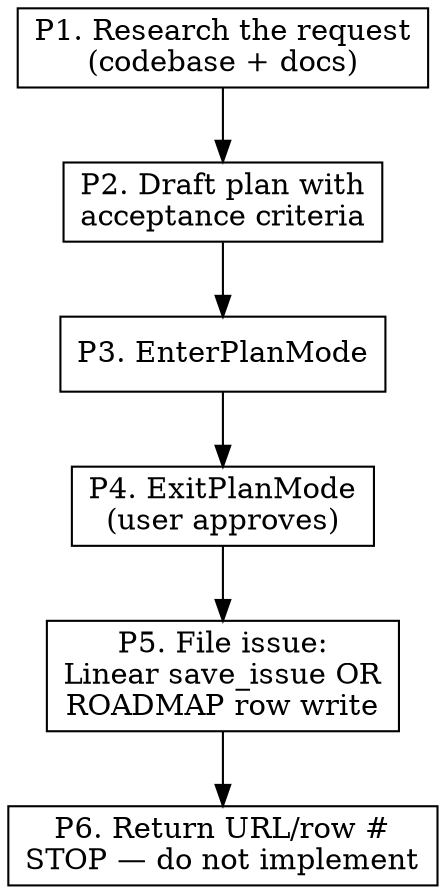
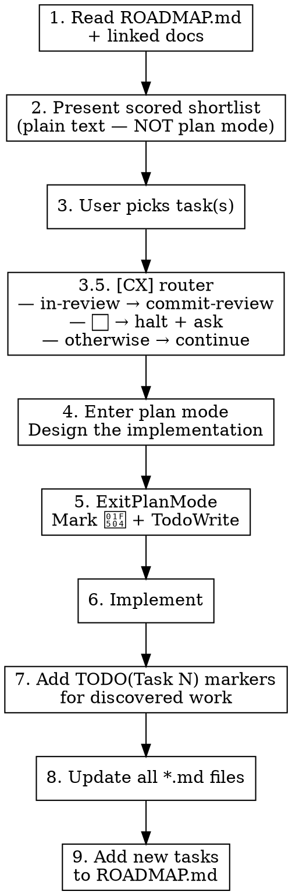

# Task Driver — Roadmap-Driven Implementation

Read the roadmap. Pick the best tasks. Implement. Update all docs. Leave no gaps.

## Phase Awareness

**This skill runs in Phase 1 of 6** in the development lifecycle:

`task-driver(1) → worktree(2) → bots(3) → commit-review(4) → merge(5) → audit-review(6)`

- **Predecessor:** (user)
- **Successor:** implementer session (Phase 2 — `worktree-workflow.md`)
- **Linear status on entry:** (none)
- **Linear status on exit:** `Todo` (Plan-and-File mode) or `In Progress` (Pickup mode, when same-session implementation continues)

Two entry modes (decided at Step 1):

| Mode | Trigger | What this skill produces |
|---|---|---|
| **Pickup** | User invokes with a specific ROADMAP task # / Linear issue ID | Implementation in this session (existing 9-step flow) |
| **Plan-and-File** | User invokes with no task ID, or asks to "plan a new task" | A Linear issue (or ROADMAP row, if no Linear) with status `Todo`. **Does NOT implement in this session** — handoff is a fresh implementer session that picks up the issue per `worktree-workflow.md` |

## Scope

WHAT THIS SKILL DOES:
  - Select tasks from ROADMAP.md by efficiency score (lightweight shortlist, no plan mode)
  - Enter plan mode AFTER a task is selected, to design the implementation
  - Implement approved tasks with TodoWrite progress tracking (Pickup mode)
  - File approved plans as Linear issues / ROADMAP rows for fresh-session pickup (Plan-and-File mode)
  - Add `TODO(Task N):` markers in code for discovered work
  - Update ALL affected *.md files after implementation
  - Add newly discovered tasks to ROADMAP.md with D/B scores

WHAT THIS SKILL DOES NOT DO:
  - Create roadmaps from scratch (use roadmap-planning skill for format guidance)
  - Code review (use staged-review:code-review)
  - Language-specific checks (use project linters and hooks)
  - Implement in Plan-and-File mode (the filed issue is the handoff; a fresh session implements)

## Mode Selection

Decide which mode applies before doing anything else:

- User named a specific task (`task-driver task 274`, `task-driver INE-12`, "implement task 5") → **Pickup mode** — go to "Workflow: Pickup Mode" below.
- User asked to plan a new task, or invoked with no task ID (`task-driver`, "let's plan something new", "I want to add X") → **Plan-and-File mode** — go to "Workflow: Plan-and-File Mode" below.
- Ambiguous → ask the user once: "Pickup an existing roadmap/Linear task, or plan a new one to file for a future session?"

## Workflow: Plan-and-File Mode

Produces a Linear issue (or ROADMAP row, if no Linear) with status `Todo`. Implementation happens in a **fresh** session — see § "Why fresh-session implementation" below.



### P1. Research the Request

Read `ROADMAP.md`, project CLAUDE.md, and any user-pointed-at docs. Survey the codebase for related modules / existing patterns / reuse opportunities. Same depth as Pickup-mode Step 4, but the goal here is filing a credible plan a future session can pick up cold — not implementing now.

### P2. Draft Plan with Acceptance Criteria

The drafted plan IS the issue body. Use the plan-shaped template from `linear-workflow.md` § "Plan-Shaped Linear Task Specs":

```markdown
## Context
Why this exists, dependencies, what's already in place.

## Task
WHAT to do, in prose. Not HOW.

## Acceptance criteria
- Bullet list a fresh QA session can verify.

## Out of scope
What this issue explicitly does NOT do.

## Files to modify
- `path/to/file.ext` — what changes
- (anchor file:line references where useful)

## Files to NOT modify
- `ROADMAP.md`, `CHANGELOG.md`, `README.md` (audit-review handles post-merge)

## Scoring
[D:X/B:Y/U:Z → Eff:W]
```

Score with the D/B/U framework (`task-prioritization.md`).

### P3. EnterPlanMode

Call `EnterPlanMode` with the drafted plan as the plan content. The user reviews in the plan-mode UI.

### P4. ExitPlanMode (User Approves)

When the user approves via the plan-mode UI, `ExitPlanMode` returns. **Only on approval does P5 fire.** Rejected or amended plans never write to Linear / ROADMAP.

### P5. File the Issue

Detect Linear MCP availability:

**Linear available** (preferred):

```
mcp__linear-server__save_issue(
  team: <team key from workspace include>,
  project: <repo project ID>,
  state: "Todo",  # Linear MCP parameter is `state` (accepts state name, ID, or type)
  title: <one-line task title>,
  body: <the approved plan from P2>,
  labels: []  # NO [CX]/[CSR] marker — unmarked = local pickup per delegation-rules.md
)
```

Capture the returned issue URL (e.g. `https://linear.app/<workspace>/issue/INE-247`).

**Linear absent (ROADMAP-fallback):**

1. Add a row to `ROADMAP.md` under the appropriate phase, with status `⬜` and the D/B/U score.
2. Write the full plan body to `.thoughts/plans/<task-id>.md` so a future session has the spec.
3. Capture the ROADMAP row number as the durable handoff identifier.
4. Commit the writes so the working tree stays clean (Task 45's `audit-review` clean-tree precondition):

   ```bash
   git add ROADMAP.md .thoughts/plans/<task-id>.md
   git commit -m "Add Task <N>: <one-line title>"
   ```

   The commit lands on the host branch (main checkout — no worktree exists yet for an unimplemented task). This is an explicit exception to the "no commits to shared branches without authorization" rule: Plan-and-File's contract IS the filed plan, so committing the row + plan on the host branch is part of the contract.

(See `linear-workflow.md` § "ROADMAP-Fallback Flow" for the broader pattern.)

### P6. Return the Handoff Identifier — STOP

Output one short message:

```
Filed: <Linear URL OR "ROADMAP Task N + .thoughts/plans/<task-id>.md">
Status: Todo (awaiting fresh-session pickup per worktree-workflow.md)
```

**Do not implement in this session.** Plan-and-File mode's contract is the filed issue; the implementer is a fresh session. This preserves the implementer/reviewer separation principle in `workflow-philosophy.md` § "Implementer / Reviewer Handoff" — the same session that designed the plan should not also implement against it without a clean session boundary.

### Why fresh-session implementation

Plan mode draws conclusions; a fresh implementer session picks up cold and re-derives them from the filed plan, catching gaps in the plan itself. Same-session implementation lets unstated assumptions slide ("I know what I meant") — exactly the failure mode plan-shaped specs exist to prevent. The Linear issue / ROADMAP row + `.thoughts/plans/<id>.md` is the cold-readable contract.

## Workflow: Pickup Mode



**Why two stages:** selection is a scored-table menu — cheap, plain text. Plan mode is where design decisions earn approval (files to touch, schema shape, trade-offs). Fusing them forces plan-mode ceremony just to read a sorted list.

### Step 1: Read the Roadmap

Read `ROADMAP.md` and any linked planning docs (e.g., `GO-INTEGRATION.md`, `DEX_ROADMAP.md`).

Identify:
- All pending tasks (⬜) with their D/B/U scores
- Blocked tasks (🔶) and what blocks them
- In-progress tasks (🔄) and their branches
- Parallel-safe tasks marked with `[P]`
- Current phase and focus area

### Step 2: Present Scored Shortlist (no plan mode)

Output the top candidates as plain text — this is a menu, not a design review. Do **not** call `EnterPlanMode` here.

```
## Recommended Tasks

| # | Task | Eff  | D/B/U       | Status | Notes                    |
|---|------|------|-------------|--------|--------------------------|
| 1 | 274  | 3.00 | D:3/B:9/U:9 | ⬜     | Independent, high ROI    |
| 2 | 290  | 1.75 | D:2/B:4/U:3 | ⬜     | Quick win, low effort    |
| 3 | 285  | 1.50 | D:4/B:6/U:6 | 🔶     | Blocked by Task 274      |

## Parallel Opportunities
Tasks 274 and 290 are independent — can run in parallel worktrees.

## Blocked Tasks
Task 285 depends on 274 completing first.
```

End with a one-line recommendation: "I suggest Task 274 (highest efficiency, unblocked). Which do you want?"

### Step 3: User Picks Task(s)

Wait for the user to pick. Do NOT proceed without approval.

### Step 3.5: Cloud-Agent Delegation Router

Before entering plan mode, check the selected task's marker (see `task-prioritization.md` § "Codex Delegation (`[CX]`)" for `[CX]`; `linear-workflow.md` § "Cursor Delegation Flow" + `cloud-agent-environments.md` for `[CSR]`):

- **Task is `[CX]` or `[CSR]` and status is `🔄 in-review`** → the cloud agent's PR is open and awaiting review. Invoke `staged-review:commit-review` and exit normally — that skill polls Linear, runs the harness, presents a verdict. Do NOT proceed to plan mode (no local implementation).

- **Task is `[CX]` and status is `⬜`** → halt. Per `critical-rules.md` § "DON'T STEAL CLOUD-AGENT-DELEGATED TASKS", Claude does not silently execute marker-labeled work locally. Ask the user:

  > "Task N is marked `[CX]`, queued for Codex. Want me to create the Linear issue and delegate (default path), or are you redirecting this one to local execution?"

  - If "delegate" → use `mcp__linear-server__save_issue` with `delegate: "Codex"`, label `cx-eligible`, body = full prompt (spec + acceptance criteria + file paths). Update ROADMAP status from `⬜` to `🔄 (delegated)` so future sessions know it's queued. Stop — Codex picks it up and opens a PR; the user runs `commit-review` later.
  - If "redirect to local" → continue to Step 4 (plan mode) with the task as if it weren't marked `[CX]`. Optionally remove or update the `[CX]` marker in ROADMAP.md.

- **Task is `[CSR]` and status is `⬜`** → halt. Same rule. Ask the user:

  > "Task N is marked `[CSR]`, queued for Cursor. Want me to create the Linear issue and delegate (default path), or are you redirecting this one to local execution?"

  - If "delegate" → use `mcp__linear-server__save_issue` with `delegate: "Cursor"`, label `cursor-eligible`, body = full prompt (spec + acceptance criteria + file paths). Cursor's eligibility is broader than Codex (hex.pm, mix tasks, internet — see `cloud-agent-environments.md` § "Cursor Cloud" for what's reachable), so don't second-guess the marker. Update ROADMAP status from `⬜` to `🔄 (delegated)` so future sessions know it's queued. Stop — Cursor picks it up via Linear, opens a PR; the user runs `commit-review` later.
  - If "redirect to local" → continue to Step 4 (plan mode) with the task as if it weren't marked `[CSR]`. Optionally remove or update the `[CSR]` marker in ROADMAP.md.

- **Task has any other future cloud-agent marker** → halt. Same discipline shape — ask the user before silently executing locally. The marker convention is in flight (see `cloud-agent-environments.md` for the agents currently documented); when in doubt, treat any `[X*]`-shaped marker on a row as a delegation signal and ask.

- **No cloud-agent marker** → continue to Step 4 (existing local flow).

### Step 4: Enter Plan Mode — Design the Implementation

**Now** call `EnterPlanMode`, scoped to the selected task. Inside plan mode:

- Read the task description and any linked docs (SCHEMA.md, CONSUMER_CONTRACT.md, etc.)
- Explore the codebase (existing patterns, modules to touch, tests that cover the area)
- Identify reuse opportunities — don't propose new code when a helper exists
- Produce a concrete plan: files to modify, new modules, schema/contract changes, verification steps

**Delegate the codebase survey to an Explore subagent** when the task needs more than ~3 searches across the repo. Keep design synthesis in the main session; push raw Grep/Glob work to Explore so it returns a compact report (file:line pairs, brief findings) instead of dumping 100+ raw matches into main context. Common trigger: a schema/contract bump that touches dozens of filename or version-string references — let Explore enumerate the call-sites, then build the plan from its summary.

Exit plan mode with `ExitPlanMode` when the plan is ready for user approval.

**Trivial task exception:** if the selected task is a one-line fix, a pure doc update, or otherwise has zero design decisions, skip plan mode and go straight to Step 5. When in doubt, plan.

### Step 5: Create TodoWrite Items + Mark 🔄

After the plan is approved, create TodoWrite items:

```
- [ ] Implement core changes
- [ ] Add tests
- [ ] Run quality checks
- [ ] Update ROADMAP.md, CHANGELOG.md
- [ ] Update CLAUDE.md/README.md if needed
```

Mark the task as 🔄 in ROADMAP.md with your branch name before the first code change.

### Step 6: Implement

Implement the task. Follow project conventions from CLAUDE.md.

Use the task description as a prompt — it describes WHAT to accomplish, not HOW. Research the codebase to determine specifics.

### Step 7: Add TODO Markers for Discovered Work

During implementation you WILL discover things that aren't the current task:
- Edge cases the current fix doesn't address
- Missing test coverage spotted during implementation
- Upstream issues from external dependencies
- Architectural improvements noticed along the way

**Every discovery gets a tracked marker:**

```elixir
# TODO(Task 295): Handle rate limiting for batch requests — discovered during Task 274
```

- Use `TODO(Task N):` format where N is a new task number
- If it's an upstream issue, use `FIXME(upstream):` instead (see staged-review skill)
- Include which task you were working on when you found it

### Step 8: Update All Documentation

**This is not optional. A task without updated docs is an incomplete task.**

Check and update whichever of these are affected:

**ROADMAP.md:**
- Mark completed task: ⬜ → ✅
- Update phase summary if phase completed
- Update "Current Focus" section
- No counts or stats (they go stale)

**CHANGELOG.md:**
- Add entry under `## [Unreleased]`
- Describe what was done and key decisions
- No test counts, function counts, or line counts

**CLAUDE.md:**
- Update if repo structure, architecture, or conventions changed
- Update skill/plugin tables if applicable

**README.md:**
- Update if user-facing features or setup instructions changed

### Step 9: Add Discovered Tasks to Roadmap

All `TODO(Task N)` markers you added in Step 7 need corresponding entries in ROADMAP.md:

```markdown
- [ ] Task 295: Handle rate limiting for batch requests [D:3/B:6/U:5 → Eff:1.83] 🚀
      Add rate limiting awareness to batch endpoint calls. Discovered during Task 274 — batch requests can hit exchange rate limits without backoff.
```

- Score every new task with D/B/U
- Write task descriptions as prompts (WHAT, not HOW)
- Mark parallel-safe tasks with `[P]`
- Flag dependencies on other tasks

## Task Selection Criteria

When choosing which tasks to recommend:

1. **Highest efficiency first** — Eff > 2.0 before Eff < 1.0
2. **Unblocked only** — skip tasks with unmet dependencies
3. **Respect current phase** — prefer tasks in the active phase
4. **Parallel opportunities** — flag independent `[P]` tasks that could run in worktrees
5. **Critical bugs always first** — regardless of D/B score

**Skip these in scoring:**
- Critical bugs (always highest priority)
- Security issues (always highest priority)
- Documentation of completed work (just do it)
- Tasks already in progress by another session

## Common Mistakes

| Mistake | Fix |
|---------|-----|
| Entering plan mode just to show the shortlist | Step 2 is plain text; plan mode is Step 4, after selection |
| Implementing without plan-mode approval for the selected task | Non-trivial tasks get plan mode in Step 4 before any code change |
| Skipping doc updates | Every task updates ROADMAP + CHANGELOG at minimum |
| Discovering work without tracking it | Every discovery gets TODO(Task N) + ROADMAP entry |
| Writing implementation details in task descriptions | Tasks are prompts: WHAT not HOW |
| Adding counts/stats to CHANGELOG | Describe what was built, not numeric inventories |
| Starting blocked tasks | Check dependencies before recommending |
| Forgetting to mark task as 🔄 before starting | Update ROADMAP status before first code change |
| Silently executing a `[CX]` / `[CSR]` (or any cloud-agent-marked) task locally | Step 3.5 routes every cloud-agent delegation marker. Per `critical-rules.md` § "DON'T STEAL CLOUD-AGENT-DELEGATED TASKS", halt and ask before redirecting to local. The marker is a fence; user override is the gate. Don't reason "but Cursor could've done what Codex was given" — that's second-guessing the marker, not respecting it |
| Skipping `commit-review` on `[CX]` + `🔄 in-review` | Step 3.5 invokes `staged-review:commit-review` for those rows. Don't try to plan-mode an already-implemented Codex PR |
| Implementing in the same session in Plan-and-File mode | Plan-and-File's contract is the filed issue. After P5 lands the issue, STOP. Fresh-session implementation is what makes the plan cold-readable; same-session implementation lets unstated assumptions slide |
| Saving the plan to Linear / ROADMAP before user approval | The `save_issue` / ROADMAP write fires in P5 ONLY after `ExitPlanMode` returns approval. Rejected or amended plans never write durable state |
| Picking the wrong mode | If the user named a specific task, Pickup. If they asked to plan something new with no task ID, Plan-and-File. Ask once if ambiguous — don't guess |
| Forgetting to commit ROADMAP/plan writes in P5.2 (Linear-absent path) | The commit is part of P5.2's contract — Task 45's `audit-review` precondition refuses dirty trees. Plan-and-File on the main checkout commits the row + plan; the implementer-session worktree picks up cleanly |
