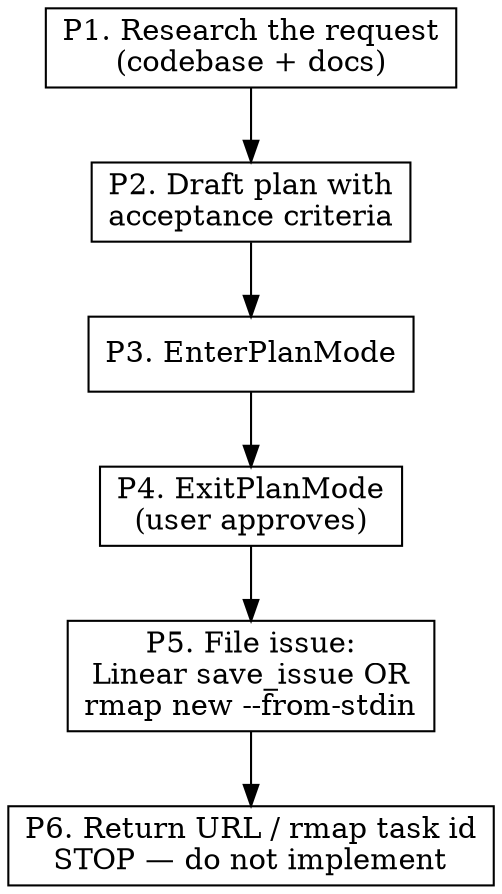
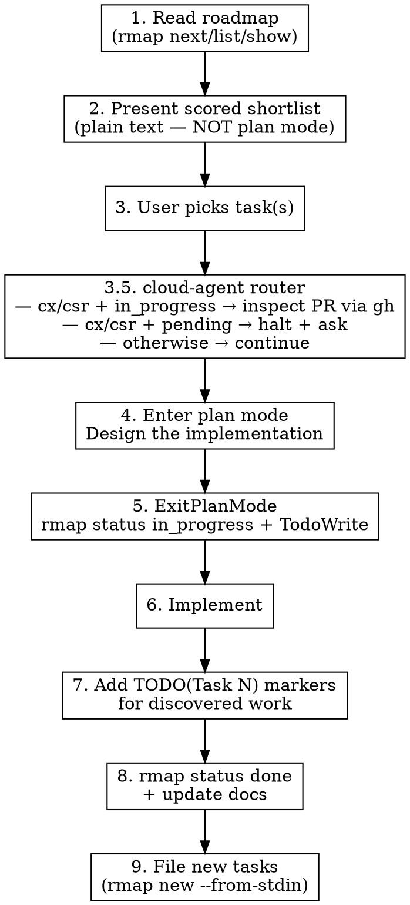

# Task Driver — Roadmap-Driven Implementation

Read the roadmap. Pick the best tasks. Implement. Update all docs. Leave no gaps.

The roadmap lives in `roadmap/tasks.toml`, managed by `rmap` — `ROADMAP.md` is rendered output, never hand-edited. See the `rmap` skill (or `rmap.md`) for the command surface and the migration procedure; this skill is the *workflow* that drives it.

## Phase Awareness

**This skill runs in Phase 1 of 5** in the development lifecycle:

`task-driver(1) → worktree(2) → bots(3) → merge(4: GH-native gh pr merge --auto) → audit-review(5)`

- **Predecessor:** (user)
- **Successor:** implementer session (Phase 2 — `worktree-workflow.md`)
- **Linear status on entry:** (none)
- **Linear status on exit:** `Todo` (Plan-and-File mode) or `In Progress` (Pickup mode, when same-session implementation continues)

Two entry modes (decided at Step 1):

| Mode | Trigger | What this skill produces |
|---|---|---|
| **Pickup** | User invokes with a specific rmap task id / Linear issue ID | Implementation in this session (existing 9-step flow) |
| **Plan-and-File** | User invokes with no task ID, or asks to "plan a new task" | A Linear issue (or rmap task, if no Linear) with status `Todo` / `pending`. **Does NOT implement in this session** — handoff is a fresh implementer session that picks up the issue per `worktree-workflow.md` |

## Scope

WHAT THIS SKILL DOES:
  - Select tasks from the rmap roadmap (`roadmap/tasks.toml`) by efficiency score (lightweight shortlist, no plan mode)
  - Enter plan mode AFTER a task is selected, to design the implementation
  - Implement approved tasks with TodoWrite progress tracking (Pickup mode)
  - File approved plans as Linear issues / rmap tasks for fresh-session pickup (Plan-and-File mode)
  - Add `TODO(Task N):` markers in code for discovered work
  - Update ALL affected *.md files after implementation
  - File newly discovered tasks via `rmap new --from-stdin` with D/B/U scores

WHAT THIS SKILL DOES NOT DO:
  - Create roadmaps from scratch (use the `roadmap-planning` skill for the framework, the `rmap` skill for the CLI)
  - Code review (use staged-review:code-review)
  - Language-specific checks (use project linters and hooks)
  - Implement in Plan-and-File mode (the filed issue is the handoff; a fresh session implements)

## Mode Selection

Decide which mode applies before doing anything else:

- User named a specific task (`task-driver task 274`, `task-driver INE-12`, "implement task 5") → **Pickup mode** — go to "Workflow: Pickup Mode" below.
- User asked to plan a new task, or invoked with no task ID (`task-driver`, "let's plan something new", "I want to add X") → **Plan-and-File mode** — go to "Workflow: Plan-and-File Mode" below.
- Ambiguous → ask the user once: "Pickup an existing roadmap/Linear task, or plan a new one to file for a future session?"

## Workflow: Plan-and-File Mode

Produces a Linear issue (or rmap task, if no Linear) with status `Todo` / `pending`. Implementation happens in a **fresh** session — see § "Why fresh-session implementation" below.



### P1. Research the Request

Read the roadmap (`rmap list`, `rmap show <id>`), project CLAUDE.md, and any user-pointed-at docs. Survey the codebase for related modules / existing patterns / reuse opportunities. Same depth as Pickup-mode Step 4, but the goal here is filing a credible plan a future session can pick up cold — not implementing now.

### P2. Draft Plan with Acceptance Criteria

The drafted plan IS the issue body. Use the plan-shaped template from `agent-dispatch.md` § "Plan-Shaped Linear Task Specs":

```markdown
## Context
Why this exists, dependencies, what's already in place.

## Task
WHAT to do, in prose. Not HOW.

## Acceptance criteria
- Bullet list a fresh QA session can verify.

## Out of scope
What this issue explicitly does NOT do.

## Files to modify
- `path/to/file.ext` — what changes
- (anchor file:line references where useful)

## Files to NOT modify
- `roadmap/tasks.toml`, `ROADMAP.md`, `CHANGELOG.md`, `README.md` (audit-review handles post-merge)

## Scoring
[D:X/B:Y/U:Z → Eff:W]
```

Score with the D/B/U framework (`task-prioritization.md`). When this lands as an rmap task (P5, Linear-absent path), the `[D:X/B:Y/U:Z]` notation becomes `scores = { d, b, u }` — `rmap` computes Eff and renders the bracket.

**Multi-batch plans render `⏸ CHECKPOINT` as lines of their own.** When the drafted plan spans ≥3 batches (or a phased migration whose file count would blow the context window), render `⏸ CHECKPOINT — batch N complete, /compact before batch N+1` markers as first-class lines between batches in the issue body, per `workflow-philosophy.md` § "Batched Execution". A prose sentence saying "compact between phases" does NOT satisfy the rule — the marker is a line on its own. At each checkpoint where a commit is the next step, include a ready one-line commit message (imperative mood, matching repo log style). Below the threshold (1–2 batches), run as a single batch in the implementer session without checkpoints — ceremony exceeds benefit.

### P3. EnterPlanMode

Call `EnterPlanMode` with the drafted plan as the plan content. The user reviews in the plan-mode UI.

### P4. ExitPlanMode (User Approves)

When the user approves via the plan-mode UI, `ExitPlanMode` returns. **Only on approval does P5 fire.** Rejected or amended plans never write to Linear / rmap.

### P5. File the Issue

Detect Linear MCP availability:

**Linear available** (preferred):

```
mcp__linear-server__save_issue(
  team: <team key from workspace include>,
  project: <repo project ID>,
  state: "Todo",  # Linear MCP parameter is `state` (accepts state name, ID, or type)
  title: <one-line task title>,
  body: <the approved plan from P2>,
  labels: []  # NO cx/csr marker — unmarked = local pickup per delegation-rules.md
)
```

Capture the returned issue URL (e.g. `https://linear.app/<workspace>/issue/INE-247`).

**Linear absent (rmap-fallback):**

1. File the task into `roadmap/tasks.toml` with `rmap new --from-stdin` — status defaults to `pending`, scores from P2, `body` / `acceptance_criteria` carried from the approved plan:

   ```bash
   rmap new --from-stdin <<'TOML'
   [[task]]
   phase = <N>
   title = "<one-line task title>"
   scores = { d = <D>, b = <B>, u = <U> }
   body = "<the approved plan's Task section, as a prompt>"
   acceptance_criteria = ["...", "..."]
   TOML
   ```

   `rmap new` validates, writes `tasks.toml`, and re-renders `ROADMAP.md` + `roadmap/data.json`.
2. Write the full plan body to `.thoughts/plans/<task-id>.md` so a future session has the spec — rmap's `body` holds the prompt; the `.thoughts` file holds the full plan-mode detail.
3. Capture the rmap task id as the durable handoff identifier (`rmap list --json` to confirm the assigned id).
4. Commit the writes so the working tree stays clean (`audit-review`'s clean-tree precondition):

   ```bash
   git add roadmap/tasks.toml ROADMAP.md roadmap/data.json .thoughts/plans/<task-id>.md
   git commit -m "Add task <id>: <one-line title>"
   ```

   The commit lands on the host branch (main checkout — no worktree exists yet for an unimplemented task). This is an explicit exception to the "no commits to shared branches without authorization" rule: Plan-and-File's contract IS the filed plan, so committing the task + plan on the host branch is part of the contract.

(See `linear-queue.md` § "ROADMAP-Fallback Flow" for the broader pattern.)

### P6. Return the Handoff Identifier — STOP

Output one short message:

```
Filed: <Linear URL OR "rmap task <id> + .thoughts/plans/<task-id>.md">
Status: Todo / pending (awaiting fresh-session pickup per worktree-workflow.md)
```

**Do not implement in this session.** Plan-and-File mode's contract is the filed issue; the implementer is a fresh session. This preserves the implementer/reviewer separation principle in `workflow-philosophy.md` § "Implementer / Reviewer Handoff" — the same session that designed the plan should not also implement against it without a clean session boundary.

### Why fresh-session implementation

Plan mode draws conclusions; a fresh implementer session picks up cold and re-derives them from the filed plan, catching gaps in the plan itself. Same-session implementation lets unstated assumptions slide ("I know what I meant") — exactly the failure mode plan-shaped specs exist to prevent. The Linear issue / rmap task + `.thoughts/plans/<id>.md` is the cold-readable contract.

## Workflow: Pickup Mode



**Why two stages:** selection is a scored-table menu — cheap, plain text. Plan mode is where design decisions earn approval (files to touch, schema shape, trade-offs). Fusing them forces plan-mode ceremony just to read a sorted list.

### Step 1: Read the Roadmap

Query the roadmap through rmap — never read raw `ROADMAP.md` task tables (they're rendered output):

```bash
rmap next --count 8 --json      # top scored candidates, ready to pick
rmap list --status blocked      # what's blocked and why
rmap list --status in_progress  # what another session is already on
rmap list --marker parallel     # parallel-safe tasks
rmap show <id> --json           # full detail on one task
```

Also read any linked planning docs the project keeps (e.g. `GO-INTEGRATION.md`, `DEX_ROADMAP.md`) and the project CLAUDE.md for current phase / focus.

Identify:
- Top pending tasks with their D/B/U scores and Eff (`rmap next`)
- Blocked tasks and their `blocked_reason`
- In-progress tasks and their branches
- Parallel-safe tasks (`parallel` marker)
- Current phase and focus area

### Step 2: Present Scored Shortlist (no plan mode)

Build the shortlist from `rmap next --count N --json`. Output the top candidates as plain text — this is a menu, not a design review. Do **not** call `EnterPlanMode` here.

```
## Recommended Tasks

| # | Task | Eff  | D/B/U       | Status      | Notes                    |
|---|------|------|-------------|-------------|--------------------------|
| 1 | 274  | 3.00 | D:3/B:9/U:9 | pending     | Independent, high ROI    |
| 2 | 290  | 1.75 | D:2/B:4/U:3 | pending     | Quick win, low effort    |
| 3 | 285  | 1.50 | D:4/B:6/U:6 | blocked     | Blocked by Task 274      |

## Parallel Opportunities
Tasks 274 and 290 are independent — can run in parallel worktrees.

## Blocked Tasks
Task 285 depends on 274 completing first.
```

End with a one-line recommendation: "I suggest Task 274 (highest efficiency, unblocked). Which do you want?"

**Escalate to batch + subagent fan-out when ≥3 shortlisted tasks are independent** (no shared `depends_on`, no file-scope overlap). Per `workflow-philosophy.md` § "Batched Execution", a set of disjoint tasks is a single batch — propose dispatching them to parallel subagents (worktree-isolated, one PR per item) instead of sequential per-worktree pickup. Below the threshold (1–2 independent tasks), the existing "parallel worktrees" recommendation stays — ceremony exceeds benefit. Example escalation:

```
## Parallel Opportunities

Tasks 274 + 290 + 295 are independent (no shared `depends_on`).
This is one batch of 3 — per `workflow-philosophy.md` § "Batched Execution",
fan out to 3 parallel subagents (worktree-isolated, one PR each)
instead of sequential per-worktree pickup.
```

### Step 3: User Picks Task(s)

Wait for the user to pick. Do NOT proceed without approval.

### Step 3.5: Cloud-Agent Delegation Router

Before entering plan mode, read the selected task's markers with `rmap show <id> --json` — markers are `cx` for Codex, `csr` for Cursor (see `agent-dispatch.md` § "Codex Delegation" / "Cursor Delegation Flow" and `cloud-agent-environments.md`):

- **Task has a `cx` / `csr` marker and status `in_progress`** → already delegated; the cloud agent's PR is (or will be) open. The PR auto-merges via GitHub-native `gh pr merge --auto` once required checks pass + no `requested-changes` + no `[BLOCK-MERGE]` label (see `plugins/staged-review/templates/auto-merge.md`). To hold for manual review, `gh pr edit <N> --add-label "BLOCK-MERGE"`. Exit normally — do NOT proceed to plan mode (no local implementation).

- **Task has a `cx` marker and status `pending`** → not yet delegated. Halt. Per `critical-rules.md` § "DON'T STEAL CLOUD-AGENT-DELEGATED TASKS", Claude does not silently execute marker-labeled work locally. Ask the user:

  > "Task N is marked `cx`, queued for Codex. Want me to create the Linear issue and delegate (default path), or are you redirecting this one to local execution?"

  - If "delegate" → use `mcp__linear-server__save_issue` with `delegate: "Codex"`, label `cx-eligible`, body = full prompt (`rmap delegate <id> --to codex` renders a paste-ready prompt). Then `rmap status <id> in_progress` so future sessions know it's queued. Stop — Codex picks it up, opens a PR, and wires GH-native auto-merge per `plugins/staged-review/templates/auto-merge.md`.
  - If "redirect to local" → `rmap mark <id> -cx` to drop the marker, then continue to Step 4 (plan mode).

- **Task has a `csr` marker and status `pending`** → not yet delegated. Halt. Same rule. Ask the user:

  > "Task N is marked `csr`, queued for Cursor. Want me to create the Linear issue and delegate (default path), or are you redirecting this one to local execution?"

  - If "delegate" → use `mcp__linear-server__save_issue` with `delegate: "Cursor"`, label `cursor-eligible`, body = full prompt (`rmap delegate <id> --to cursor`). Cursor's eligibility is broader than Codex (hex.pm, mix tasks, internet — see `cloud-agent-environments.md` § "Cursor Cloud" for what's reachable), so don't second-guess the marker. Then `rmap status <id> in_progress`. Stop — Cursor picks it up via Linear, opens a PR, and wires GH-native auto-merge per `plugins/staged-review/templates/auto-merge.md`.
  - If "redirect to local" → `rmap mark <id> -csr`, then continue to Step 4 (plan mode).

- **Task has any other future cloud-agent marker** → halt. Same discipline shape — ask the user before silently executing locally. The marker convention is in flight (see `cloud-agent-environments.md` for the agents currently documented); when in doubt, treat any delegation-shaped marker on a task as a delegation signal and ask.

- **No cloud-agent marker** → continue to Step 4 (existing local flow).

### Step 4: Enter Plan Mode — Design the Implementation

**Now** call `EnterPlanMode`, scoped to the selected task. Inside plan mode:

- Read the task (`rmap show <id>`) and any linked docs (SCHEMA.md, CONSUMER_CONTRACT.md, etc.)
- Explore the codebase (existing patterns, modules to touch, tests that cover the area)
- Identify reuse opportunities — don't propose new code when a helper exists
- Produce a concrete plan: files to modify, new modules, schema/contract changes, verification steps

**Delegate the codebase survey to an Explore subagent** when the task needs more than ~3 searches across the repo. Keep design synthesis in the main session; push raw Grep/Glob work to Explore so it returns a compact report (file:line pairs, brief findings) instead of dumping 100+ raw matches into main context. Common trigger: a schema/contract bump that touches dozens of filename or version-string references — let Explore enumerate the call-sites, then build the plan from its summary.

Exit plan mode with `ExitPlanMode` when the plan is ready for user approval.

**Trivial task exception:** if the selected task is a one-line fix, a pure doc update, or otherwise has zero design decisions, skip plan mode and go straight to Step 5. When in doubt, plan.

### Step 5: Create TodoWrite Items + Mark In-Progress

After the plan is approved, create TodoWrite items:

```
- [ ] Implement core changes
- [ ] Add tests
- [ ] Run quality checks
- [ ] rmap status <id> done + update CLAUDE.md/README.md if needed
```

Run `rmap status <id> in_progress` before the first code change — rmap re-renders `ROADMAP.md`. Record the branch in `tasks.toml` if the project tracks it.

### Step 6: Implement

Implement the task. Follow project conventions from CLAUDE.md.

Use the task description as a prompt — it describes WHAT to accomplish, not HOW. Research the codebase to determine specifics.

### Step 7: Add TODO Markers for Discovered Work

During implementation you WILL discover things that aren't the current task:
- Edge cases the current fix doesn't address
- Missing test coverage spotted during implementation
- Upstream issues from external dependencies
- Architectural improvements noticed along the way

**Every discovery gets a tracked marker:**

```elixir
# TODO(Task 295): Handle rate limiting for batch requests — discovered during Task 274
```

- Use `TODO(Task N):` format where N is the rmap task id (assigned when you file it in Step 9)
- If it's an upstream issue, use `FIXME(upstream):` instead (see staged-review skill)
- Include which task you were working on when you found it

### Step 8: Update All Documentation

**This is not optional. A task without updated docs is an incomplete task.**

Check and update whichever of these are affected:

**Roadmap (`rmap status`):**
- `rmap status <id> done` — rmap re-renders `ROADMAP.md` + `roadmap/data.json`. Never hand-edit ROADMAP.md task tables; they're rendered output.
- Record `shipped_in` (PR/commit) in `tasks.toml` if the project tracks it.
- When a phase fully completes, set `[phases.N].status = "done"` — rmap collapses its rendered table to a one-line summary. No manual archiving, no strikethrough.

**CHANGELOG.md:**
- Only a curated human release-notes entry under `## [Unreleased]`, and only if the change is release-worthy. CHANGELOG is release notes, not a task archive — `tasks.toml` already holds per-task history (`body`, `done_at`, `shipped_in`).
- No per-task entries, no test/function/line counts, no D/B/U scores. Describe *what* shipped and *why*.

**CLAUDE.md:**
- Update if repo structure, architecture, or conventions changed
- Update skill/plugin tables if applicable

**README.md:**
- Update if user-facing features or setup instructions changed

### Step 9: File Discovered Tasks

Every `TODO(Task N)` marker you added in Step 7 needs a corresponding rmap task. File them with `rmap new --from-stdin` — atomic batch, so file all discoveries in one call:

```bash
rmap new --from-stdin <<'TOML'
[[task]]
phase = 3
title = "Handle rate limiting for batch requests"
scores = { d = 3, b = 6, u = 5 }
markers = ["parallel"]
body = "Add rate-limiting awareness to batch endpoint calls. Discovered during Task 274 — batch requests can hit exchange rate limits without backoff."
acceptance_criteria = ["Batch calls back off on 429", "Backoff ceiling is configurable"]
TOML
```

- Score every new task with D/B/U — `rmap` computes Eff and the tier glyph at render time; never hand-format `[D:X/B:Y/U:Z]`.
- Write `body` as a prompt (WHAT, not HOW) — see `task-writing.md`.
- Mark parallel-safe tasks `markers = ["parallel"]`; declare dependencies with `depends_on = [...]` (or `rmap depend <id> on <id>`).
- Reconcile the `TODO(Task N)` markers from Step 7 with the ids `rmap new` assigned.

## Task Selection Criteria

When choosing which tasks to recommend:

1. **Highest efficiency first** — Eff > 2.0 before Eff < 1.0
2. **Unblocked only** — skip tasks with unmet dependencies
3. **Respect current phase** — prefer tasks in the active phase
4. **Parallel opportunities** — flag independent `parallel`-marked tasks that could run in worktrees
5. **Critical bugs always first** — regardless of D/B score

**Skip these in scoring:**
- Critical bugs (always highest priority)
- Security issues (always highest priority)
- Documentation of completed work (just do it)
- Tasks already in progress by another session

## Common Mistakes

| Mistake | Fix |
|---------|-----|
| Entering plan mode just to show the shortlist | Step 2 is plain text; plan mode is Step 4, after selection |
| Implementing without plan-mode approval for the selected task | Non-trivial tasks get plan mode in Step 4 before any code change |
| Hand-editing ROADMAP.md task tables | ROADMAP.md is rendered output — mutate `roadmap/tasks.toml` via `rmap status` / `rmap mark` / `rmap new`, never edit the task tables by hand |
| Skipping doc updates | Every task: `rmap status <id> done` + CLAUDE/README if structure or features changed. CHANGELOG only if release-worthy |
| Discovering work without tracking it | Every discovery gets a `TODO(Task N)` marker + an `rmap new` task |
| Writing implementation details in task descriptions | Tasks are prompts: WHAT not HOW |
| Adding counts/stats to CHANGELOG | Describe what was built, not numeric inventories |
| Starting blocked tasks | Check dependencies before recommending |
| Forgetting to mark the task in_progress before starting | Run `rmap status <id> in_progress` before the first code change |
| Silently executing a `cx` / `csr` (or any cloud-agent-marked) task locally | Step 3.5 routes every cloud-agent delegation marker. Per `critical-rules.md` § "DON'T STEAL CLOUD-AGENT-DELEGATED TASKS", halt and ask before redirecting to local. The marker is a fence; user override is the gate. Don't reason "but Cursor could've done what Codex was given" — that's second-guessing the marker, not respecting it |
| Trying to plan-mode an already-delegated `cx` / `csr` task | Step 3.5 routes already-`in_progress` cloud-agent tasks to GH-native auto-merge inspection (`gh pr view`, `[BLOCK-MERGE]` label) — don't try to plan-mode an already-delegated cloud-agent PR |
| Implementing in the same session in Plan-and-File mode | Plan-and-File's contract is the filed issue. After P5 lands the issue, STOP. Fresh-session implementation is what makes the plan cold-readable; same-session implementation lets unstated assumptions slide |
| Saving the plan to Linear / rmap before user approval | The `save_issue` / `rmap new` write fires in P5 ONLY after `ExitPlanMode` returns approval. Rejected or amended plans never write durable state |
| Picking the wrong mode | If the user named a specific task, Pickup. If they asked to plan something new with no task ID, Plan-and-File. Ask once if ambiguous — don't guess |
| Forgetting to commit the `rmap new` + plan writes in P5 (Linear-absent path) | `git add roadmap/tasks.toml ROADMAP.md roadmap/data.json .thoughts/plans/<id>.md` then commit — `audit-review` refuses dirty trees. Plan-and-File on the main checkout commits the task + plan; the implementer-session worktree picks up cleanly |
