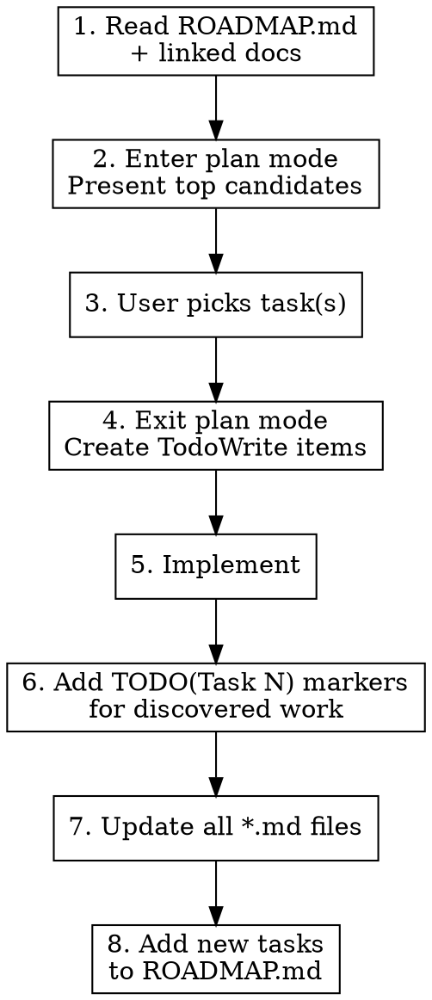

# Task Driver — Roadmap-Driven Implementation

Read the roadmap. Pick the best tasks. Implement. Update all docs. Leave no gaps.

## Scope

WHAT THIS SKILL DOES:
  - Select tasks from ROADMAP.md by efficiency score
  - Enter plan mode to propose task selection for user approval
  - Implement approved tasks with TodoWrite progress tracking
  - Add `TODO(Task N):` markers in code for discovered work
  - Update ALL affected *.md files after implementation
  - Add newly discovered tasks to ROADMAP.md with D/B scores

WHAT THIS SKILL DOES NOT DO:
  - Create roadmaps from scratch (use roadmap-planning skill for format guidance)
  - Code review (use staged-review:code-review)
  - Language-specific checks (use project linters and hooks)

## Workflow



### Step 1: Read the Roadmap

Read `ROADMAP.md` and any linked planning docs (e.g., `GO-INTEGRATION.md`, `DEX_ROADMAP.md`).

Identify:
- All pending tasks (⬜) with their D/B/U scores
- Blocked tasks (🔶) and what blocks them
- In-progress tasks (🔄) and their branches
- Parallel-safe tasks marked with `[P]`
- Current phase and focus area

### Step 2: Enter Plan Mode — Present Candidates

**Enter plan mode.** Present the top task candidates sorted by efficiency (Eff score):

```
## Recommended Tasks

| # | Task | Eff  | D/B/U       | Status | Notes                    |
|---|------|------|-------------|--------|--------------------------|
| 1 | 274  | 3.00 | D:3/B:9/U:9 | ⬜     | Independent, high ROI    |
| 2 | 290  | 1.75 | D:2/B:4/U:3 | ⬜     | Quick win, low effort    |
| 3 | 285  | 1.50 | D:4/B:6/U:6 | 🔶     | Blocked by Task 274      |

## Parallel Opportunities
Tasks 274 and 290 are independent — can run in parallel worktrees.

## Blocked Tasks
Task 285 depends on 274 completing first.
```

Include your recommendation: "I suggest starting with Task 274 (highest efficiency, unblocked)."

### Step 3: User Picks Tasks

Wait for user to approve or adjust the selection. Do NOT proceed without approval.

### Step 4: Exit Plan Mode — Create TodoWrite Items

Exit plan mode. Create TodoWrite items for the approved task(s):

```
- [ ] Read and understand Task N context
- [ ] Implement core changes
- [ ] Add tests
- [ ] Run quality checks
- [ ] Update ROADMAP.md, CHANGELOG.md
- [ ] Update CLAUDE.md/README.md if needed
```

Mark the task as 🔄 in ROADMAP.md with your branch name before starting.

### Step 5: Implement

Implement the task. Follow project conventions from CLAUDE.md.

Use the task description as a prompt — it describes WHAT to accomplish, not HOW. Research the codebase to determine specifics.

### Step 6: Add TODO Markers for Discovered Work

During implementation you WILL discover things that aren't the current task:
- Edge cases the current fix doesn't address
- Missing test coverage spotted during implementation
- Upstream issues from external dependencies
- Architectural improvements noticed along the way

**Every discovery gets a tracked marker:**

```elixir
# TODO(Task 295): Handle rate limiting for batch requests — discovered during Task 274
```

- Use `TODO(Task N):` format where N is a new task number
- If it's an upstream issue, use `FIXME(upstream):` instead (see staged-review skill)
- Include which task you were working on when you found it

### Step 7: Update All Documentation

**This is not optional. A task without updated docs is an incomplete task.**

Check and update whichever of these are affected:

**ROADMAP.md:**
- Mark completed task: ⬜ → ✅
- Update phase summary if phase completed
- Update "Current Focus" section
- No counts or stats (they go stale)

**CHANGELOG.md:**
- Add entry under `## [Unreleased]`
- Describe what was done and key decisions
- No test counts, function counts, or line counts

**CLAUDE.md:**
- Update if repo structure, architecture, or conventions changed
- Update skill/plugin tables if applicable

**README.md:**
- Update if user-facing features or setup instructions changed

### Step 8: Add Discovered Tasks to Roadmap

All `TODO(Task N)` markers you added in Step 6 need corresponding entries in ROADMAP.md:

```markdown
- [ ] Task 295: Handle rate limiting for batch requests [D:3/B:6/U:5 → Eff:1.83] 🚀
      Add rate limiting awareness to batch endpoint calls. Discovered during Task 274 — batch requests can hit exchange rate limits without backoff.
```

- Score every new task with D/B/U
- Write task descriptions as prompts (WHAT, not HOW)
- Mark parallel-safe tasks with `[P]`
- Flag dependencies on other tasks

## Task Selection Criteria

When choosing which tasks to recommend:

1. **Highest efficiency first** — Eff > 2.0 before Eff < 1.0
2. **Unblocked only** — skip tasks with unmet dependencies
3. **Respect current phase** — prefer tasks in the active phase
4. **Parallel opportunities** — flag independent `[P]` tasks that could run in worktrees
5. **Critical bugs always first** — regardless of D/B score

**Skip these in scoring:**
- Critical bugs (always highest priority)
- Security issues (always highest priority)
- Documentation of completed work (just do it)
- Tasks already in progress by another session

## Common Mistakes

| Mistake | Fix |
|---------|-----|
| Implementing without plan mode approval | Always enter plan mode first |
| Skipping doc updates | Every task updates ROADMAP + CHANGELOG at minimum |
| Discovering work without tracking it | Every discovery gets TODO(Task N) + ROADMAP entry |
| Writing implementation details in task descriptions | Tasks are prompts: WHAT not HOW |
| Adding counts/stats to CHANGELOG | Describe what was built, not numeric inventories |
| Starting blocked tasks | Check dependencies before recommending |
| Forgetting to mark task as 🔄 before starting | Update ROADMAP status before first code change |
